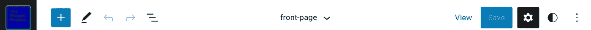
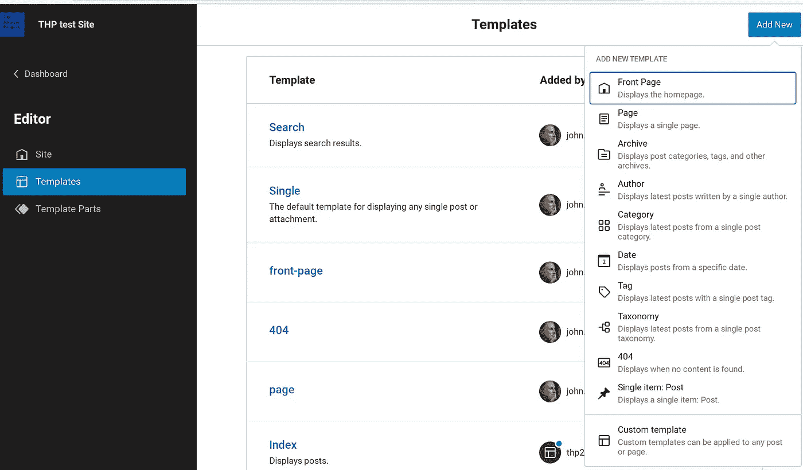

# 第二次全网站编辑(FSE)冒险:匹配 Divi 网站

> 原文：<https://medium.com/codex/second-full-site-editing-fse-adventure-matching-a-divi-site-939c03034162?source=collection_archive---------14----------------------->


照片由 [Unsplash](https://unsplash.com/s/photos/wordpress?utm_source=unsplash&utm_medium=referral&utm_content=creditCopyText) 上的 [Fikret tozak](https://unsplash.com/@tozakfikret?utm_source=unsplash&utm_medium=referral&utm_content=creditCopyText) 拍摄

我工作的组织有一个美丽的基于 Divi 的面向公众的网站【thp.org。它的大部分基本布局依赖于 Divi 的默认设置，并且在 WordPress 全站点编辑(FSE)出现之前，公司就已经设置好了。现在随着 WordPress 6.1 的发布，FSE 增加了重要的新功能。

我个人不喜欢使用附加页面生成器。它们中的大部分用起来都很糟糕，其中很多，像 Divi，用简短的代码填充你的文章和页面，这相当于把你锁定在他们的主题中。如果你去页面生成器之外的主题，你会看到一片狼藉。这违背了内容和设计分离的原则。

那么，FSE 能在实际基础上与 Divi、Elementor 和其他公司竞争吗？

在 2020 年，我发现我可以复制我们基于 Divi 的风格，基于 Tania Rascia 非常好的[非主题](https://github.com/taniarascia/untheme)构建我自己的[经典主题](https://github.com/thpglobal/thptheme)——作为一名 PHP 程序员，这并不十分困难。因此，我有一个工作的样式表，为这个项目开了个头。但是“纯粹的”FSE 主题并不使用单独的样式表。FSE 旨在让您直接设置您的主题样式，或者您可以手动编辑主题的 theme.json 文件来微调它。如果你发现你需要一些特殊的 css，正如我的前一篇文章中提到的，你可以通过直接访问 url /wp-admin/customize.php 来使用定制 css 的定制器(虽然那些不会出现在站点编辑器中)

# 从零开始

**第一步:**如果你想在 FSE 从头开始创建一个网站，你可以使用 Wordpress 自己的 **create-block-theme** 插件，它在你的仪表板外观选项卡下增加了两个新选项:创建 block 主题和管理主题字体。我用这些创建了名为 thp2022 的主题，并添加了 thp.org 使用的两种谷歌字体，Unna 和 Source Sans Pro。我很高兴看到插件在本地加载字体，因为我被警告说在欧洲直接从谷歌加载字体的网站可能是非法的。

第二步:如果你不是简单地改变现有网站的主题，那么你至少要为所有出现在主菜单上的页面创建存根，以及一些帖子。FSE 可以导入一个现有的菜单，但是如果让它自己决定，它会直接从站点编辑器创建一个新菜单。

# 启动网站编辑器

从仪表板/外观/编辑器(测试版)中，您会看到一组新图标。我习惯于看到不言自明的图标，但这些不是。正如您所料，加号框将添加一个新的 Gutenberg 块，Save 将保存您的工作。铅笔意味着你的光标在你可以编辑的地方，它可以切换到指针工具来拖动东西。



WordPress 完整站点编辑器菜单

交错的三条线向您展示了块的层次结构，您可以四处拖动(非常方便！).齿轮是特定块的设置，黑白圆圈是“样式”，可以是整个站点或整个站点中特定块的所有实例。

**风格**就是你要开始的地方。你几乎可以从这里定义你的主题的一切。你可以添加自定义的**颜色**到你的托盘，设置基本的站点**布局**(特别是页面和内容的宽度)，以及排版。在样式菜单的底部，你会看到“块”,这将让你选择任何古腾堡块，并分别为它们设置样式。如果你有一个特定的块需要在特定的上下文中进行样式化，比如在页眉或页脚中，你应该只使用**齿轮**。这三个点可以让你做各种事情，比如导出你的主题与朋友分享！

您的空白主题只包含一个名为 **index** 的初始模板。你会想要点击最左边的图标(一旦你选择它，它会显示你自己的图标)，并选择**模板** —这里我已经添加了首页、页面、单个、搜索和 404 模板。



添加新模板的屏幕截图

# 为什么您可能需要自定义 css

据我所知，有些功能您可能想要，但客户还没有。以“粘头”为例。在定制器中，我能够增加 header 标签的粘性并克服块间距:

```
header {position:sticky; top:0; background-color:white; z-index:100; bottom-margin:-25px !important;}
```

我还可以通过找到 WordPress 为其按钮使用的类(我用 Chrome Inspect 工具找到的)并向其添加 css 来为按钮添加悬停动作:

```
a.wp-block-button__link:hover {color:white; background-color:#0000aa;}
```

我喜欢做的另一件事是不使用插件。所以在我的主页上有一个大的计数计数器是很重要的——是的，它可以在各种插件中使用，但这些插件通常会添加一大堆我不想要的功能和额外的 css，所以我只添加了一点 css:

```
.countup {text-align:center;font-family:sans-serif; font-size:50px;}
```

然后我添加我自己的定制 html 块来添加 countup 跨度，并(对于最后一个)将它们链接到存储在 cdn 中其他地方的我自己的 css:

```
<div class="has-text-align-center"><span class="countup">11994810</span><br>people reached</div><script src="[https://storage.googleapis.com/thp/countup.js](https://storage.googleapis.com/thp/countup.js)"></script>
```

# 结论

我和 FSE 在一起很开心，我还在学习。我不是那种从文档中学习的人——我在实践中学习。

然而，我的问题的答案是“是”有了 WP 6.1，我会毫不犹豫地向任何想要创建一个好看网站的人推荐 FSE，并且会继续建议人们不要用附加的网站建设者来启动新项目。