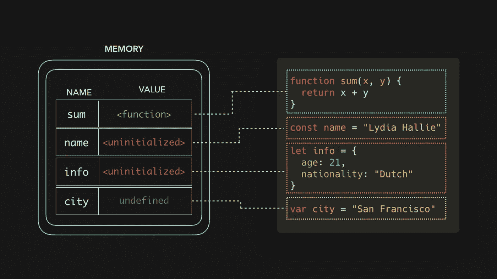
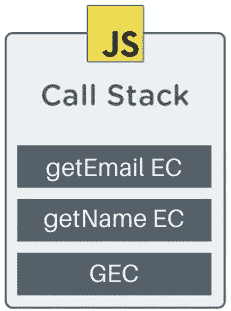

# JavaScript 中提升的秘密暴露了！

> 原文：<https://medium.com/codex/secrets-of-hoisting-in-javascript-revealed-429dede81aa3?source=collection_archive---------20----------------------->

## [法典](http://medium.com/codex)


嘿访客！怎么了？让我猜猜，“为什么这不起作用？”，或者，“这是怎么做到的？”。IKR，作为 JavaSript 开发人员的额外津贴。但是今天我的任务是揭示 JavaScript 最流行的魔术之一**提升的神秘秘密。**

我们将深入 JavaScript，所以请系好安全带，你的旅程即将开始。

## 让我们困惑吧！

请看以下三种情况，以及 JavaScript 对它们的不同反应。

1.  在第一种情况下，首先声明变量`i`和函数`getName`，然后使用。这是我们在大多数编程语言中经常做的事情。
2.  在第二种情况下，`i`和`getName`在被使用后被声明。这在其他 pl 中是不允许的，会导致运行时错误，但是在 JavaScript 中，这是允许的。请注意，`i`中有值`undefined` 。
3.  在第三种情况下，`i`在程序中的任何地方都没有声明，因此存在一个引用错误，表明 **i 没有定义**。

```
**//CASE 1** var i = 10;
function getName(){
   console.log("Shivam Bhasin");
}
console.log(i); **//10**
getName(); **//Shivam Bhasin****//CASE 2**
console.log(i); **//undefined**
getName(); **//Shivam Bhasin**
var i = 10;
function getName(){
   console.log("Shivam Bhasin");
}**//CASE 3**
console.log(i); **//Reference Err: i is not defined**
getName();
function getName(){
   console.log("Shivam Bhasin");
}
```

在案例 2 中，JavaScript 已经知道有一个变量`i`被声明，只是它的值还没有定义，但是`i`在第 3 行被我们初始化了。所以不知何故，JavaScript 将第 3 行的声明移到了顶部，而没有给它赋值 10。还要注意的是`getName`确实被执行并打印了“Shivam Bhasin”。同样，JS 在声明函数之前就知道了函数的一切。在**情况 2 中的`console.log(getName)`，在`getName`声明之前的**，将给出以下输出。这就好像 JavaScript 在引用中包含了函数的完整代码。

```
f getName(){
   console.log("Shivam Bhasin");
}
```

然而，在案例 3 中，`i`在代码中的任何地方都没有被我们定义。所以 JavaScript 不知道它，因此在我们面前抛出一个错误‘嘿，伙计！“这个‘我’从何而来？”

这就是大家一直称之为**的吊装。我从 W3 学校得到这个:**

> 提升是 JavaScript 将所有声明移动到当前作用域顶部的默认行为。

好了，我们知道所有的变量和函数声明都移到了当前作用域的顶部，但问题是它们真的上移了吗？或者还有别的 JavaScript 在做 BTS。

## BTS(幕后— JavaScript)

在代码开始执行之前， **JavaScript 遍历我们所有的代码，并将内存分配给所有的变量和函数**。是的，即使没有执行一行代码，JavaScript 也有关于我们在代码中声明的变量和函数的信息。

在执行之前，它创建一个**全局执行范围**，它基本上是两个阶段，**内存阶段**和**代码阶段**。我们今天对记忆阶段感兴趣。甚至在第一行代码运行之前，我们所有的变量和函数都存储在这里。它是提供给我们作为**全局对象**使用的。

内存阶段是一个键值存储。下面是这种说法的一个例证。



图片来自开发人员

考虑下面的例子:

```
console.log(i); **//undefined**
getName(); **//Hey Visitor!**
console.log(getName); **//f getName(){  console.log("Hey Visitor!"); }**
var i = 10;
function getName(){
   console.log("Hey Visitor!");
}
```

现在，在执行第一行代码之前，JavaScript 遍历代码并创建一个对象 **Global** ，如下所示:

```
Global: {
   i: undefined,
   getName: f () { //body of the function },
   //Other fields in the object
}
```

你知道这个**全局**物体吧？没有吗？你用过类似`window.alert()`的东西。有没有想过，这些是从哪里来的？是的，你是对的！所有这些函数都由 JavaScript 提供，供您在这个全局对象中使用。

对于变量，存储未定义的**，对于函数，存储完整的**函数体**。是的，所有函数都完全存储在作用域中。对象 Global，基本上就是**全局执行范围**。**

**所以现在当 JavaScript 开始执行代码并遇到第 1 行，即`console.log(i);`时，它知道`i`，因为它在**全局对象**中，因此打印出**未定义的**。函数`getName`也是如此，它被执行是因为它的整体存储在全局范围内。**

**现在考虑以下情况:**

```
getName(); **//Hey Visitor!**
console.log(i); **//Reference Err: i is not defined**
function getName(){
   console.log("Hey Visitor!");
}
```

**在这种情况下，JavaScript 将再次创建一个全局对象，如:**

```
Global: {
   getName: f () { //body of the function },
   //Other fields in the object
}
```

**这里，在执行代码时，当 JavaScript 遇到第 2 行，即`console.log(i);`，它在全局范围内找不到`i`，因此抛出一个错误**I not defined**，因为我们没有在代码中的任何地方声明`i`，JavaScript 对此一无所知。**

## **函数呢？**

**到目前为止，我们知道有一个全局执行范围，它包含全局范围的变量和函数。现在考虑以下情况:**

```
console.log(getName); **// f getName() { //body of function }**
console.log(i); **//Reference Error: i is not defined**
console.log(getEmail); **//Reference Error: getEmail is not defined**
function getName(){
   var i = 10;
   function getEmail(){
      console.log("my@email.com");
   }
}
```

**在这种情况下，JavaScript 再次遍历我们的代码并创建一个全局对象，如下所示:**

```
Global: {
   getName: f getName() { //body }
   //other fields in the object
}
```

**但是在这种情况下，`i`和`getEmail` 都在 **getName 执行上下文**内，而不在全局范围内。这是因为 JavaScript 中的每个函数都有自己的执行上下文。将整个程序视为一个全局功能，放在 **GEC** 下。注意，函数执行上下文是在特定函数执行期间创建的，而不是在此之前。**

**现在请看下面的场景:**

```
console.log(getName); **//f getName() { //body of function }**
function getName(){
   console.log(i); **//10**
   console.log(getEmail); **//f getEmail() { //body of function }**
   var i = 10;
   function getEmail(){
      console.log("my@email.com");
   }
}
```

**在这种情况下，创建了一个包含`getName` 的全局执行范围。在执行过程中，它遇到`line 2`，然后创建一个新的 **getName 执行上下文**。这将有它自己的**内存阶段**和它自己的全局对象，看起来像这样:**

```
getName: {
   i: undefined,
   getEmail: f getEmail() { //body of function }
}
```

**这个范围仅限于 **getName 执行上下文**，不能从任何其他地方访问。`getEmail` 功能的情况也是如此。执行时将创建一个新的 EC，该 EC 仅限于在内部访问。**

****

**执行顺序由调用堆栈维护。在 start 中，JS 引擎将 GEC 推入堆栈，并开始执行代码。当遇到一个函数时，它创建一个新的面向函数的 EC，并将其推送到调用栈。当函数执行完毕时，它从调用堆栈中弹出 EC，并将控制权返回给 GEC。**

**所以现在每当有人问什么是 JavaScript 中的提升，不要只是说这是一种向上移动声明的行为。向他们解释全局执行范围，以及 JavaScript 如何在开始执行代码之前给所有变量和函数分配内存。**

**JavaScript 中的每一个魔法都有一个解释。只要有足够的好奇心去寻找真正的原因。这样事情才会真正变得明朗。**

**我希望你从这篇文章中得到价值。如果有任何疑问或讨论，请不要三思而后行。**

**下次见，访客！**