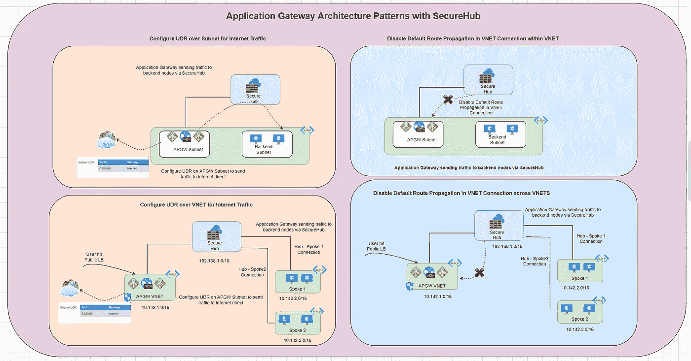

# 应用程序网关的安全集线器模式。

> 原文：<https://medium.com/codex/secure-hub-architecture-patterns-for-application-gateway-63b1bb6bfd76?source=collection_archive---------5----------------------->

作者照片

众所周知，安全虚拟集线器可用于过滤虚拟网络之间的流量(V2V)、虚拟网络与分支机构之间的流量(B2V)以及从 VNET/分支机构流向互联网的流量(B2I/V2I)。今天，在这篇博文中，我们将讨论如何通过 secure hub 保护应用程序网关及其后端池之间的流量。