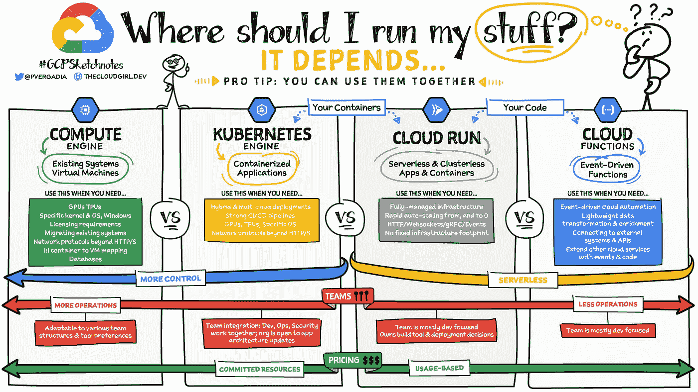
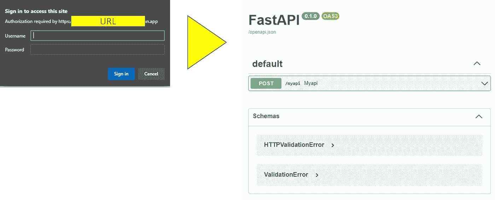
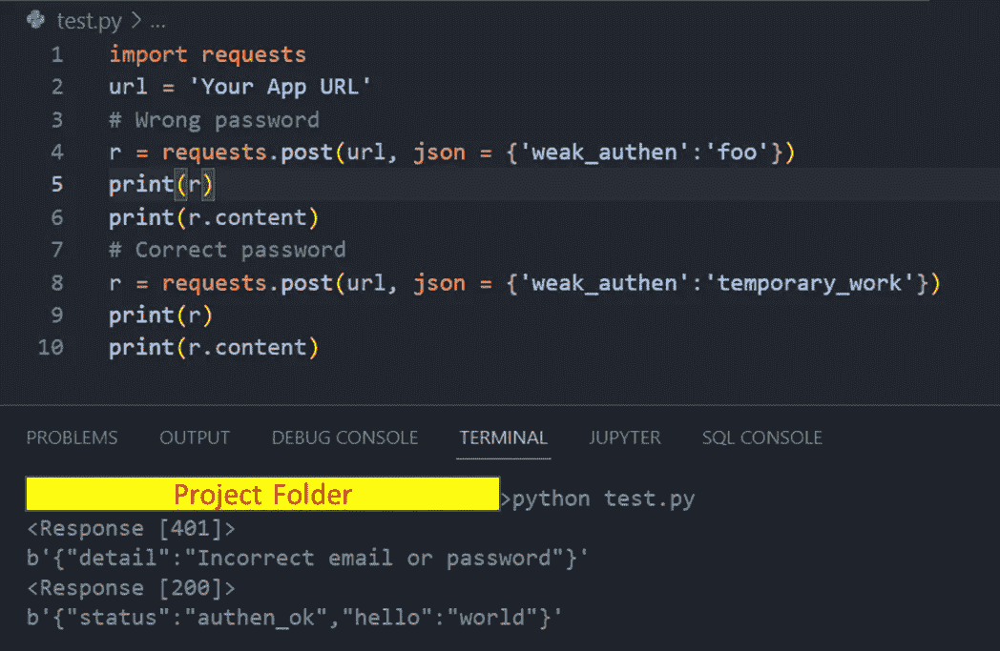
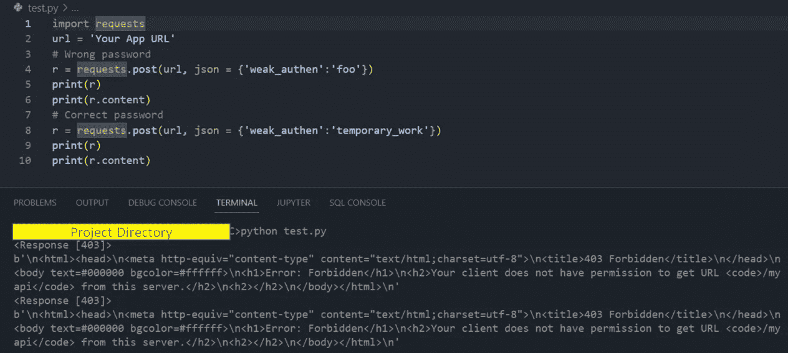
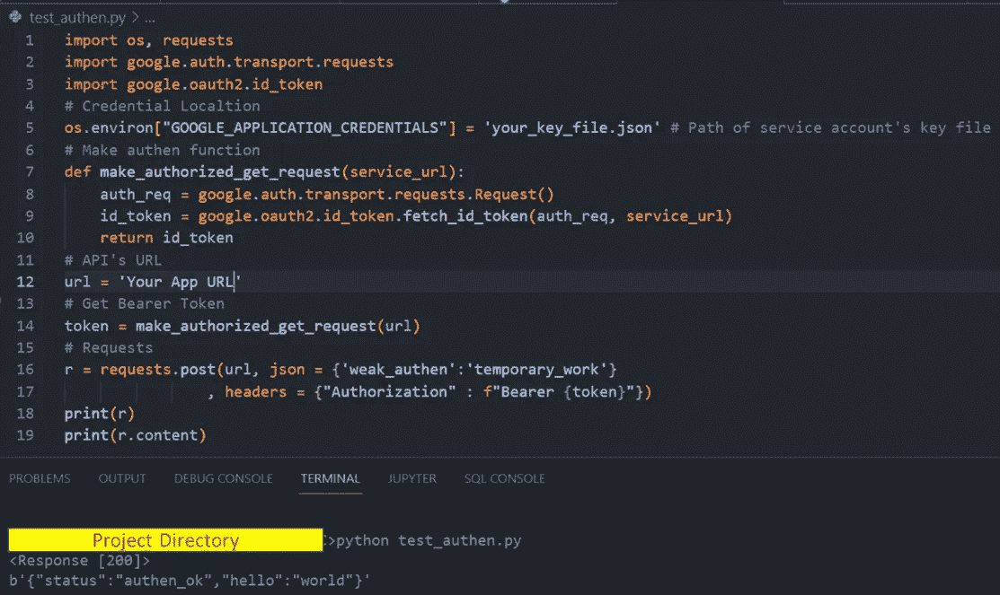

# 使用 Google Cloud 运行安全的无服务器 FastAPI

> 原文：<https://medium.com/codex/secured-serverless-fastapi-with-google-cloud-run-66242b916b46?source=collection_archive---------2----------------------->

微服务是现代应用的一个非常重要的概念。

在数据科学/数据工程中，可以使用 API 后端来分离工作负载，使其模块化编程，甚至作为数据传输给用户。


[FastAPI](https://fastapi.tiangolo.com/) 和 [Google Cloud Run](https://cloud.google.com/run) 的标志

在这篇文章中，我想分享在 Google Cloud 上部署 FastAPI 的许多方法之一，使用 Google Cloud 的身份验证运行。

# 先决条件

*   Python 和 [FastAPI](https://fastapi.tiangolo.com/) 的基础
*   关于通行证和容器的一点知识
*   谷歌云平台用户
*   谷歌云 SDK 安装，从[这里](https://cloud.google.com/sdk)

# Google Cloud Run 是什么？

Google Cloud Run 是来自 Google Cloud Platform (GCP)的无服务器平台即服务(PASS ),我们可以部署我们的容器。

你可以在这里了解更多关于**《我该怎么运行我的东西》** [。](https://cloud.google.com/blog/topics/developers-practitioners/where-should-i-run-my-stuff-choosing-google-cloud-compute-option)



图片来自谷歌云的博客:[这里](https://cloud.google.com/blog/topics/developers-practitioners/where-should-i-run-my-stuff-choosing-google-cloud-compute-option)

还有一个 Google Cloud 的基础教程从这个片段[这里](https://www.youtube.com/watch?v=nhwYc4StHIc)。

# Google Cloud Run 上的 Hello FastAPI

在本文中，我将使用 FastAPI 的脚本，该脚本基于此处链接[中 FastAPI 的问题，我做了一些修改，以使其与 Google Cloud Run 的身份验证一起工作。](https://github.com/tiangolo/fastapi/issues/364)

*我们将对文档使用基本身份验证，**它们比较弱**，但是对于重新检查 FastAPI 的文档来说已经足够几分钟了，无论如何我们稍后会添加 Google 的身份验证。

*对于 API，我们必须使用一个**甚至更弱的认证**，因为必须保存认证头以用于我们稍后将添加的 Google Cloud Run 的认证。

*** *这个密码太弱了，应该进行哈希运算，而不是像我这里的脚本一样的硬代码，它只是用于演示，不要在生产中使用！！！**

为了在 Google Cloud Run 上部署 FastAPI，我们需要像这样组织我们的项目文件夹。

```
--project
 |--main.py # put FastAPI's script here
 |--requirements.txt
 |--Dockerfile
 |--.gcloudignore # Optional
 |--.dockerignore # Optional
```

对于 requirements.txt，我们需要如下指定所需的库。

```
fastapi
uvicorn
```

对于 Dockerfile，大多数情况下，我们将从这个片段[这里](https://www.youtube.com/watch?v=nhwYc4StHIc)修改一个脚本。

```
# Use the official lightweight Python image.
FROM python:3.9-slim# Allow statements and log 
ENV PYTHONUNBUFFERED True# Copy local code to the container image.
ENV APP_HOME /app
WORKDIR $APP_HOME
COPY . ./# Install production dependencies.
RUN pip install -r requirements.txt# Run
CMD ["python", "main.py"]
```

当一切都准备好了，我们需要做的就是从教程剪辑[这里](https://www.youtube.com/watch?v=nhwYc4StHIc)再执行 3 个命令。

*确保你的 cmd 指向你的项目文件夹*

```
gcloud init
```

*“g Cloud init”*是在你的 PC 上初始化你的 Google Cloud SDK，同时选择你的 GCP 用户和项目，更多信息[在这里](https://cloud.google.com/sdk/gcloud/reference/init)。

```
gcloud builds submit --tag gcr.io/{project name}/{container name}
```

*“g cloud 构建...”*是让 GCP 从你的项目文件夹和“Dockerfile”中构建一个容器映像，并存储在谷歌云存储中，更多信息[在这里](https://cloud.google.com/sdk/gcloud/reference/builds/submit)。

```
gcloud run deploy --image gcr.io/{project name}/{container name} --platform manage
```

*"gcloud run ... "*是将您的容器映像从*“g Cloud build……”*部署到 Google Cloud Run，更多信息[在此](https://cloud.google.com/sdk/gcloud/reference/run/deploy)。

我建议首先允许取消认证查看 FastAPI 的文档。

之后，Google Cloud Run 会给你一个 URL，这将是一个基本的认证 FastAPI，就像这张图片一样。



在 Google Cloud 上运行带有基本身份验证的 FastAPI

我们还可以用 python 的请求测试这个弱身份验证 API。



从 Google Cloud Run 使用弱身份验证调用 FastAPI

因此，我们 FastAPI 可以用于来自 Google Cloud Run 的身份验证。

# 谷歌认证

现在，我们将使用 Google 的认证来保护我们的 API。

1.  从[控制台网页](https://console.cloud.google.com/)打开您的 GCP 项目。
2.  从“IAM”页面创建服务帐户和 json 密钥，
    -关于创建服务帐户[此处](https://cloud.google.com/iam/docs/creating-managing-service-accounts)
    -关于创建服务帐户密钥[此处](https://cloud.google.com/iam/docs/creating-managing-service-account-keys)|
    -不要忘记下载密钥文件
3.  转到我们刚刚创建的云运行，查找“权限”。
4.  从“权限”中删除“所有用户”。
5.  添加从 2 创建的服务帐户。角色为“云运行调用者”的云运行。
6.  可能需要 2-5 分钟将角色分配到此云运行中。

**经过上面的 6 个步骤，**我们应该准备好通过 Google Cloud Run 使用新的身份验证来调用我们的 API。

所以，用同样的代码再试一次，你会得到错误“未授权”。



由于 Google Cloud Run 的身份验证，无法呼叫

现在，我们需要使用来自谷歌图书馆的附加函数和密钥文件，你可以从[这里](https://cloud.google.com/run/docs/authenticating/service-to-service#run-service-to-service-example-python)阅读它。但是，我们需要做一些修改，使它容易把 API 的参数。

我们可以看到，FastAPI 与 Google Cloud Run 的认证结果将与之前相同，如下图所示。



这就是 FastAPI 在 Google Cloud 上带认证运行的全部内容。

# 限制

谷歌云运行有一些限制，例如，响应的大小不能大于 32 MB，你可以在这里看到其他限制。