# 保护您的 Linux 服务器第二部分

> 原文：<https://medium.com/codex/securing-your-linux-server-part-ii-48e45c581931?source=collection_archive---------1----------------------->


加布里埃尔·海因策在 [Unsplash](https://unsplash.com?utm_source=medium&utm_medium=referral) 上的照片

我们已经阅读了不同类型的对策，我们可以采取，以保护我们的服务器。我们可以采取一些不同的对策，我们将在博客中讨论这些对策。所以，这是保护您的 Linux 服务器系列的第二部分。如果你还没有看完第一部，你可以在这里看一下[。](/codex/securing-your-linux-server-with-these-best-practices-50b30e026bd)

这一部分更倾向于保护您的敏感文件、加密、放弃传统的密码机制，并揭示日志文件及其服务的目的。我们来讨论那些有很大解释的。

**加密敏感文件**

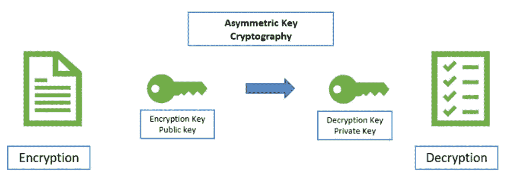

[来源](https://cheapsslsecurity.com/blog/what-is-asymmetric-encryption-understand-with-simple-examples/)

什么被归类为敏感文件？它是包含重要信息的任何文件。它可能是你的密码，数字钱包的种子短语，你的雇员的个人身份信息，SSH 密钥，等等。以及任何其他需要保护的信息。

如果有人能够绕过安全控制，攻击者要做的下一件事就是保持持久性，他应该通过创建帐户或寻找密码、破解 SSH 密钥来做到这一点。这样做是为了确保即使他的连接中断或您的服务器关闭，他也可以再次访问，而不必侵入。他要做的下一件事是寻找敏感文件，并把它们泄露出去。

这就是你加密敏感文件的原因。关于加密的基础，你可以在这里查看我们的博客文章。对于这篇博文，我们将执行对称加密。对称加密只需要一个用于加密和解密的密钥。

我们将使用 **GNU Privacy Guard (GPG)** ，它被广泛用于通过使用不对称和对称系统来加密和解密电子邮件。

1.  假设您有一个想要加密的名为 sensitive.txt 的文件。


sensitive.txt 文件的内容

2.我们将从生成密钥开始。

```
gpg --gen-key
```

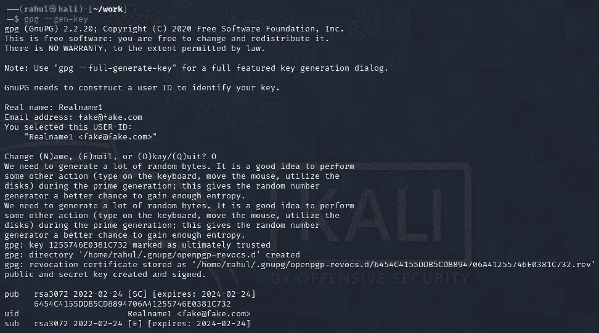

生成密钥

3.输入真实姓名和电子邮件地址。记住真实的名字，因为你需要它来加密文件。(我用过**实名 1** )

4.您将被进一步要求输入密码短语；通行短语可以被视为密码。

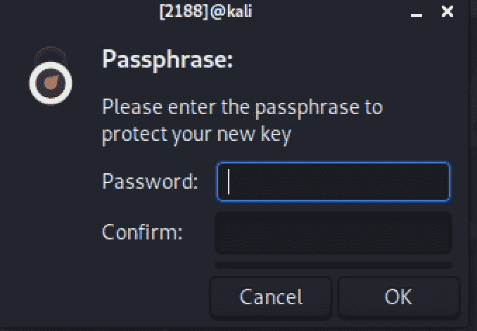

输入密码短语

5.要检查您生成的密钥，您可以通过以下方式进行检查

```
gpg --list-keys
```

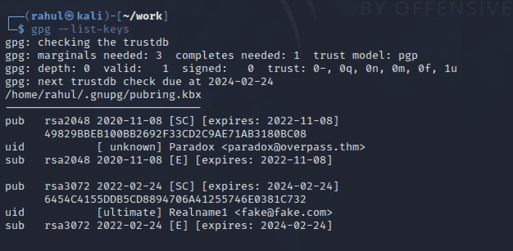

列表键

6.要加密文件，您需要输入用户名。*正如你所记得的，我们使用了 Realname1*

```
gpg -e -r Realname1 sensitive.txt
```


加密文件

7.此参数生成一个带有。gpg 已附加。原始文件不会被删除，因此您可能需要删除它。

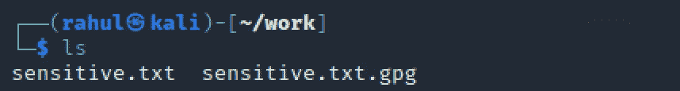

加密文件已创建

8.现在，如果攻击者破坏了系统，他将只能看到 sensitive.txt.gpg 文件，这是一个加密文件。如果他想检查内容，他只会看到一些随机的文本

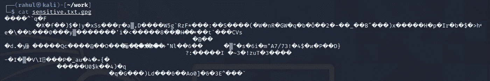

加密文件的内容。

9.如果你想解密文件，你可以这样做

```
gpg -d -o unencrypted.txt sensitive.txt.gpg
```


解密文件

10.输入您在设置 gpg 密钥时使用的密码

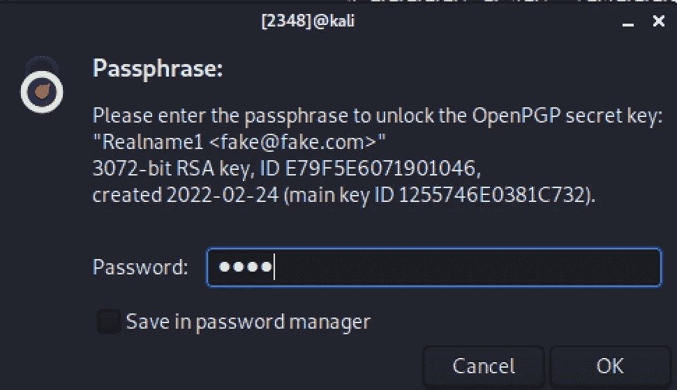

输入密码短语

11.你可以访问未加密的. txt 文件

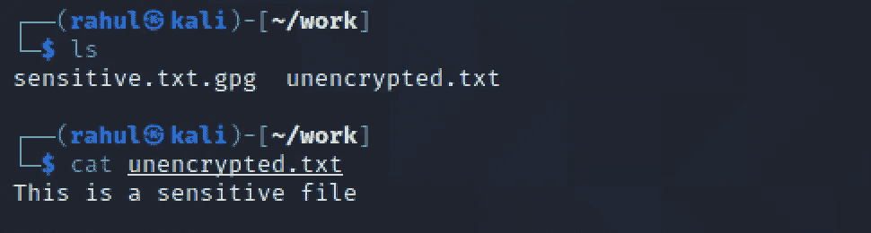

解密文件

**禁用 SSH 用户名和密码登录**

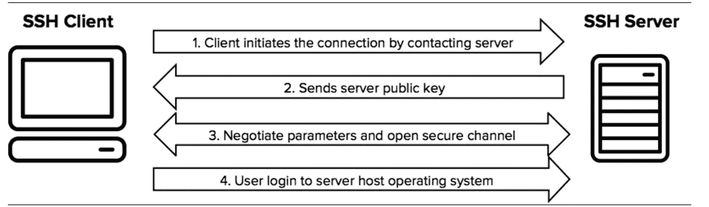

[来源](https://avocado89.medium.com/remote-login-with-ssh-dbb804f82ebf)

如果你在云上或者公司网络上设置了一个 Linux 服务器，那么你可能会意识到你也可以通过密码 SSH 进入服务器。许多不同的组织不会改变这种行为，而是使用密码登录到系统，这样他们就可以修改设置。如果这种配置容易受到暴力攻击，这可能是非常有害的，如果使用弱密码，它很容易被暴力破解，攻击者将获得系统的访问权限。

相反，尝试使用 SSH 密钥登录系统。

要生成 SSH 密钥对，可以输入

```
ssh-keygen
```

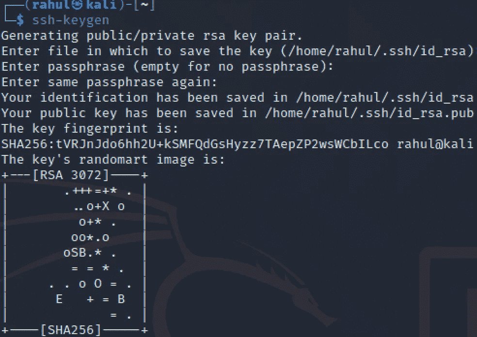

生成密钥对

您可能需要输入密码。因此，下一次使用 SSH 时，您也必须输入一个密码。身份验证将使用密码短语执行，它作为密码工作，但由于它是一个长字符串，它不能轻易被暴力破解

默认情况下，SSH 密钥存储在。ssh 文件夹。

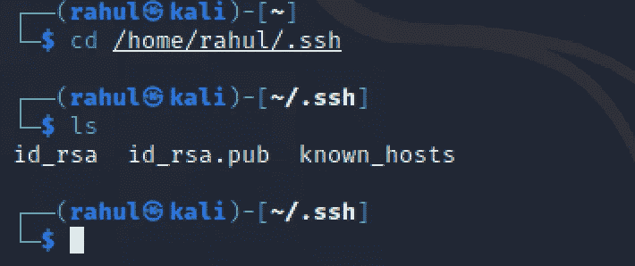

SSH 密钥存储在。ssh 目录

现在，你要做的就是将 id_rsa.pub 文件复制到 authroized_keys 文件夹中。


复制 id_rsa.pub 到 authorized_keys

在最后一步中，将 id_rsa 复制到您的本地机器，现在您可以使用它 SSH 到机器中。

完成后，您可以禁用密码登录。

为此，请打开/etc/ssh/sshd_config 文件

```
nano /etc/ssh/sshd_config
```

向下滚动到显示**密码验证是**的部分，并将其更改为**密码验证号**。此后，密码身份验证将被禁用，任何人都无法使用密码登录系统。

**日志记录和审计**

一旦你的机器暴露在公共互联网上，对手就会盯上它，尤其是当它托管一个应用程序或网站时。因此，启用日志记录并关注日志文件非常重要。它们很繁琐，但可以给你很多有价值的信息，如网站上可能发生的攻击，如果有人试图进行端口扫描，如果有人试图爬网站，它会记录一切。

默认的日志目录是/var/log，基于应用程序、web 服务器、反向代理等。它会在这个目录中创建自己的文件夹。要查看 Apache 日志文件，可以查看/var/log/apache2/access.log 文件。

```
nano /var/log/apache2/access.log
```

同样，您安装的其他应用程序也会有日志文件。

**结论**

从初学者的角度来看，这些是可以用来加强 Linux 服务器安全性的一些方法。如果是高级用户，也可以尝试使用 iptables 和 ufw 来创建防火墙规则。 **ufw** 代表简单防火墙。您可以使用它来阻止端口、应用规则以及只接受来自您信任的 IP 地址的流量。这只是冰山的一角。借助 iptables 和 ufw 可以完成很多事情。您还可以在 Linux 中部署 IDS、IPS 和其他安全控制，因为 Linux 是开源的，您可以做很多事情。

可以安装类似 Fail2Ban 的服务来专门防止对系统的暴力攻击。Fail2Ban 可以配置和设置为与任何服务一起运行，它会根据其规则自动阻止暴力攻击。