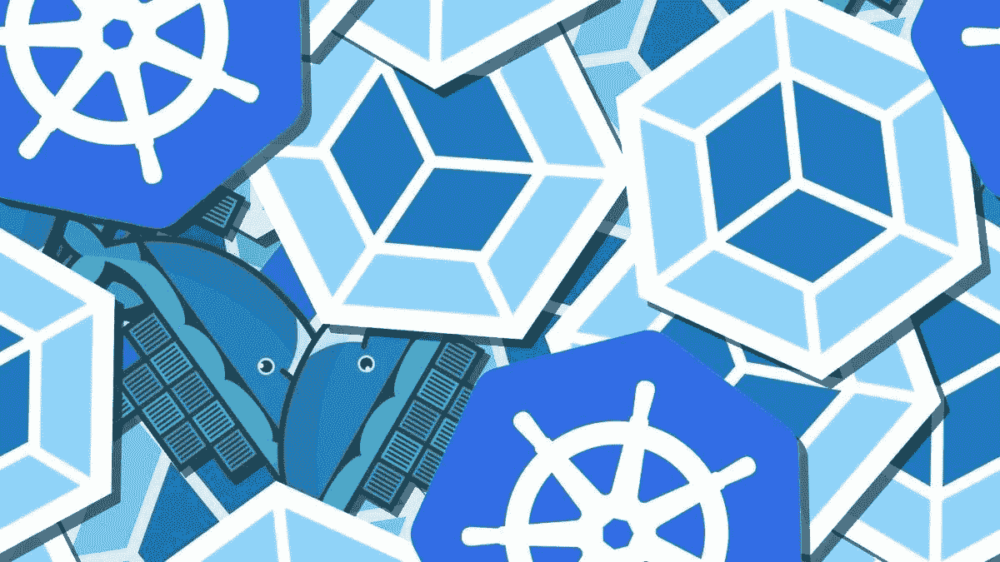
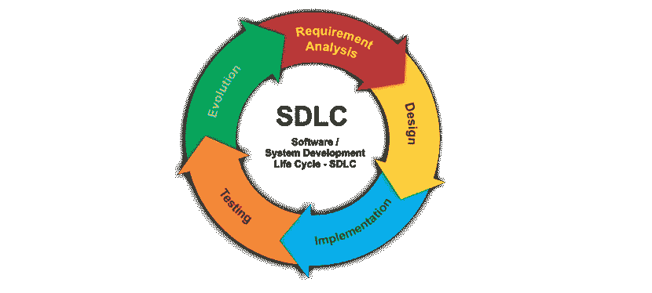
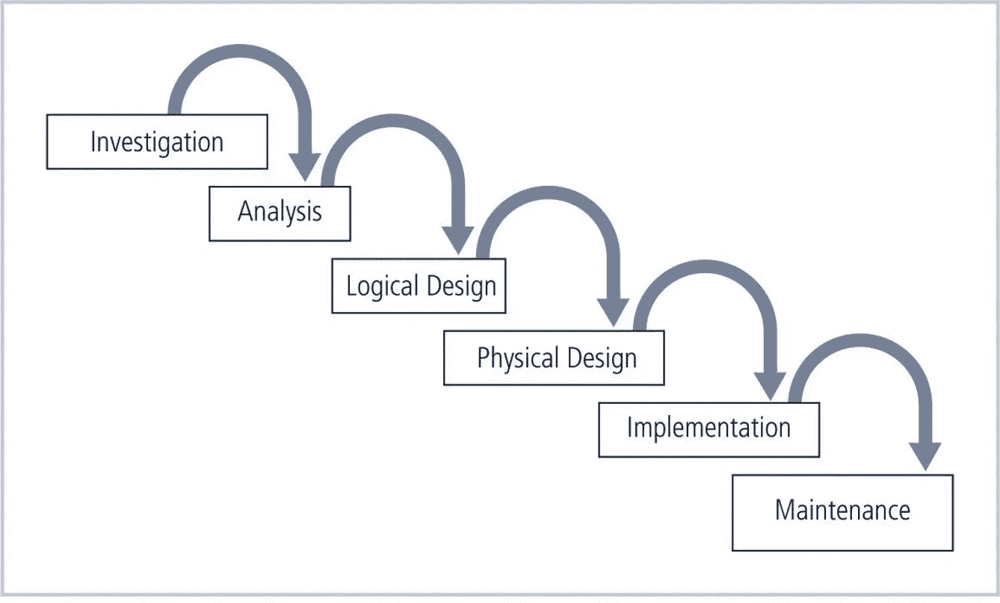

# Kubernetes 应用程序开发中的安全性

> 原文：<https://medium.com/codex/security-in-kubernetes-application-development-c8460ef0284d?source=collection_archive---------8----------------------->

图片:奥列格·米舒丁，Getty Images/iStpckPhoto

# 目标

*   解释 Kubernetes 对安全性的需求。
*   解释如何使用成熟的工具来提高安全性。
*   风险可以通过新的工具和技术来解决。
*   介绍 Kubernetes 安全最佳实践。
*   解释 Kubernetes 解决方案可用工具的用法。

# 什么是 SDLC？

开发团队使用不同的模型，如瀑布模型、迭代模型或敏捷模型。然而，所有模型通常都遵循以下阶段:

[https://addontraining . com/WP-content/uploads/2016/10/SDLC . png](https://addontraining.com/wp-content/uploads/2016/10/sdlc.png)

*   规划和要求
*   建筑和设计
*   测试计划
*   编码
*   测试代码和结果
*   发布和维护

# 什么是安全的 SDLC，为什么重要？

**安全系统开发生命周期**被定义为软件开发周期中的一系列过程和程序，旨在使开发团队能够以显著

*   降低安全风险
*   消除安全漏洞
*   降低成本
*   像传统的系统开发生命周期一样，这个过程被分成许多阶段。

# 如何保护 SDLC？

*   开发人员通常只在测试阶段执行与安全相关的任务，导致发现问题太晚或者根本没有发现问题。
*   随着时间的推移，团队开始整合安全活动，以便在开发周期的早期发现漏洞。
*   考虑到这一点，安全 SDLC 的概念应运而生。
*   安全 SDLC 将渗透测试、代码审查和架构分析等活动集成到开发流程的所有步骤中。

# 采用**安全** SDLC 的优势

采用**安全** SDLC 的主要优势包括:

*   **使安全成为持续关注的问题** —将所有利益相关者纳入安全考虑
*   **帮助在开发过程的早期发现缺陷**——降低组织的业务风险
*   **降低成本** —通过在生命周期的早期检测和解决问题

# 安全 SDLC 是如何工作的？

大多数公司将简单地通过将与安全相关的活动添加到他们已经存在的开发过程中来实现安全的 SDLC。例如，他们可以在设计阶段执行架构风险分析。

在大多数 SDLCs 中有七个阶段，尽管它们可能根据所使用的方法而有所不同，例如敏捷或瀑布:

*   概念
*   规划
*   设计和开发
*   测试
*   释放；排放；发布
*   维持
*   处理

# SDLC 正在运行

[https://slide to doc . com/presentation _ image _ h/14837 c 6630 a6b 8 ECB 251451 ABC 43 FD 16/image-9 . jpg](https://slidetodoc.com/presentation_image_h/14837c6630a6b8ecb251451acb43fd16/image-9.jpg)

# 使用 Kubernetes 保护 SDLC

## **调查&分析**

Kubernetes 中新部署的调查和分析包括一项任务，该任务控制在集装箱化环境中满足新产品部署的条件或要求。

*   **Kube-Bench** 可以在此阶段帮助使用经过认证的 CIS(互联网安全中心)基准执行有针对性的 Kubernetes 集群安全评估。一旦从安全角度清理了环境，我们就可以进一步进入设计和实现阶段。

## **设计&实施**

设计和实施是开发可执行系统以交付给客户的过程。有时这涉及到软件设计和编程的独立活动。在 Kubernetes 中，Docker 映像和清单文件是在这个阶段实现的。

*   Kubesec 可以帮助执行对 Kubernetes 清单的已知漏洞扫描。
*   **Trivy** 可以帮助执行 Docker 图像的已知漏洞扫描。

## **测试&集成**

测试和集成被定义为一个阶段，其中软件模块被逻辑地集成并作为一个组进行测试。一个典型的软件项目由多个软件模块组成。当这些软件模块集成到实时 Kubernetes 环境中时，它们之间的交互可以在这个阶段进行测试。

*   在受限的系统调用下，Seccomp 可以帮助在 Kubernetes 环境中运行 pods。
*   **AppArmor** 可以帮助应用配置文件，并确保 Kubernetes pods 在受限功能下运行。

## **维护**

软件维护是在软件产品交付给客户后对其进行修改的过程。软件维护的主要目的是在识别故障后修改和更新软件应用程序并提高性能。

*   **Falco** 可以帮助持续审计 Kubernetes Pods，以检测维护威胁。

# 主动与被动的安全方法

建立安全的 SDLC 可以分为两种主要方法:

*   **主动方法**关注在项目开始时防止所有可能的缺陷和违规，以安全的方式实施解决方案。
*   **反应式方法**旨在确保发布前的安全性，并在产品的整个生命周期中保持安全性。

## 主动方法示例

*   银行使用带有先进电子系统的厚钢筋混凝土保险库来防止和检测非法闯入。
*   许多公司使用摄像头记录商业活动，其理念是摄像头既能阻止盗窃，又能在盗窃发生时帮助识别肇事者。
*   一些组织已经开始使用入侵检测和响应系统(IDRSes)来尝试检测计算机入侵，然后在检测到攻击时激活防御措施。

## 反应式方法的示例

*   灾难恢复计划
*   使用私人调查服务和损失恢复专家
*   在受损系统上重新安装操作系统和应用程序。
*   切换到其他位置的备用系统。

# 总结一下，积极主动是安全的

*   值得一提的是，主动方法总是首选。
*   如果在发布之前的开发阶段就发现了 bug，那么发现 bug 的后果就不那么严重了。
*   当产品处于开发阶段时，修复 bug 会更便宜、更容易、更快，这导致了在项目的最开始就应该实现安全性的想法。
*   最好的选择是在实际开发之前就考虑安全性，对员工进行安全实践方面的培训。
*   当人们理解了安全程序的重要性以及如何正确地实现它们时，他们就能更好地保护他们的产品的安全。

内容鸣谢: [**纳达·汉尼·谢里夫博士**](https://www.aast.edu/pheed/staffadminview/pdf_retreive.php?url=4_25655_SE731_2020_1__2_1_Lecture%201%20-%20Course%20Outline%20and%20Secure%20SDLC.ppt&stafftype=staffcourses)

加入牧神: [**网站**](https://faun.to/i9Pt9) 💻**|**|[**播客**](https://faun.dev/podcast)**🎙️**|**[**推特**](https://twitter.com/joinfaun) 🐦 **|** [**脸书**](https://www.facebook.com/faun.dev/) 👥**|**[**insta gram**](https://instagram.com/fauncommunity/)**📷| [**Facebook 群**](https://www.facebook.com/groups/364904580892967/)**🗣️**|**[**LinkedIn 群**](https://www.linkedin.com/company/faundev) 💬 **|** [**松弛**](https://faun.dev/chat) 📱 **|** [**云原生** **新闻**](https://thechief.io) 📰 **|** [**更有**](https://linktr.ee/faun.dev/) **。********

****如果这篇文章有帮助，请点击拍手👏按钮几下，以示你对作者的支持👇****