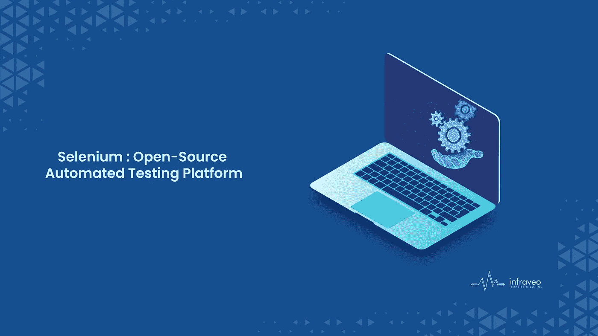

# Selenium:一个 IDE 开源软件

> 原文：<https://medium.com/codex/selenium-an-ide-open-source-software-1aa85a718617?source=collection_archive---------18----------------------->

Selenium:一个 IDE 开源软件

# **简介**

Selenium 是最流行的开源 Web UI(用户界面)自动化测试套件之一。它最初是由 Jason Huggins 在 2004 年开发的，作为思想工作的内部工具。这是一个自动管理网络浏览器的有用工具。它支持所有广泛使用的操作系统和浏览器，它的脚本可以用许多其他语言编写，包括 Python、Java 等。我们将根据需要使用 Python。在 Windows、Linux、Solaris 和 Macintosh 等操作系统上，Selenium 很容易安装。此外，它支持 iOS、Windows Mobile 和 Android 移动操作系统。现在最常用的两个 Selenium Web 驱动程序是 Java 和 C#。您可以用任何受支持的编程语言开发。

# **硒是什么？**

Selenium 是一个开源(免费)的自动化测试平台，用于验证跨许多平台和浏览器的 web 应用程序。Selenium 测试脚本可以用多种编程语言定义，包括 Java、C#和 Python。Selenium testing 是使用 Selenium testing 工具的各种测试的常用术语。

# **硒的成分**

Selenium 已经被全球的自动化测试人员使用了很长时间。硒的四种主要成分如下:

## **1)硒 IDE:**

在 Selenium 套件中，Selenium 的集成开发环境(IDE)是主要工具。它是作为 Firefox 插件和 Chrome 扩展实现的。它使得记录、编辑和调试功能测试成为可能。Selenium Recorder 是它以前的名字。Shinya Kasatani 创造了 Selenium-IDE，并于 2006 年将其捐赠给硒项目。在 Selenium IDE 中创建的脚本是用 Selenese(一种 Selenium 脚本语言)编写的。

## **2)硒 RC(遥控)**

Selenium Remote Control (RC)是一个 Java 服务器，它接收浏览器的 HTTP 命令。它可以更有效地集成到已经存在的单元测试框架中，因为 RC 支持用任何编程语言为 web 应用程序创建自动化测试。因为 html 测试用例需要 Selenium RC 服务器的运行实例，所以每个并行运行应该使用一个单独的端口。

## **3) Selenium WebDriver:**

Selenium Web 驱动首先出现，然后是 Selenium RC。它接收指令并将它们发送到浏览器。自动化测试可以使用各种计算机语言来创建，包括 Java、Python、JavaScript 等等。Selenium WebDriver 支持在任何服务器上进行测试。因此，WebDriver 直接启动和控制浏览器实例。包括 Windows、Mac、Linux、Android 和其他操作系统都与 Selenium WebDriver 兼容。

## **4)硒栅:**

Selenium Grid 是一个服务器，它使得在测试中使用运行在远程机器上的 web 浏览器实例成为可能。一台服务器充当 It 网格的中枢。使用 Selenium Grid 可以集中分析多个浏览器设置和版本，并且可以在多台机器上同时进行测试。如果能够在远程浏览器实例上进行测试，将测试工作负载分布在几台计算机上，并在与不同平台和操作系统兼容的浏览器中运行测试，这将非常有用。

# **结论**

对于测试简单的功能性 web 应用程序，Selenium 易于使用和理解。它允许记录和回放测试 web 应用程序。它可以在不同的浏览器上多次运行一个脚本。Selenium 测试的设置和维护确实需要一些脚本，一些测试过程需要一些第三方连接。然而，它提供了许多令人惊叹的功能，例如用于自动跨浏览器测试的开源 web 框架。