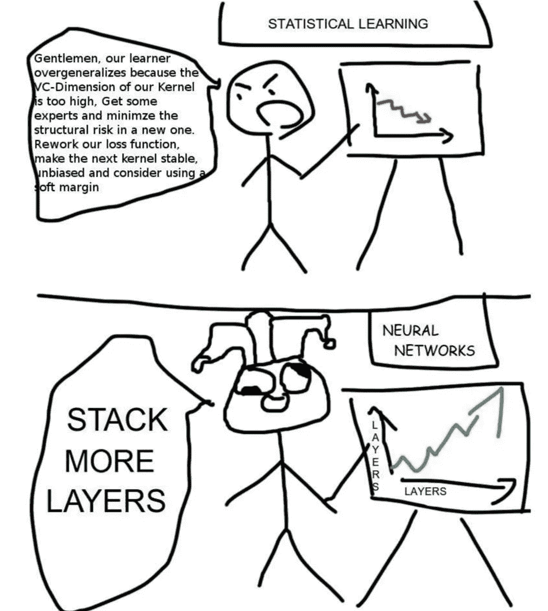

# 自我怀疑的数据科学家，为什么

> 原文：<https://medium.com/codex/self-doubted-data-scientists-and-why-15f6e4dc7de3?source=collection_archive---------6----------------------->

## [法典](http://medium.com/codex)

警告:这篇文章纯粹是为了好玩，无意冒犯任何人，包括数据科学家。

如果你被授予数据“科学家”的头衔，你会自我怀疑我真的是一个“科学家”吗？或者我真的在从事“科学”工作，或者只是数据分析师？

最近，我看到一条推特，上面写道: