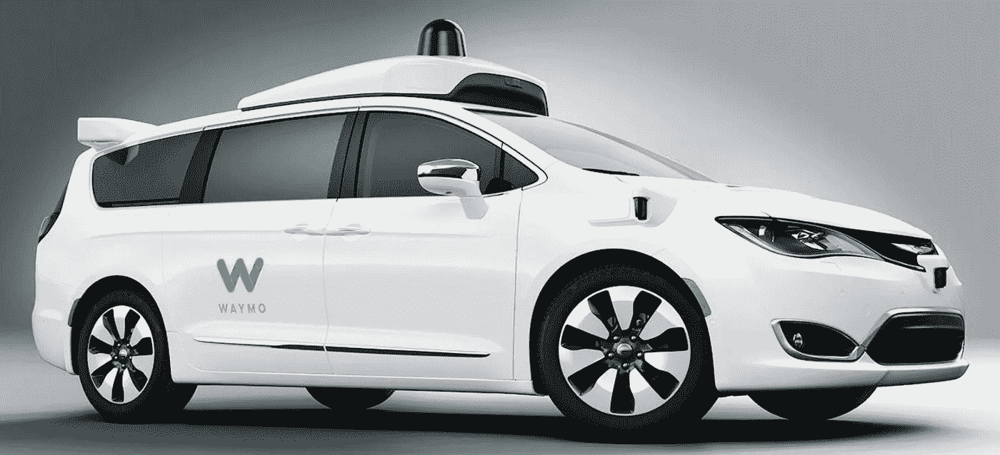

# 自动驾驶汽车:预测

> 原文：<https://medium.com/codex/self-driving-cars-implementation-predictions-bb25586d6c9a?source=collection_archive---------4----------------------->

## 对交通规划的影响

自动驾驶汽车:一本关于战略和破坏的好书

自动驾驶汽车，一个只存在于科幻梦想中的概念，现在已经成为一个发展中的现实。尽管它们还不能在工业上实现，但创新的快速发展创造了一个机械进步需要超越管理条件的环境。机械方面的进步给政府带来了推行…