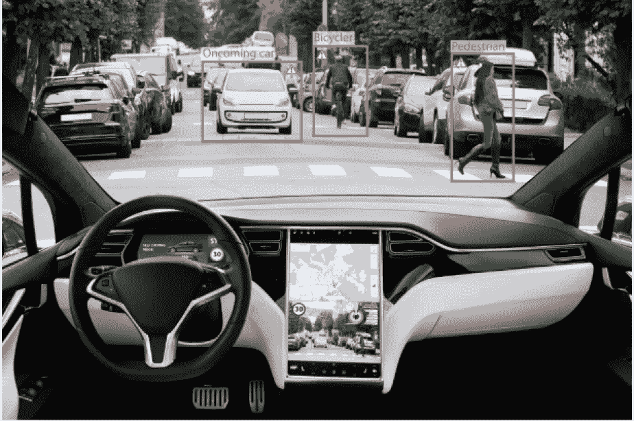

# 无人驾驶汽车:利弊

> 原文：<https://medium.com/codex/self-driving-cras-the-pros-cons-of-automated-vehicles-d08b0bd38a93?source=collection_archive---------2----------------------->

图片:谷歌 CCL

许多公司已经在自动驾驶汽车项目上投入了数百万甚至数十亿美元。谷歌(Google)、特斯拉(Tesla)、优步、奥迪(Audi)、宝马(BMW)等公司正处于这些领域的前沿。这些公司也参与了大多数涉及自动驾驶汽车的测试。

谷歌的 Waymo 具有复杂的高架激光系统，有助于引导车辆。这个激光系统工作紧密…