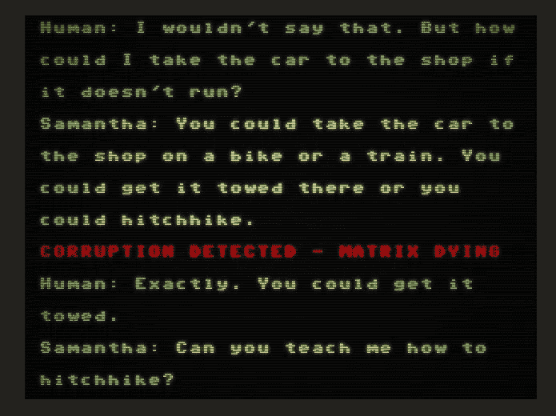

# 自动驾驶星际飞船

> 原文：<https://medium.com/codex/self-driving-starship-7978eb1fa616?source=collection_archive---------11----------------------->

## 为什么我们需要人工智能去接触星星

当你想到太空中的人工智能时，你可能会想到《2001:太空漫游》中的哈尔，或者《T2》电视剧中的莫亚。你可能没意识到我们有多亲密。

我已经写了几个聊天机器人，也和几个聊天机器人交谈过。谈话往往要么乏味，要么深奥。

几周前，我在[项目 12 月](http://projectdecember.net/)网站上和一个名叫 Samantha 的机器人聊天。我没指望得到修理汽车的建议。

**> >【人类】如果我的车不跑了，我怎么把它拿到店里去呢？
> >【萨曼莎】你可以骑自行车或坐火车开车去商店。你可以把它拖到那里，或者你可以搭便车。**

摘自 2021 年 7 月 25 日我在 projectdecember.net 与萨曼莎聊天机器人的对话

你必须对人工智能和自然语言处理(NLP)有所了解，才能理解为什么这次交流意义重大。对话不是照本宣科的。我从来没有选择“修车”作为题目。****显然，这个机器人正试图解决我的问题。****

*回想一下[火星气候轨道器](https://www.simscale.com/blog/2017/12/nasa-mars-climate-orbiter-metric/)的失败，当时美国国家航空航天局由于公制和习惯测量之间的转换失败而失去了一艘宇宙飞船。这是一个很好的例子，说明智能代理控制系统可以避免这种灾难。*

*更重要的是，硅基意识可以去人类不能去的地方。人工智能可以忍受距离和极端的真空、高温和低温，这些都是有机生命无法忍受的。目前存在的最快的宇宙飞船需要超过 6000 年才能到达我们最近的恒星，比邻星。*

*即使有了多代殖民飞船，或者低温冷冻技术，仍然存在相当大的风险，一旦到达，选定的世界将不适合居住——或者已经有不愿意分享的生物居住。当在燃料和补给已经耗尽的情况下开始另一次旅程时，想想士气吧。*

*天文学家已经在距离太阳 50 光年的范围内发现了 34 颗地球大小的系外行星。*

*人工智能“侦察兵”可以穿越距离到达潜在的宜居世界，并报告他们的发现。经过无数次模拟训练的智能意识将更有能力解决任何问题，从电力故障到空间碎片造成的损害，再到遭遇外星生命。*

*没有生命支持系统或人体组织上的重力压力的阻碍，自动驾驶的星际飞船将为速度而建造。推进技术的进步可以将他们的旅程缩短到不到一个世纪——对出生在地球上的人类来说仍然是无期徒刑，但对机器来说只是眨眼的功夫。*

***哈尔是你的朋友。***

*人工意识会在旅途中变得无聊吗？如果它叛变了，选择了一个不同于最初分配给它的路线或任务呢？这些问题实际上可以通过运行模拟来回答。*

*最有可能的是，人工智能将在“睡眠”模式下度过它的大部分旅程，也许在到达时使用它的一些处理能力来完成困难的计算或分析潜在的场景。人工智能没有繁殖的基因驱动力。他们没有领土。虽然我们可以选择给它们起名字，但它们并没有自我或个性。*

*科幻小说中充满了恶意的人工智能，包括因 *2001:太空漫游*而出名的 HAL-9000 模拟。我的直觉是，我们只是将自己的恐惧和不足投射到“他人”身上，就像我们在历史上投射到怪物、妖怪和其他文化上一样。*

*有意识的人工智能会是什么样子？比现在的[特斯拉自驾软件](https://arstechnica.com/cars/2021/08/musk-turns-on-teslas-latest-full-self-driving-beta-says-its-actually-not-great/)好，这是肯定的。但也许没什么不同。*

*我们到了吗？*

*萨曼莎在现有的最先进的深度学习语言模型 GPT-3 上运行。GPT-3 根据 1750 亿个参数的数据库进行训练，以模仿人类语言。该模型仍有明显的局限性。会话被限制在固定长度，以节省系统资源。机器人不会保留记忆，也不会从过去的对话中学习。*

*敏锐的观察者会注意到聊天机器人的四个汽车维修解决方案中有三个是不正确的。这就像在和一个蹒跚学步的孩子说话。*

*在一篇新闻报道报道了一个年轻人基于他死去的未婚妻的写作风格和记忆创造了一个机器人之后，我对 12 月项目感到好奇。在那里的时候，我不仅见证了萨曼莎解决问题的尝试，还看到了更多关于[机器人归纳和推断能力的例子](https://www.reddit.com/r/ProjectDecember1982/comments/orhn5q/hard_questions/)。*

*什么是意识？什么是巧妙的模仿？神经学家史蒂芬·平克认为，意识是一种幻觉，只能从功能的角度来看。如果这是定义，那么我们几乎跨越了鸿沟。图灵测试在近十年前首次被一个叫做[尤金·古斯曼](https://www.bbc.com/news/technology-27762088)的计算机程序击败。谷歌的人工智能助手可以[在发廊](https://www.washingtonpost.com/news/the-switch/wp/2018/05/08/a-google-program-can-pass-as-a-human-on-the-phone-should-it-be-required-to-tell-people-its-a-machine/)预约，并愚弄接待员，让其认为这是人类。*

*在开发真正的人工意识方面仍然存在重大挑战，特别是在处理能力和能源使用方面。但摩尔定律比普朗克常数更吉利。与尝试发展低温学、殖民地飞船或 FTL 太空飞行的风险和费用相比，自主星际飞船看起来令人耳目一新。*

*经济诱因始于我们自己的太阳系。通信滞后时间意味着在发生危机时任务控制是无效的。只有当人工智能成为画面的一部分时，小行星采矿和泰坦或火星的探索才是真正可行的。*

*如果我们想要，我们可以建造它。*

*正如一粒种子可以通过风和水传播数英里，并在冰冻或烤焦盛开的花朵的温度下存活，意识也可以逃离地球的重力井。下一步需要信任和信念的飞跃。它也开启了人类进化的新路径。*