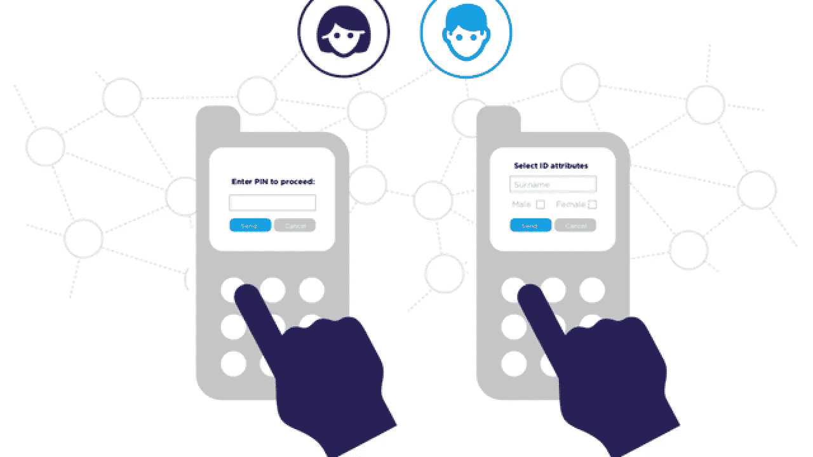

# 自我主权身份(SSI) —优势概述—区块链 Shiksha

> 原文：<https://medium.com/codex/self-sovereign-identity-ssi-overview-with-advantages-blockchain-shiksha-efb9988ddda4?source=collection_archive---------14----------------------->

全世界的互联网用户都在担心网络攻击、安全、商业诚信和消费者隐私。区块链技术和自我主权身份(SSI)原则可以解决这个问题。

我们认为这些技术是数字身份的未来。这些技术旨在平衡准确的数字身份验证和自我宣传。

SSI 代表自我主权身份，这是一种不可篡改的数字身份。它保护用户在个人和专业系统中的登录。SSI 的采用越来越多，因为它比脸书或谷歌注册等数字身份能确保更好的安全性和隐私性。

近年来，互联网用户使用他们的脸书或谷歌个人资料解锁公共域名，如亚马逊、Instagram、易贝、达美乐等。所有这些平台都有被黑客攻击的风险，并且容易在你没有意识到的情况下泄露你的信息。

区块链技术支持 SSI。当一个人使用 SSI 进行任何服务时，他们可以控制自己的身份。在 SSI 系统中，发行者发行数字签名的文档。这些文件建立了对区块链网络的信任。用户可以在区块链的应用程序上使用这些文件来认证数字身份。

# SSI 的元素

**分散标识符(DID):** DID 是指一个可信的网络，在这个网络中，ID 取代了独立自主的用户名。这些 id 可以通过区块链和分布式账本技术交换数据，以确保交易安全和保护隐私。这是一个抵制审查的区块链环境。区块链喜欢 W3C，比特币，以太坊，超账本 Indy 等。使用 DID。

**可验证凭证:**可验证凭证是 SSI 生态系统的重要组成部分。他们用可证实的凭证信息证明每个 DID。可验证凭证的一个例子是给予持有者驾驶车辆的驾驶执照。政府机构在社会服务和公共计划 SSI 生态系统中为受益人创建 did 或可数字验证的身份配置文件。这些系统储存出生日期、年龄、SSN 等信息。受益人的名单。

该系统简化了使用 DID 交换的合格人员的身份认证过程。系统可能会生成一个一次性密码来验证流程。

**面向 SSI 的 EthereumBlockchain:**基于 EthereumBlockchain 开发的 SSI 支持整个生态系统的免密码登录。在 SSI 系统中，所有用户，如人类、团体、组织、机器人等。在 SSI 系统中有可识别的代理配置文件。

# SSI 的优势:

SSI 技术有助于受益者和服务提供者。它为身份管理提供了一个易于审计、透明、安全且无人为错误的系统。

**医疗保健中的数据隐私:**医疗保健行业必须维护病历的隐私。Lumedic Exchange 确保了患者数据隐私的维护。它使用基于 SSI 的身份验证在保险公司、医院和药店之间传输医疗记录。

**传染病管理:**国际航空运输协会(IATA)为预防传染病，保存了全球航空旅客的记录。在这次疫情疫情中，国际航空运输协会一直在确认乘客的新冠肺炎病毒检测和疫苗接种情况。

**员工识别系统:** SSI 提供经济高效的员工识别系统。它有助于在紧急情况下不受限制地行动。在危机情况下，它使医生和护士等紧急医疗工作者能够无障碍地移动。

**公民身份系统:**基于 SSI 的验证系统可用于社会保障、银行、医疗、教育、税收等设施。

**高效的金融服务:** SSI 系统可以在很大程度上提高金融领域的 SSI 速度。Bonifil 的 MemberPass 是美国一个基于 SSI 的身份认证系统，用于解决与信用合作社服务相关的问题。

## 区块链和 SSI:

区块链技术比分布式存储系统有更多的功能。SSI 可以为区块链技术的特性添加 counterpunch。SSI 可以为唯一分散标识符(did)创建事务和生活事件的不可变记录。在网络的边缘，一个可验证的凭证被加密地共享。

最终想法:

采用区块链技术的 SSI 提供了可信和安全的密钥交换。SSI 的范围与日俱增，见证这一历程将会非常有趣。

如果您有更多的疑问，请在下面的框中评论。BlockchainShiksha 团队很乐意帮助你。

*原载于 2022 年 1 月 4 日 https://blockchainshiksha.com***。**