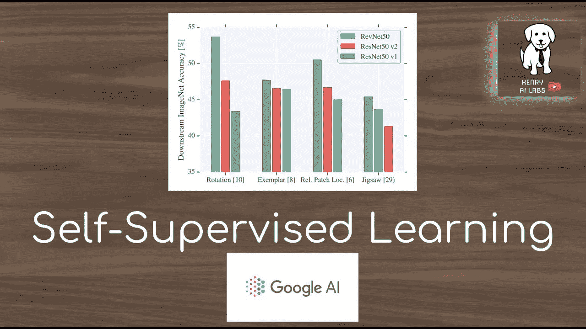
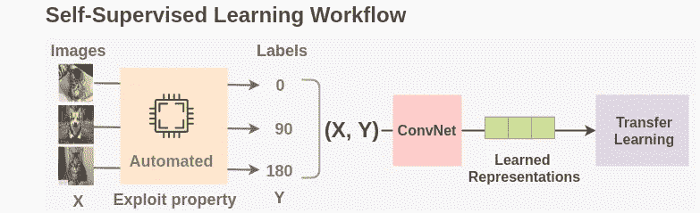
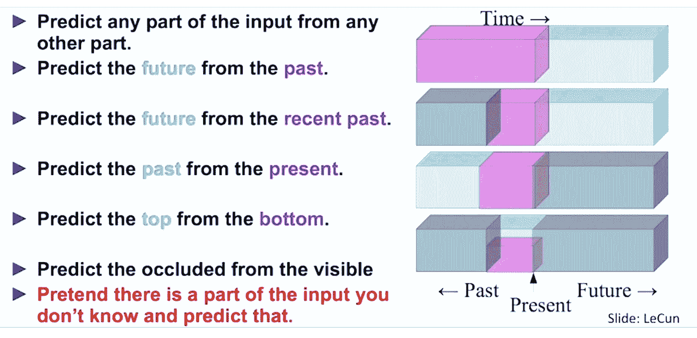

# 自我监督学习

> 原文：<https://medium.com/codex/self-supervised-learning-2eb997d5247c?source=collection_archive---------9----------------------->

来源:谷歌人工智能

近年来，人工智能领域在开发可以从大量仔细标记的数据中学习的人工智能系统方面取得了巨大进展。

这种监督学习的范例在训练专家模型方面有着良好的记录，这些专家模型在他们被训练完成的任务上表现得非常好。不幸的是，仅靠监督学习，人工智能领域能走多远是有限的。

监督学习是构建更智能的通才模型的瓶颈，这些模型可以在没有大量标记数据的情况下完成多项任务并获得新技能。实事求是地说，给世界上的一切贴上标签是不可能的。**也有一些任务没有足够的标记数据，例如为低资源语言训练翻译系统。**

如果人工智能系统能够在训练数据集中指定的内容之外，收集对现实更深入、更细微的理解，它们将更加有用，并最终使人工智能更接近人类水平的智能。

作为婴儿，我们主要通过观察来了解世界是如何运转的。我们通过学习对象持久性和重力等概念，形成关于世界上对象的广义预测模型。在以后的生活中，我们观察这个世界，对它采取行动，再次观察，并通过试错建立假说来解释我们的行动如何改变我们的环境。

**一个有效的假设是，关于世界的广义知识，或常识，构成了人类和动物生物智能的主体。人类和动物的这种常识性能力被认为是理所当然的，但自人工智能研究开始以来，它一直是一个公开的挑战。**

> **某种程度上，常识就是人工智能的暗物质。**

资料来源:amitness.com

人类如何能够在几乎没有监督的情况下，在大约 20 小时的练习中学会驾驶汽车，而完全自动驾驶仍然无法通过人类驾驶员数千小时的数据训练我们最好的人工智能系统？

自我监督学习使人工智能系统能够从数量级更多的数据中学习，这对于识别和理解世界更微妙、更不常见的表达模式非常重要。**自我监督学习长期以来在推进自然语言处理(NLP)领域取得了巨大成功，包括 Collobert-Weston 2008 模型、Word2Vec、GloVE、fastText 以及最近的 bert、RoBERTa、XML-R 等。以这种方式预训练的系统比以监督方式单独训练的系统产生更高的性能。**

## 自我监督学习是预测学习:-

来源:Lilwian.github.io

自我监督学习从数据本身获得监督信号，通常利用数据中的底层结构。自我监督学习的一般技术是从输入的任何观察到的或未隐藏的部分预测输入的任何未观察到的或隐藏的部分(或属性)。例如，正如在 NLP 中常见的，我们可以隐藏句子的一部分，并从剩余的单词中预测隐藏的单词。我们还可以从当前帧(观察数据)预测视频中过去或未来的帧(隐藏数据)。由于自我监督学习使用数据本身的结构，它可以利用跨共现模态的各种监督信号，而完全不依赖于标签。

作为通知自我监督学习的监督信号的结果，术语“自我监督学习”比以前使用的术语“无监督学习”更被接受无监督学习是一个定义不清、容易引起误解的术语，它暗示学习根本不需要监督。

> 事实上，自我监督学习不是无监督的，因为它比标准的监督和强化学习方法使用更多的反馈信号。