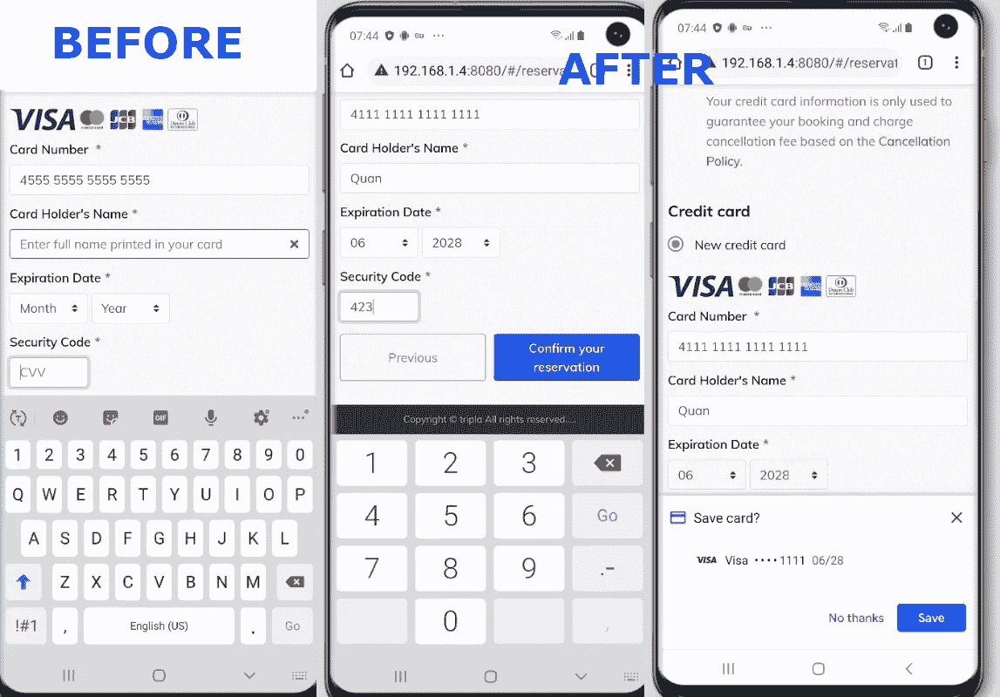

# 语义 HTML:让我们来谈谈输入

> 原文：<https://medium.com/codex/semantic-html-lets-talk-about-inputs-a8d7cef5fddb?source=collection_archive---------9----------------------->


# 什么是语义 HTML

根据谷歌的说法，**语义**的意思是与语言或逻辑中的意义相关。

那么**语义 HTML** 怎么样呢？根据维基百科，**语义 HTML** 是使用 [HTML](https://en.wikipedia.org/wiki/HTML) 标记来加强网站和网络应用中信息的语义或意义，而不仅仅是定义其[表示或外观](https://en.wikipedia.org/wiki/Model%E2%80%93view%E2%80%93presenter)。简而言之:

> **语义成分=有意义的成分。**

语义元素向浏览器和开发人员清楚地表明了它意义。基本上任何人或任何事只要阅读它就能理解元素的作用。

# HTML 中的输入

前端开发人员熟悉`<input>`元素。我们几乎每天都用它来做各种各样的事情。但是你知道 HTML 中的`<input>`有超过 20 种的**吗？**

`<input>` HTML 元素用于为基于 web 的表单创建交互式控件，因此它当然有各种类型的输入数据和控件。

但是我假设阅读这篇文章的人都熟悉`<input>`元素，所以我在这里不告诉你们如何使用`input`标签。我写这篇文章的原因是想谈谈如何在语义上使用`<input>`元素。

# 语义输入

## 使用带有 id 的标签

而不是:

```
<label>Username</label>
<input type="text">
```

我们应该写:

```
<label for="username">Username</label>
<input type="text" id="username">
```

这可以帮助我们增加触摸面积，用户可以点击标签或输入来聚焦

## 请使用自动完成功能！

`autocomplete`属性用于…自动补全，lol。但是如果输入的是信用卡或用户名，那就太有用了。

## **咏叹调标签是必要的**

属性定义了一个标记交互元素的字符串值。有时候你的输入没有标签，那么盲人用户怎么能理解他们输入的是什么呢？此时`aria-label`会有所帮助，因此屏幕阅读器可以点击输入来理解它做了什么

## 占位符比仅仅一个占位符更重要

属性指定了一个提示，它描述了一个输入字段的预期格式。因此，用户可以理解，输入的是电话号码，或信用卡号码，或任何东西…

## 仅在需要时使用`spellcheck`

`spellcheck`属性指定是否检查元素的拼写和语法。但并不是每个输入都需要它。尤其是信用卡或用户名

## 正确的输入方式可以提高 UX

如果您正在输入电话号码或信用卡号码，请确保使用`inputmode='numeric'`,以便手机用户可以有正确的输入模式



# 结论

这只是我在语义 HTML 系列的第一篇文章。我希望这个系列能够帮助你提高用户的体验和对语义 HTML 的了解

# 遗言

虽然我的内容对每个人都是免费的，但是如果你觉得这篇文章有帮助，[你可以在这里给我买杯咖啡](https://www.buymeacoffee.com/kylele19)