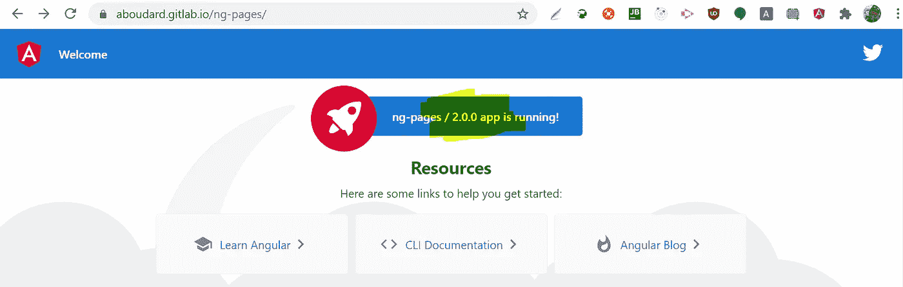

# 使用 Gitlab CI 的语义发布角度

> 原文：<https://medium.com/codex/semantic-release-angular-with-gitlab-ci-ba961c7fe3e?source=collection_archive---------4----------------------->


并发布在 Gitlab 页面上。并用 APP_INITIALIZER 显示我们的版本。

在本文中，我们将介绍在 Gitlab CI 管道的帮助下发布 Angular 应用程序的几个步骤，使用语义发布根据我们的提交生成适当的版本，并将该版本推送到部署有 Gitlab 页面的应用程序中。

你需要一些 git commit 和 gitlab 的基础知识，但并不复杂。最终的产品离生产就绪还很远，但是对于那些投身于 devops 问题的人来说，这是一个很好的开始。你会在例子中看到，我们只在主节点上工作，因为我不想添加分支、分叉和合并请求的问题。

> **注**:查看优秀的凯文·克罗伊泽关于[如何在 CI/CD 中加载 Angular](/angular-in-depth/handling-angular-environments-in-continuous-delivery-eeaee96f0aae) 的环境特定配置的这篇文章。

# 在 Angular 应用程序中初始化 Gitlab CI

这是第一步，很简单，你可以找到相关的资源。[在这个视频](https://www.youtube.com/watch?v=Jav4vbUrqII)中，了解一下**的基本情况。gitlab-ci.yml** 文件。请注意，您不必在 Gitlab 项目配置中做任何事情来激活 CI/CD，如果您转到项目中的`/settings/ci_cd#runners`，您应该会看到 [Runners](https://docs.gitlab.com/runner/) 已经被激活，这些是共享资源，因此不要期望它们总是以毫秒为单位响应，但基本上，它们将在目标分支上的每次提交时运行。


默认启用 Gitlab CI 运行程序

完成后，您可以将 Angular 应用程序上传到您的存储库。我们将有 4 个步骤:

*   试验
*   释放；排放；发布
*   发布后
*   部署

## 在您的管道中配置最小测试

当然，这对于演示来说不是强制性的，但是对于我们的管道来说这是一个好的开始，如果 lint 或测试失败了，我们认为生成一个发布不是一个好主意。下面是我们的**。gitlab-cy.yml** 可能看起来像:

```
image: weboaks/node-karma-protractor-chromestages:
  - testtest:
  stage: test
  script:
    - export CHROME_BIN=/usr/bin/google-chrome
    - npm install -g @angular/cli@9.1.4
    - npm install
    - npm run lint
    - npm run test:ci
  only
  - master
```

> 请小心您的阶段中的“only”参数，因为由于语义发布会在您的回购中创建一个标签，如果您没有指定“only”，发布的创建将触发任何没有正确定位的阶段。


查看由发布触发的失败管道。

一定要小心，按照最新版 Docker 图片的说明:[https://hub . Docker . com/r/web oaks/node-karma-provider-chrome/](https://hub.docker.com/r/weboaks/node-karma-protractor-chrome/)。特别注意你将要使用的浏览器，配置 karma 运行 Chrome 而不是 Chrome。

```
// **karma.conf.js**
customLaunchers: {
      ChromeHeadlessCI: {
        base: '**Chromium**',
        flags: ['--no-sandbox', '--headless', '--disable-gpu', '--remote-debugging-port=9222', '--single-run']
      },// **package.json**
scripts: {
   "test:ci": "ng test --watch=false --browsers=ChromeHeadlessCI",
```

从现在开始，我们有两个独立的任务:

*   在 ci/cd 流程中运行语义发布脚本。
*   使用由此产生的版本，并在 Angular 应用程序中呈现给用户。

# 在您的项目中配置语义发布。

主要目标是在您的存储库中生成一个版本。这个版本是一个特定的 git 标签，没有链接到您的实际代码。所以请记住，我们不会改变我们的应用程序的代码库，但仍然希望向用户显示版本。您可以转到您的项目并创建一个发布:`/releases/new`


在 Gitlab 界面中创建一个发布

Gitlab 版本可以通过用户工具或简单的 git 命令手动生成。[语义发布](https://semantic-release.gitbook.io/semantic-release/)是一个项目，将分析我们的提交，并为我们产生这个版本。

如果你想要一个完整的过程介绍，请看这篇文章。你有你需要的所有信息，甚至更多关于你的分支策略的信息。我们将从这几点中保留:

*   生成个人访问令牌
*   配置 GITLAB_TOKEN 变量
*   配置语义发布
*   在管道中运行语义发布

## 生成个人访问令牌

这是在您的个人资料页面`/profile/personal_access_tokens`中完成的，正如文章中所述，使用 **api** 和 **write_repository 作用域**，这样 runner 将能够读取提交并发布新版本。


Gitlab 个人访问令牌

## 配置 GITLAB_TOKEN 变量

这个变量是按照惯例命名的，就像 Github 或其他的自动化插件一样。只需转到`/simple-ci/-/settings/ci_cd`并粘贴您刚刚创建的令牌的值。


## 配置语义发布

我们将要求 semantic release 生成发布版本，并将版本号保存在一个名为 VERSION.txt 的文件中(我们稍后将使用它)。您只需要在项目的根文件夹中创建一个名为. releaserc.yml 的文件。

```
// **.releaserc.yml**
plugins:
  - "[@semantic](http://twitter.com/semantic)-release/commit-analyzer"
  - "[@semantic](http://twitter.com/semantic)-release/release-notes-generator"
  - - "[@semantic](http://twitter.com/semantic)-release/exec"
    - verifyReleaseCmd: "echo ${nextRelease.version} > **VERSION.txt**"
  - "[@semantic](http://twitter.com/semantic)-release/gitlab"
branches:
  - "master"
  - "+([0-9])?(.{+([0-9]),x}).x"
  - name: "alpha"
    prerelease: "alpha"
```

## 在我们的管道中运行语义发布

/exec 插件将创建我们的 VERSION.txt 文件。该工具将在我们的发布阶段被调用，如下所示:

```
stages:
  - test
  - release
[...]
release:
  image: node:13
  stage: release
  only:
    refs:
    - master
    - alpha
    # This matches maintenance branches
    - /^(([0-9]+)\.)?([0-9]+)\.x/
    # This matches pre-releases
    - /^([0-9]+)\.([0-9]+)\.([0-9]+)(?:-([0-9A-Za-z-]+(?:\.[0-9A-Za-z-]+)*))?(?:\+[0-9A-Za-z-]+)?$/
  script:
    - npm install [@semantic](http://twitter.com/semantic)-release/gitlab [@semantic](http://twitter.com/semantic)-release/exec
    - npx semantic-release
  artifacts:
    paths:
      - **VERSION.txt**
```

我们使用另一个图像，因为我们只需要这个阶段的节点。注意我们只安装了 2 个包，/gitlab 和/exec，然后用 npx 调用 semantic-release。您还会看到 VERSION.txt 文件被声明为一个**工件**，以便下一阶段能够读取它。

> 注意，目前我们需要这个“绝招”，因为没有其他办法，跟随 github 上的这个讨论，了解人们在使用他们的发布版本号打印输出时遇到了什么样的问题:[https://github . com/semantic-release/semantic-release/issues/753](https://github.com/semantic-release/semantic-release/issues/753)

# 为 Angular app 生成一个 json 文件

这一步将简单地从以前的文件中提取版本，并把它放在一个 JSON 文件中，该文件将放在已部署应用程序的文件夹中。我更喜欢两个不同的阶段，以分离逻辑。

```
stages:
  - test
  - release
  - postrelease
[...]
postrelease:
  stage: postrelease
  script:
    - echo "test release"
    - test -f **VERSION.txt**
    - appversion=`cat VERSION.txt`
    - sed "s/\"app_version\".*/\"app_version\":\"${appversion}\"/" src/configuration.json > **configuration.json**
  artifacts:
    paths:
      - configuration.json
  only:
  - master
```

在这个脚本中，我们检查 VERSION.txt 文件是否可用，替换 JSON 文件中的内容，并将这个新文件声明为工件。

这个 configuration.json 文件包含在我们的 repo 中(在/src 文件夹中)，它在生命周期或源代码中从不改变，所以本地版本将总是固定的，比如说 1.0.0，或者？。？。？。


我们应用程序的/src 文件夹中的 configuration.json 文件示例。

> 关于这个文件，它是一个普通的文件，当由 Gitlab Pages 或任何类似 Nginx 的 HTTP 服务器提供服务时，您只需要将它放在一个适当的 web 文件夹中，以暴露其内容。但是在 dev 模式下，当运行 ng serve 或者运行测试时，您需要将这个文件声明为 karma 的资产和代理。

# 部署 Angular 应用程序和配置文件

最后一个阶段将简单地使用 Gitlab 页面部署应用程序，当它完成时，它将复制 deploy 文件夹中的工件。这个阶段非常简单，因为在 Gitlab 页面上部署就像创建一个名为“Pages”的阶段一样简单。查看本页以供参考:[https://docs.gitlab.com/ee/user/project/pages/](https://docs.gitlab.com/ee/user/project/pages/)

```
stages:
  - test
  - release
  - postrelease
  - pages
[...]
pages:
  cache:
    paths:
    - node_modules/
  stage: deploy
  script:
    - npm install -g [@angular/cli](http://twitter.com/angular/cli)@11.2.6
    - ng build --base-href "[https://username.gitlab.io/ng-pages/](https://aboudard.gitlab.io/ng-pages/)"
    - mv dist/ng-pages/* public/
    - test -f **configuration.json**
    - mv configuration.json public/
  artifacts:
    paths:
    - public
  only:
  - master
  - pages
```

正如我们在文档中看到的，Gitlab Pages 只获取/public 文件夹中的文件，这就是为什么我们使用您在这里找到的适当域名:`/pages`来构建应用程序，然后将结果移动到/public 文件夹中。


构建完成后，我们还将 configuration.json 文件移动到/public 文件夹中，它将覆盖现有的文件。“页面”阶段将简单地部署该文件夹下的所有内容。

# 在 Angular 应用程序中显示发布版本

这是最后一步，可以先完成，因为我们不需要部署来使它工作。基本上，我们在 APP_INITIALIZER 中请求 configuration.json 文件，并在服务中公开它。

## 将文件作为资产公开

```
// **angular.json**
"assets": [
              "src/favicon.ico",
              "src/assets",
              "src/configuration.json"
            ],
```

这样，它将总是发布在构建的/dist 文件夹中，这就是为什么我们在 ng 构建之后移动我们的工件。

对于单元测试，我们需要声明如果需要，我们可以访问这个文件。

```
// **karma.conf.js**
files: [
      { pattern: './src/configuration.json', watched: false, included: false, served: true, nocache: false }
     ],
     proxies: {
      "/configuration.json": "/base/src/configuration.json"
     }
```

## 在 Angular 应用程序中请求文件

一个简单的方法是创建一个调用服务的 APP_INITIALIZER 提供程序，这个服务进行 HTTP 调用。

```
// **app.module.ts**
export function loadConfigurations(configService: ConfigService): () => {} {
  return () => configService.getConf();
 }[@NgModule](http://twitter.com/NgModule)({
  declarations: [ AppComponent ],
  imports: [
    BrowserModule, AppRoutingModule, HttpClientModule
  ],
  providers: [
    {
      provide: APP_INITIALIZER,
      useFactory: loadConfigurations,
      deps: [ConfigService],
      multi: true
    }
```

> 请注意，从 Angular 12 开始，我们现在可以在 APP_INITIALIZER 中使用 Observables，不再需要调用 toPromise()。查看本文:[https://dzhavat . github . io/2021/02/25/using-observable-in-app-initializer . html](https://dzhavat.github.io/2021/02/25/using-observable-in-app-initializer.html)

这将是配置服务:

```
// **config.service.ts**
[@Injectable](http://twitter.com/Injectable)({
  providedIn: 'root'
})
export class ConfigService {
  configData: Configuration;
  constructor(private http: HttpClient) { }
  getConf(): Promise<Configuration> {
    return this.http.get<Configuration>('configuration.json')
      .pipe(
        tap(result => {
          this.configData = result;
        })
      ).toPromise();
  }
}
```

在任何组件中，我们使用该服务并公开其中的任何内容(它可能是一个可观察到的值，而不是一个简单的值，但它真的不应该在应用程序运行时发生变化)。

```
// **app.component.ts**
export class AppComponent implements OnInit {title = 'ng-pages';
  configData: Configuration;constructor(private configService: ConfigService) {}ngOnInit(): void {
    this.configData = this.configService.configData;
  }}
```

结果在这里是在线的，有一个简单的版本显示:



https://aboudard.gitlab.io/ng-pages/

Gitlab repo 的原文可以在这里找到:

【https://gitlab.com/aboudard/ng-pages/ 

> 最后一件事，当你在回购协议中提交重大变更时要小心，你必须尊重一条规则，以便将结果视为主要版本！看这里:[https://github.com/semantic-release/semantic-release](https://github.com/semantic-release/semantic-release)