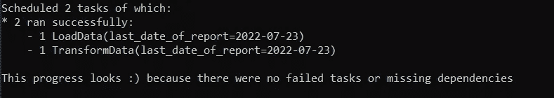
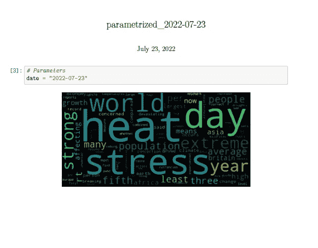

# 使用 Python 的 Luigi 进行半自动报告

> 原文：<https://medium.com/codex/semi-automatic-reports-with-pythons-luigi-aec32abecbc8?source=collection_archive---------1----------------------->

# 【Luigi 的简单报告

作为一名分析师，给你的利益相关者(项目经理、同事、老板)提供价值的最简单的方法之一就是给他们定期的报告。

这可以采取 Tableau 中的仪表板、帮助模拟场景的托管应用程序甚至普通的 excel 电子表格的形式。

不幸的是，我们并不总是有技术支持来实现这些。例如，您可能无法访问服务器。在这种情况下，您可以使用 Python 包 Luigi 为定期更新创建一个本地管道。Luigi 允许您使用一个命令就可以获得业务任何部分的更新报告，并与您的利益相关者共享。

在本文中，我们将介绍如何使用 Luigi 任务建立一个文件来提取 tweets，并从这些 tweets 中创建一个单词云。如果你已经知道 Luigi 的基本知识，并且只想要代码，你可以在 [Github](https://github.com/gratipine/luigi-flow) 中找到。

# **演示概述**

这个项目连接到 Twitter，并从用户@ ECONdailycharts——每日图表的经济学人账户——获取上周的推文。我们只得到文本。一旦我们有了文本，我们就把它放入一个很长的单词列表中，并清除所有的逗号和符号。我们把这些数据记在笔记本上，然后创建一个单词云。单词云被转换成 pdf 格式，你可以很容易地与任何需要的人分享。

文章的标题说这些报告是半自动的。它们不是全自动的，因为要获得它们，您仍然需要运行一个命令。但是，可以很容易地将报告完全自动化，例如，通过将它们绑定到一个 chron 作业，该作业以固定的时间间隔执行您需要的命令。

# **路易吉概述**

Luigi 是一个帮助创建管道的 Python 库。它可以为你做批处理作业，处理可视化和打印错误。欲了解更多信息，您可以阅读[完整文档](https://luigi.readthedocs.io/en/stable/index.html)。

它在功能上类似于气流。Luigi 的好处是无需技术支持即可在本地轻松使用。

这一点尤其重要，因为你是团队中第一个担任分析职能的人，或者公司没有太多的分析/数据科学技术支持。

Luigi 以任务的形式运行。这些任务中的每一个都被表示为一个具有三种方法的类:

*   要求—在运行该任务之前，我们是否要求任何条件为真。例如，管道中的第二个任务可能要求完成第一个任务。
*   运行—任务的主要部分
*   输出—存储任务输出的路径。通过这种方法，Luigi 知道任务何时成功完成。

Luigi 在您的 repo 的根目录下的单个文件中使用。文件名并不重要，但是为了一致起见，我们使用的文件名叫做 tasks.py。)可以保持原样，就好像你没有使用 Luigi 一样。

# **项目中的任务**

我们将在这个演示中看到的[项目总共有 4 个任务:](https://github.com/gratipine/luigi-flow)

*   LoadData —从 Twitter 下载数据
*   TransformData —将 Twitter 数据转换成对分析有用的东西
*   CreateNotebook —用我们决定使用的数据参数化一个笔记本
*   RenderPDF 将参数化的笔记本渲染为 PDF

您可以通过在命令行上执行来运行任何任务

```
python -m luigi --module name-of-the-file-you-have-the-tasks task-name --local-scheduler
```

## **LoadData**

这个任务在 Twitter 中搜索 ECONdailycharts 用户在过去一周的所有推文，然后将它们保存为 pickle 文件。这是管道中的第一个任务，因此不需要之前的步骤。然而，我们确实需要指定运行和输出方法。output 方法表示如果任务已经完成，系统应该期望什么样的结果。在这种情况下，我们认为系统应该在缓存目录中有一个名为 data_out_date_of_report.pkl 的 pickle 文件。

output 方法返回 LocalTarget 对象。LocalTarget 对象从 FileSystemTarget 类继承行为。你可以在[代码](https://luigi.readthedocs.io/en/stable/_modules/luigi/local_target.html)中阅读该行为的文档。你可以在这里看到父类 FileSystemTarget [的行为](https://luigi.readthedocs.io/en/stable/_modules/luigi/target.html)。

run 方法说明任务中发生了什么。在这种情况下，任务从 Twitter 中提取数据，并将其保存在输出方法预期的路径中。

因为 output 方法返回的是一个对象，而不是一个指定文件名的字符串，所以我们通过使用 self . output()path 得到文件名，Self 指的是类，output()是方法。在 self.output()中，我们获得了类 LocalTarget 的一个实例。该实例具有属性，其中之一是 path。当我们创建 LocalTarget 实例时，我们将该路径设置为等于我们传递给它的字符串。Self .输出()。path 与任务类中的其他函数交流输出的路径。

这是一种复杂的设置方式。您可能会想，在任何需要重用文件名的地方重复这些文件名是否更容易。这可能会节省您设置复制和粘贴的时间。然而，编码是一个迭代的过程，您可能需要在以后更改文件名。如果您必须在多个地方更改它，您很容易忘记在一个地方进行更改，从而导致您的程序出现 bug。

下面你可以看到这个任务的完整代码。

## **转换数据**

转换任务要求我们首先下载数据。这是有道理的——如果我们没有数据，那么我们就没有东西可以利用。把这个作为一个要求，让生活更轻松。如果我们之前没有运行 LoadData 任务，我们只是决定运行转换任务，由于输出方法，Luigi 将看到下载任务之前没有运行过(或者根本没有运行过，或者没有使用我们需要的特定参数运行过),它将首先运行它。

一旦完成，它将返回到转换任务，执行它的 run 方法，如果完成，告诉你它的状态。



下面是示例项目中的任务:

## **创建笔记本**

此任务使用模板创建一个参数化的笔记本。新笔记本电脑具有:

*   日期参数
*   您要从中读取数据的数据源
*   一段代码来创建你正在阅读的数据源的单词云。

此外，它还保存了原始单元格的标签。这意味着，如果您在模板笔记本中将某个内容标记为“要删除”，该标记将保留在新笔记本中。

该任务要求您已经运行了转换任务，而转换任务又要求您已经运行了下载任务。如果管道中有多个连续的步骤，则不必在 requires 方法中指定它们。最简单、最干净的解决方案是为每项任务指定最后一个您需要的。但是，如果一个任务有多个并行输入，可以在 requires 方法中用 yield 关键字而不是 return 来指定它们。

如果满足要求，创建笔记本任务运行一个 [papermill](https://papermill.readthedocs.io/en/latest/usage-workflow.html) 命令，允许你在一个新的地方创建一个参数化的笔记本。它设置日期参数并读入正确的数据。该命令通过将带有正确参数的笔记本保存到一个新位置来完成。你可以在笔记本[这里](/p/5d7ad05b44db)了解如何设置参数和单元格标签。

有两种方法可以执行 papermill。您可以使用如以下任务所示的 CLI 命令，也可以直接在脚本中调用 papermill，如下所示:

下面是整个任务的样子:

## **RenderPDF**

“渲染 pdf”任务要求我们有一个笔记本，其中包含上一任务中的正确日期参数。一旦我们确保上一个任务中的参数化笔记本存在，我们就通过 nbconvert 将该笔记本呈现为 pdf。你也可以转换成其他东西，但是 pdf 对几乎任何系统都是友好的，所以如果你只是想给某人传递一份报告，它们是一个不错的选择。

在 run 方法中，我们指定要运行一个命令来删除标记为“remove-cell”或“input-cell”的单元格。我们也说我们想要 pdf 在哪里。默认情况下，新的 pdf 文件将与原始笔记本放在同一个文件夹中，因此，如果您想将它放在其他地方，您必须以相对方式编写输出路径。例如，如果您的笔记本在模板目录中，但是您希望 pdf 在报告目录中，并且模板和报告在同一个根目录下，您的输出方法应该是返回

```
luigi.LocalTarget(f"../reports/report_{self.last_date_to_report}.pdf")
```

模板中的任务如下所示:

## **运行管道和最终结果。**

要从头到尾执行，只需在命令行上运行最后一个任务。

```
python -m luigi --module tasks RenderPDF --local-scheduler
```

这将转到执行 RenderPDF，它将转到 CreateNotebook 任务，然后是转换任务，一直到下载任务。每一个都将依次运行，将其成功状态传递给下一个。

一旦所有任务都运行了，我们就有了一个 pdf，其中包含两个内容——日期参数的设置，这样您就可以知道哪个日期运行了，以及来自@ ECONdailycharts 帐户的过去 7 天推文的文字云。看起来是这样的:



## **哲学笔记**

我们试图让每个任务只有一个输出，即使一个任务有多个输入。这使得跟踪错误变得更加容易，也使得以后重现这些步骤变得更加容易。例如,“创建笔记本”和“渲染 pdf”任务可以是一个单独的任务，但是如果我们稍后需要仔细检查我们的工作，那么同时拥有 pdf 和创建它的参数化笔记本会更容易。例如，如果您正在使用的某个单元格在您将它设置为删除时出现，您可能遇到 papermill、标签或其他问题。如果您总是保存中间步骤，这将更容易诊断。

# **故障排除**

## **create notebook 任务**的 papermilled 笔记本中未显示的参数

您需要用“parameters”标签指定哪个单元格保存您的参数。

## **运行 RenderPDF 任务时未找到此类文件**

您需要指定文件位置，以便它们相对于您执行任务的位置。如果您在 repo 的根目录下运行 task 命令，那么即使您的笔记本位于 scripts 或 notebooks 文件夹中而不在根目录下，您仍然需要设置您的文件位置，就好像笔记本在根目录下一样。

示例:

"./data/data.csv "而不是"。/../data/data.csv "

## **没有这样的文件或目录:' cache \ \ cache \ \ template . pdf '**

pdf 将相对于您的笔记本电脑的位置进行渲染。如果您的笔记本在缓存目录中，默认情况下，您的 pdf 也会在该目录中呈现。您必须设置相对于该目录的路径。

## **任务运行，但状态为失败**

看看你的输出方法说它期望什么。例如，您的输出方法可能会说在任务结束时会有一个名为“log.txt”的文件，但是在您的 run 方法中，您保存的是“logs.txt”。甚至一个字母的差异都会让 Luigi 认为任务失败了。

## **使用了错误的命令，导致程序挂起**

如果您使用的是 cmd /k 而不是 cmd /c，那么下次尝试运行该任务时，您很可能会得到类似如下的结果:

```
Pid(s) {number_of_pid} already running
```

在这种情况下，您可以使用以下命令终止该进程。

```
taskkill /PID number_of_pid
```

如果它有理由抱怨:只能强制终止该进程(使用/F 选项)，请尝试以下命令:

```
taskkill /PID number_of_pid /F
```

# **消息来源**

广泛的文档:

*   [本次演示的回购](https://github.com/gratipine/luigi-flow)
*   [造纸厂文件](https://papermill.readthedocs.io/en/latest/usage-workflow.html)
*   [Luigi 文档索引](https://luigi.readthedocs.io/en/stable/index.html)
*   [任务的 Luigi 文档](https://luigi.readthedocs.io/en/stable/tasks.html)
*   [参数化 jupyter 笔记本](https://www.wrighters.io/parameters-jupyter-notebooks-with-papermill/)

故障排除:

*   [将 Jupyter 笔记本渲染成 pdf 格式](/p/5d7ad05b44db)
*   [从 Twitter 获取数据](https://www.askpython.com/python/examples/extracting-tweets-using-twitter-api)
*   [从 Twitter 2 中提取数据](https://datascienceparichay.com/article/get-data-from-twitter-api-in-python-step-by-step-guide/)
*   [搜索特定推文](https://towardsdatascience.com/searching-for-tweets-with-python-f659144b225f)
*   [在 Python 脚本中执行命令](https://datatofish.com/command-prompt-python/)
*   [PID 杀死一个任务进程(Windows)](https://www.shellhacks.com/windows-taskkill-kill-process-by-pid-name-port-cmd/)
*   [local target 类的代码](https://luigi.readthedocs.io/en/stable/_modules/luigi/local_target.html)
*   [文件系统目标类代码](https://luigi.readthedocs.io/en/stable/_modules/luigi/target.html)