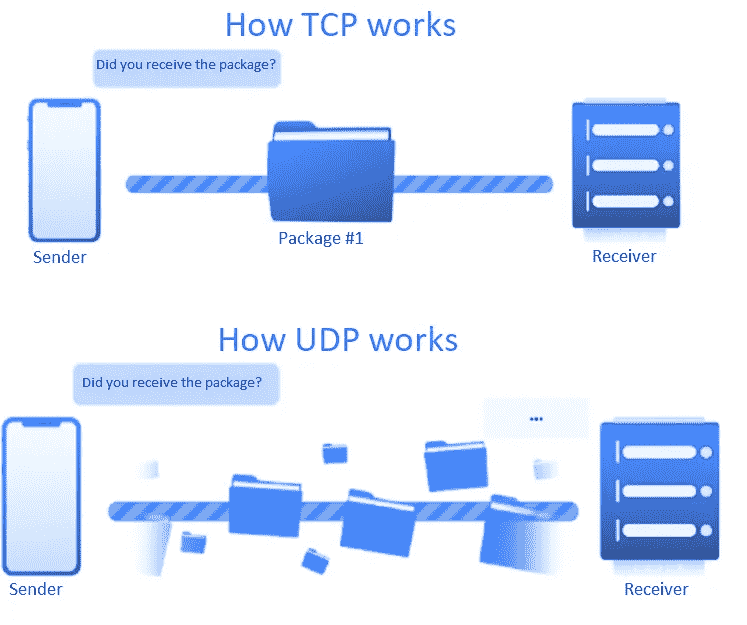
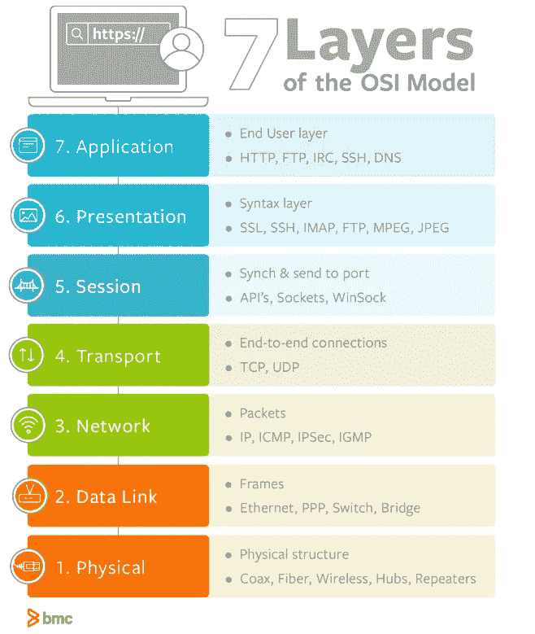

# 发送和接收—7 层 OSI 模型

> 原文：<https://medium.com/codex/send-receive-the-7-layer-osi-model-e475829b999?source=collection_archive---------8----------------------->

无线连接是人类最重要的基本需求之一。但是怎么可能发送或接收数据呢？什么是协议，使用哪些协议？这篇文章解释了网络的基本知识以及 OSI 模型的七层是什么。

[https://unsplash.com/photos/1lfI7wkGWZ4](https://unsplash.com/photos/1lfI7wkGWZ4)

# 内容

*   [什么是网络？](/@sebastianstreng96/a-brief-insight-into-networks-2171f1e9aea1)
*   什么是网络协议？
*   TCP 和 UDP
*   解释 OSI 层
*   OSI 模型协议
*   结论

# 什么是网络？

网络是两台或多台计算机或其他电子设备的关联，支持数据交换和共享资源的使用。最简单的网络是对等网络，其中两台计算机通过电缆连接。

> 想了解更多关于网络的细节，请阅读我的文章:
> 

# **什么是网络协议？**

**网络协议定义了两台计算机如何通信和交换数据。该协议包含特定的规则和定义，即数据传输必须采用什么格式，以及如何从计算机 A 传输到计算机 b。**

**在 IP 世界中，互联网协议制定了寻址规则。传输控制协议(TCP)等更高级别的协议使用寻址来传输数据。HTTP、POP、IMAP、SMTP 或 FTP 等应用协议依次使用 TCP 或 UDP 等传输协议。**

# **TCP 和 UDP**

**需要了解的最重要的协议是 TCP 和 UDP。它们被大多数其它协议用于数据传输。**

## **传输控制协议（Transmission Control Protocol）**

**传输控制协议(TCP)是一种标准，它定义了如何建立和维护应用程序可以用来交换数据的网络对话。TCP 使用互联网协议(IP ),该协议定义了计算机如何相互发送数据包。**

## **用户数据报协议(User Datagram Protocol)**

**用户数据报协议(UDP)是一种通信协议，主要用于在互联网上的应用程序之间提供低延迟、容错的连接**

****

## **差异**

*   **TCP 发送单独的包，接收者检查信息并发送关于包是否已经到达或有缺陷的回答。这用于正常的互联网使用。**
*   **UDP 快速连续地发送数据分组，而接收器不检查相应的分组。例如，这被用于流媒体或在线游戏，因为在这类用例中速度非常重要。**

# **7 层开放系统互连模型**

**开放系统互连**

****

**[https://www.bmc.com/blogs/osi-model-7-layers/](https://www.bmc.com/blogs/osi-model-7-layers/)**

## **第 7 层—应用程序**

**第 7 层描述了人与人之间的交互，其中应用程序访问各自的网络服务。它是离最终用户最近的一层，与应用程序交互。**

## **第 6 层—演示**

**第 6 层负责发送方和接收方之间数据格式的转换和调整。同时，与传输数据的加密和压缩相关的任务位于这一层。**

## **第 5 层—会话**

**第 5 层支持两个系统之间的过程通信。第 5 层建立并控制系统之间的逻辑连接(会话)。**

## **第 4 层—运输**

**第 4 层表示传输系统(第 1 层到第 3 层)和应用系统(第 5 层到第 7 层)之间的接口。重要的任务是端到端和传输控制。**

## **第 3 层—网络**

**第 3 层负责在各个连接部分和网络节点之间交换数据。它负责寻址通信伙伴，并找到到达目的地的最快或最便宜的方式。**

## **第 2 层—数据链路**

**第 2 层的任务是保护分段数据交换的安全。为此，这些位被组合成数据块。定义了纠错、流量控制和访问传输介质的程序。**

## **第 1 层—物理**

**第 1 层定义了通过介质在两个组件之间传输比特的物理和电气属性。在第 1 层中，定义了插头的形状、尺寸和分配以及电信号。**

# **Osi 模型协议**

> **为了不使本文篇幅过长，我决定在另一篇文章中提供更详细的协议描述
> 请点击这里:
> [七层网络协议浅显易懂](/@sebastianstreng96/7-layer-network-protocols-easily-explained-e11e3e09f34d)**

# **结论**

**7 层 OSI 模型描述了数据如何在互联网上传输，并向我们展示了它不仅仅是简单地按下一个按钮。
为了更好地理解它是如何工作的，你应该熟悉各自的协议，并理解它们所扮演的角色。感谢您阅读我的文章，如果您想了解更多关于计算、网络和软件开发的知识，请关注我的频道。**

# **来源**

*   **IP-inside . de**
*   **Imperva.com**
*   **mpcservice.com**

# **请查看我的其他文章:**

*   **[LINQ——如何避免 C#中的嵌套循环](/codex/linq-how-to-avoid-nested-loops-in-c-ed4ae19886e4)**
*   **[。Net C# —干净的架构&依赖-反转-原则](/dev-genius/net-c-clean-architecture-dependency-inversion-principle-7ea64f586c58)**
*   **[编程范例—简介](/dev-genius/programming-paradigms-a-very-short-brief-5324908640bd)**
*   **[C# —面向对象编程](/codex/c-object-oriented-programming-oop-2d92a5cd336f)**
*   **[c#——单责任容易解释](/@sebastianstreng96/c-single-responsibility-easily-explained-e3fabbf0d877)**
*   **[OCP——真正重要的是什么](/@sebastianstreng96/ocp-what-really-matters-610159d600dc)**
*   **[提高程序员积极性的 8 大技巧](/@sebastianstreng96/top-8-tips-to-improve-your-motivation-as-programmer-be63b2baaf7e)**
*   **[对网络的简要了解](/codex/a-brief-insight-into-networks-2171f1e9aea1)**
*   **[七层网络协议浅显易懂](/@sebastianstreng96/7-layer-network-protocols-easily-explained-e11e3e09f34d)**