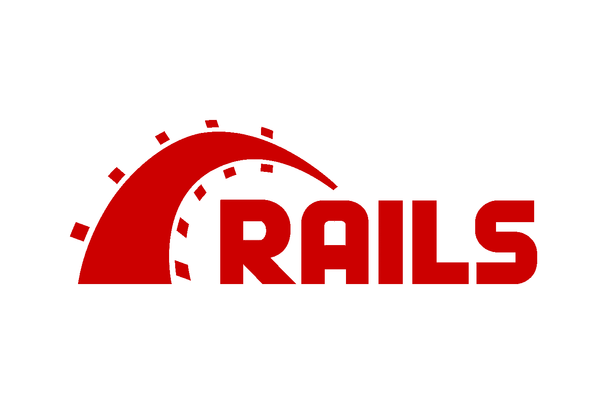
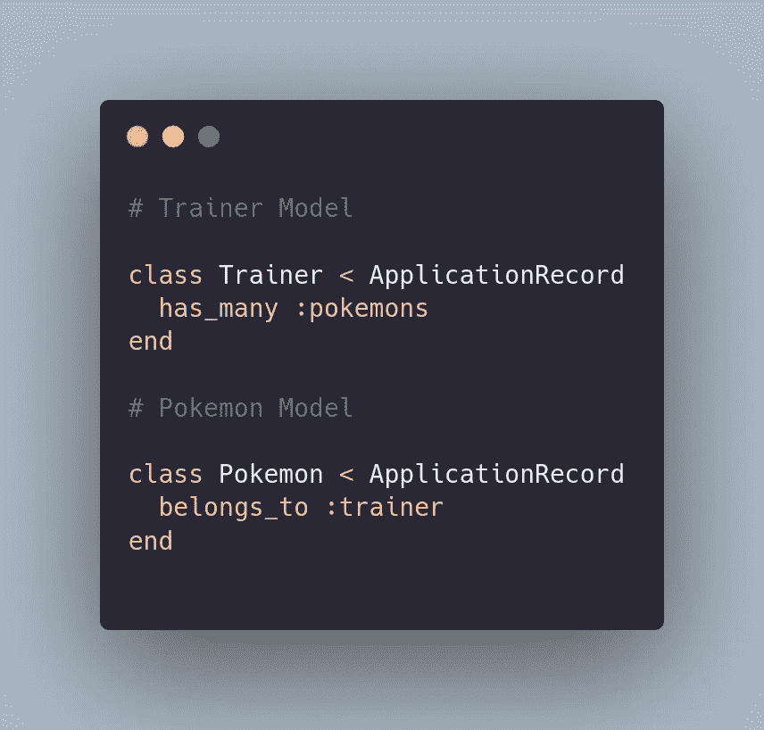
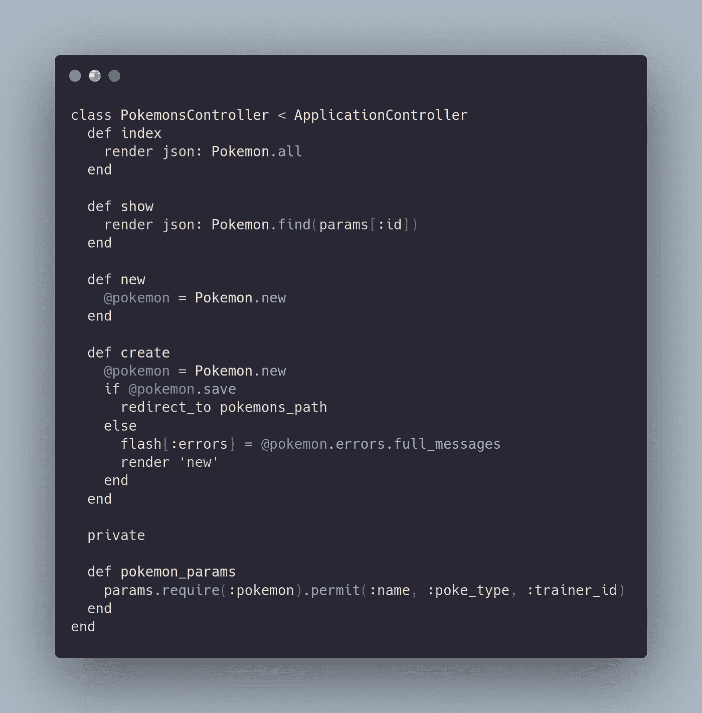
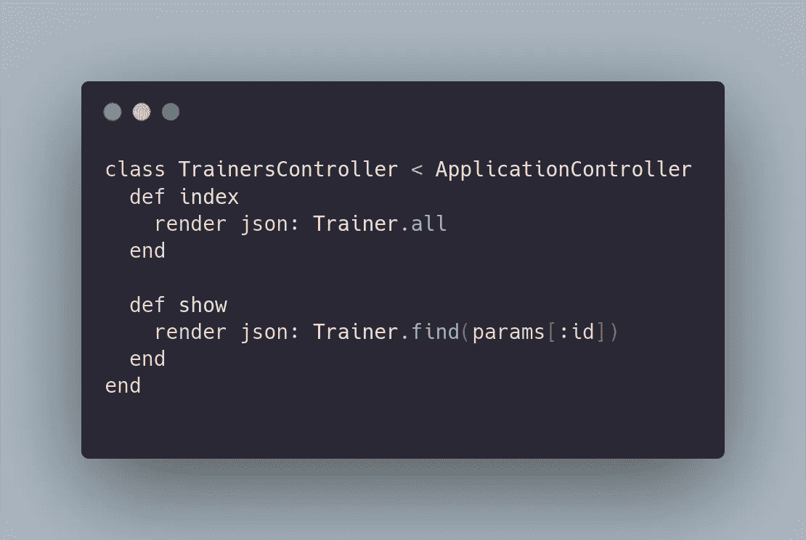
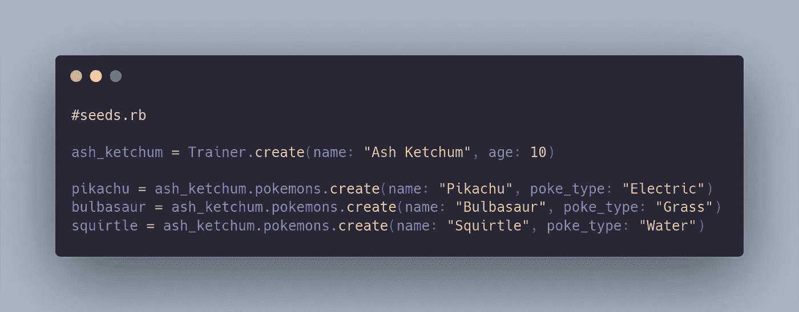
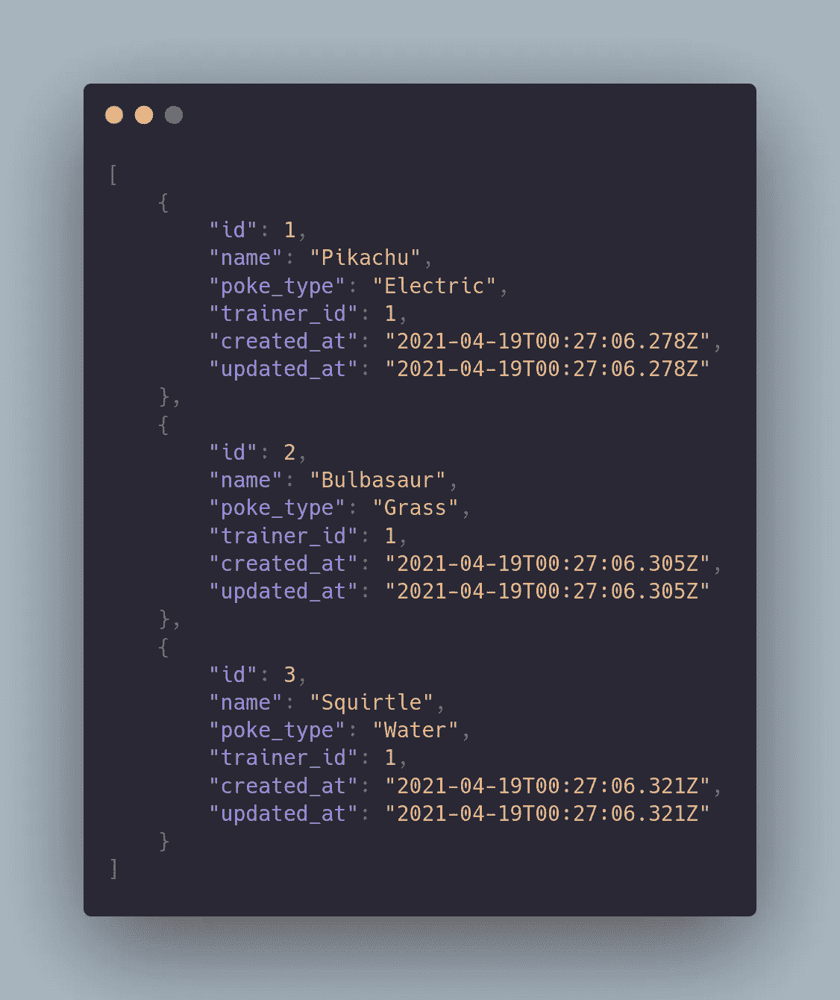
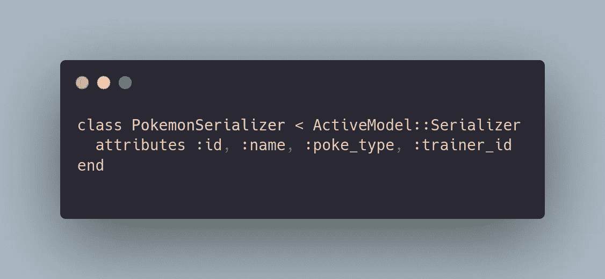
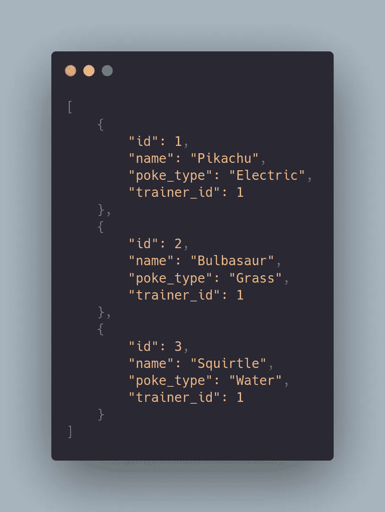
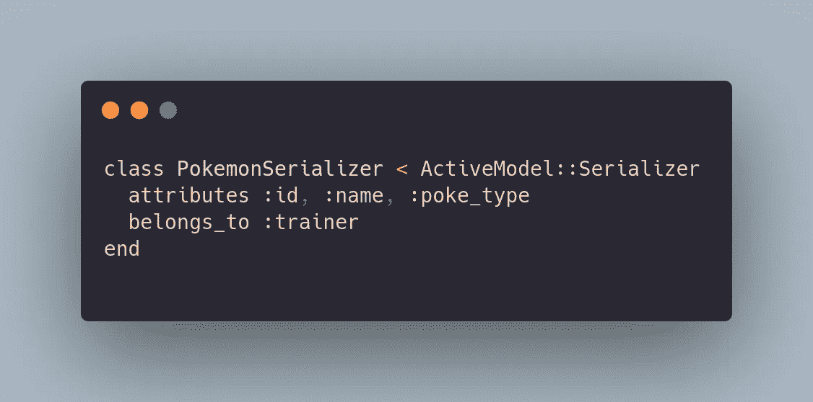
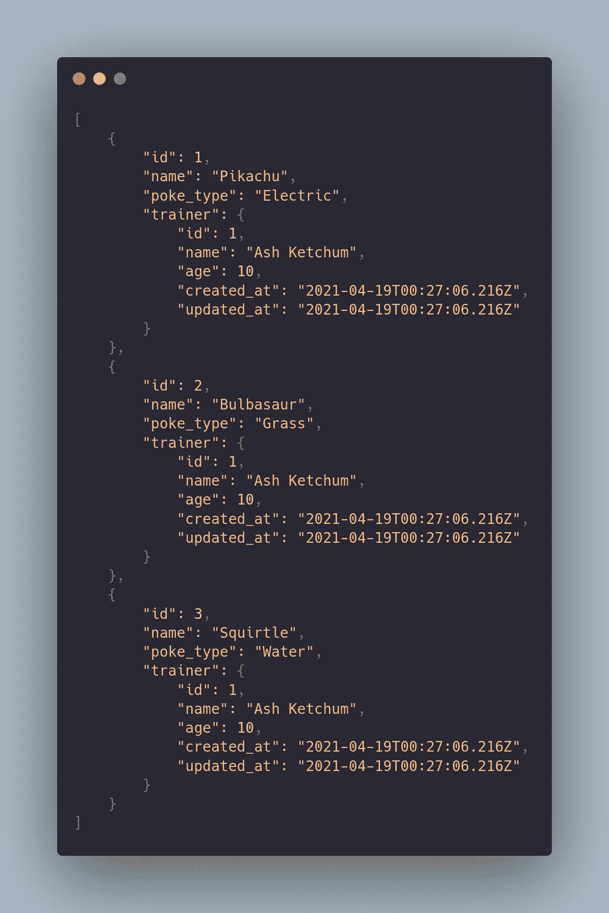

# 用 Rails 序列化程序发送更好的数据

> 原文：<https://medium.com/codex/sending-better-data-with-rails-serializers-5d50cb7c750c?source=collection_archive---------7----------------------->



使用 Ruby on Rails 作为 API 很棒，因为它的 render :json 方法。唯一的问题是，很多时候 JSON 数据可能包含很多不必要的东西。我们希望有更多的选项来定制数据，我们可以使用序列化器来实现。我们可以使用序列化器来格式化我们的 JSON，只选择我们真正需要的数据，并访问模型关系。让我们开始吧。

在这个例子中，我们可以想象你想从数据库中查询一个口袋妖怪和它们的训练者的列表。让我们创建两个模型。

```
rails g model Trainer name:string age:integer
rails g model Pokemon name:string poke_type:string
```

之后，我们想建立我们的模型协会。



接下来，我们必须设置我们的控制器。

```
rails g controller pokemons
rails g controller trainers
```

这将是我们的口袋妖怪控制器。



这将是我们训练员的控制器。



现在我们必须像这样定义我们的路线。


现在，我们可以运行迁移，并用这些命令播种我们的数据库。



```
rails db:migrate
rails db:seed
```

现在一切都已经设置好了，我们可以发出 GET 请求来查询数据库中所有口袋妖怪的列表。如果没有序列化程序，这就是我们的数据将会是什么样子。



你可以看到我们有一些并不需要的信息。没有必要知道口袋妖怪是什么时候被创造和更新的。隐藏这些信息就好了。还有一点就是我们只能得到一个整数作为 trainer_id。每个口袋妖怪都有自己的训练师，但除了 id 之外，我们并没有得到任何训练师的信息。让我们让这些数据看起来更好。首先将序列化程序 gem 添加到您的 gem 文件中

```
gem ‘active_model_serializers’
```

安装完这个包之后，你将能够非常容易地生成序列化器。继续运行这个命令。

```
rails g serializer Pokemon
```

这将在你的应用程序文件夹中创建一个名为 serializer 的文件夹，其中包含一个 pokemon_serializer.rb 文件。您可以在这里添加想要在渲染中显示的属性。对于 pokemon，我们希望显示名称、trainer_id 和类型，因此序列化程序将如下所示。



执行 GET 请求后，您看到的数据将如下所示。



这看起来棒极了！我们不再显示已创建或已更新的属性。每个口袋妖怪都有一个教练，但我们没有任何关于教练的信息。我们希望能够显示的不仅仅是 id，所以在我们的序列化程序中，我们将把它修改成这样。



最后，我们的数据将看起来像这样。



仅此而已！使用序列化程序非常简单，并且是定制您正在呈现的数据的一种非常好的方式。试着在你的 API 上使用它，让我知道你的想法。编码快乐！😎