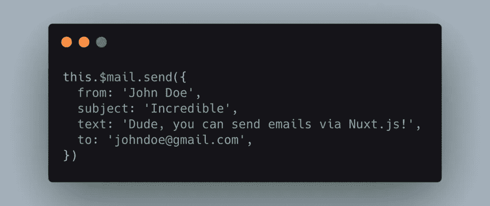

# 用 Nuxt.js 发送电子邮件的简单方法

> 原文：<https://medium.com/codex/sending-emails-with-nuxt-js-the-easy-way-91a65963bb4?source=collection_archive---------1----------------------->

当我开始使用 Nuxt.js 时，我经常遇到这样的问题，我想通过联系方式发送电子邮件。虽然有第三方服务可以做到这一点，但我想:为什么不使用 Nuxt.js 自带的现有服务器基础设施呢？

这就是为什么我编写了 [nuxt-mail](https://github.com/dword-design/nuxt-mail) ，这是一个 Nuxt.js 模块，它向服务器添加了一个`/mail/send`路由，并注入了一个包装 API 调用的`$mail`变量。

# 使用

首先通过`npm install nuxt-mail @nuxtjs/axios`或`yarn add nuxt-mail @nuxtjs/axios`安装模块和 [@nuxtjs/axios](https://github.com/axios/axios) 。

`@nuxtjs/axios`在这里很重要，因为它允许模块执行 REST 调用。

然后将`@nuxtjs/axios`和`nuxt-mail`添加到`nuxt.config.js`文件中。我们必须传递应该由`nodemailer`内部使用的 SMPT 设置。出于安全原因，我们也在这里配置接收者。这样，客户端就无法从您的 SMTP 服务器向任意收件人发送电子邮件。你实际上可以在这里预先配置消息，以防你总是想给它们相同的标题，发件人地址或什么的。

请注意，您可能应该通过环境变量传递凭证或整个配置(例如，通过 [dotenv](https://github.com/motdotla/dotenv) )。还要注意，您不能将这个模块用于静态站点(通过`nuxt generate`)，因为服务器中间件不存在。

我们走吧！现在，我们可以自己实现一个联系表单页面并发送电子邮件:

在`<script>`部分，我们基本上称之为`this.$mail.send()`:

当你现在点击`Send`按钮时，你应该会收到一封电子邮件到你的收件箱！

# 多消息配置

还可以通过将“消息”配置改变成数组来提供多种消息配置。

然后，您可以像这样引用配置:

或者通过索引(在这种情况下，您不需要“名称”属性):

基本上就是这样，我希望这对你们中的一些人有用。

# 结论

您可以使用该模块轻松设置电子邮件发送功能。如果您计划构建一个更大的发送大量电子邮件的 SaaS，那么通过 cronjob 或服务器端钩子发送邮件的异步解决方案可能是一个更好的主意。但是对于第一个解决方案，它应该工作得很好。

请告诉我您对该模块的看法，以及是否有任何未解决的问题。另外，因为这是我的第一篇文章，让我知道你对这篇文章的总体看法。

你可以在这里找到模块[。](https://github.com/dword-design/nuxt-mail)

**如果你喜欢我正在做的事情，请关注我的** [**Twitter**](https://twitter.com/seblandwehr) **或者查看我的** [**网站**](https://sebastianlandwehr.com/) **。也可以考虑在** [**给我买杯咖啡**](https://www.buymeacoffee.com/dword)**[**PayPal**](https://www.paypal.com/paypalme/SebastianLandwehr)**或者**[**Patreon**](https://www.patreon.com/dworddesign)**进行捐赠。非常感谢！❤️****

***原载于*[*sebastianlandwehr.com*](https://sebastianlandwehr.com/blog/sending-emails-with-nuxt-js-the-easy-way)**