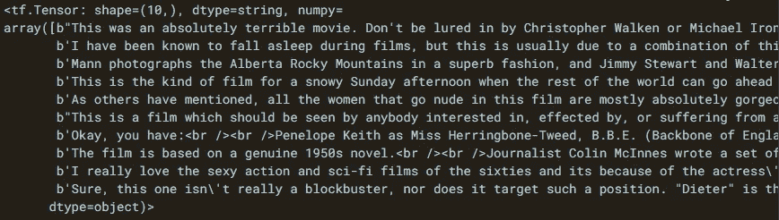
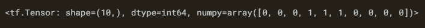
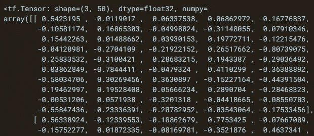
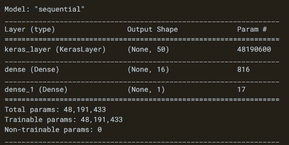
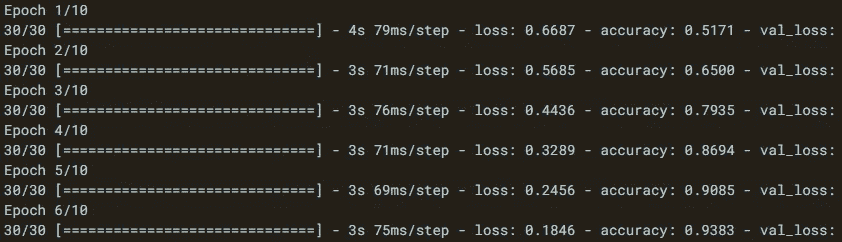
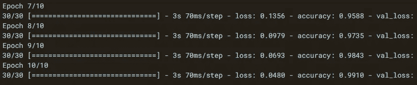
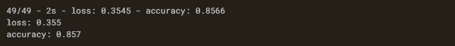

# 基于迁移学习的情感分析

> 原文：<https://medium.com/codex/sentiment-analysis-with-tensorflow-hub-678c30ac79a2?source=collection_archive---------2----------------------->

## 关于如何使用 IMDB 数据集进行迁移学习的简单指南。


照片由[埃弗顿维拉](https://unsplash.com/@evertonvila?utm_source=medium&utm_medium=referral)在 [Unsplash](https://unsplash.com?utm_source=medium&utm_medium=referral) 拍摄

模特训练是一个艰难的过程。从零开始训练一个模型，必须要有大量的数据和计算能力。例如，运行了数千小时的 GPU 来训练 2017 年开发的 [NASNet](https://ai.googleblog.com/2017/11/automl-for-large-scale-image.html) 模型。

幸运的是，您可以使用预先训练的模型进行分析，如文本或图像分类。这些预先训练好的模型在 TensorFlow 和 PyTorch 等库中也有。您可以轻松地将这些预训练模型应用到您的数据集。

将这些模型直接应用于数据集可能不会获得良好的结果。因为这些模型是根据某些数据训练的。假设您想用 ResNet 模型对狗和猫的图片进行分类。ResNet 经过训练，可以对数千张图像进行分类。但是你只想对狗和猫的图像进行分类。为此，您需要定制这个模型的最后几层。在这篇文章中，我将向你展示如何用一个预先训练好的模型进行情感分析。

在开始之前，请不要忘记订阅我们的 youtube 频道，在那里我创建了关于人工智能、数据科学、机器学习和深度学习的内容。

让我们开始吧！

# 什么是 TensorFlow Hub？

TensorFlow Hub 是一个预先训练好的机器学习模型的存储库。只需几行代码就可以在 TensorFlow Hub 中使用类似 BERT 的模型。借助 TensorFlow Hub，您可以执行图像分类、文本嵌入、音频和视频识别等分析。

# 情感分析

随着社交媒体和技术的发展，大多数人分享他们的想法和思想。这些共享的数据对于社会科学和市场营销等领域非常重要。分析一个文本是正面的还是负面的叫做情感分析。情感分析是自然语言处理的一个子领域，也是当今的热门领域之一。我将使用 IMDB 数据集来演示 TensorFlow Hub 的情感分析。让我们仔细看看 IMDB 数据集

# IMDB 数据集

[IMDB 数据集](https://ai.stanford.edu/~amaas/data/sentiment/)由 5 万条电影评论组成，其中 2.5 万条为教程，2.5 万条为测试。这些评论一半被标为正面，另一半被标为负面。通过 TensorFlow 数据集(TFDS)库，您可以加载这些数据集。让我们安装数据集和 tfds 模块。

```
pip install tensorflow-datasets #for the stable version
pip install tfds-nightly #Contains the latest version of datasets
```

安装完这个库之后，让我们导入 TensorFlow 和 tensorflow_datasets。

```
import tensorflow as tf
import tensorflow_datasets as tfds
```

# 下载 IMDB 数据集

现在，让我们使用 tfds.load 方法加载 IMDB 数据集。在加载数据集时，让我们也将它分为训练、验证和测试。注意，用训练数据拟合模型，用验证数据调整超参数，用测试数据评估模型。

我想将训练数据集分成 60%的训练和 40%的验证。

```
train_data, validation_data, test_data = tfds.load(
    name="imdb_reviews",                         #1
    split=('train[:60%]', 'train[60%:]', 'test'),#2
    as_supervised=True                           #3
)
```

让我们检查一下这些代码。

(1)我在 name 参数中设置了数据集的名称。

(2)我指定了如何将数据集拆分为 split 参数。

(3)通过将 as_supervised 参数设置为 True，我已经将数据集的结构设置为输入和标签。

让我们开始探索数据集。

# 浏览数据集

理解数据集是数据分析的重要阶段之一。IMDB 数据集中的每个示例都由一个电影评论和该电影评论的标签组成。标签由 0 或 1 组成。0 表示评论是负面的，1 表示评论是正面的。

让我们打印前 10 个例子。首先，我要把例子中的注释和标签分开。

```
train_examples_batch, train_labels_batch =
next(iter(train_data.batch(10)))
```

我用分批法选择了前 10 个样本。让我们看看前 10 条评论。

```
train_examples_batch
```



训练数据集中的前 10 条评论

让我们打印前 10 个标签。

```
train_labels_batch
```



训练数据集中的前 10 个标签

# 建立模型

让我建立一个神经网络模型。深度神经网络(DNN)模型已经变得非常流行，尤其是在最近几年。使用基于 DNN 的模型可以获得高精度。

神经网络的最大缺点是调整模型的超参数。如果你不对超参数进行微调，你就不会得到好的模型。在构建神经网络时，您需要指定超参数，例如文本将如何表示，模型中使用了多少层，以及每层中有多少个神经元。

我们的输入数据由句子组成。表示这些文本的一种方法是将句子翻译成嵌入向量。因此，从文本中学习单词在向量空间中的位置。学习单词的向量空间中的位置称为嵌入。请注意，向量空间中更接近的单词具有相似的含义。

文本分类的第一层必须是预先训练好的文本嵌入。有了这一层，文本预处理就完成了。因此，文本预处理过程(这是最累人的过程之一)很容易完成。

TFHub 上有很多预先训练好的[文本嵌入](https://tfhub.dev/)。这些文本嵌入是基于前馈神经网络语言模型(NNLM)。您可以根据您的工作使用这些嵌入之一。在这个分析中，我将使用 [nnlm-en-dim50/2](https://tfhub.dev/google/nnlm-en-dim50/2) 。该模型使用基于在 7D 英语 google 新闻语料库中训练的文本嵌入的标记，并且包括 50 个嵌入维度。

首先，我将把预先训练好的嵌入层赋给嵌入变量。

```
embedding = “[https://tfhub.dev/google/nnlm-en-dim50/2](https://tfhub.dev/google/nnlm-en-dim50/2)"
```

现在，让我们使用 TensorFlow Hub 模型创建一个 Keras 层。首先我要导入 tensorflow_hub。

```
import tensorflow_hub as hub
```

让我们创建一个 Keras 层。

```
hub_layer = hub.KerasLayer(embedding, input_shape=[], dtype=tf.string, trainable=True)
```

因为数据类型是 text，所以我在 dtypes 参数中设置了 tf.string。我还在可训练参数中设置了 True，因为我希望这些层是可训练的。让我们看看使用 hub_layer 图层的训练数据集中前三个样本的输出。

```
hub_layer(train_examples_batch[:3])
```



训练数据集的前三个示例

现在，我们可以建立整个模型。我将使用顺序技术来建立模型。

```
model = tf.keras.Sequential()
```

我将使用 add 方法添加每个图层。首先，让我们添加我刚刚创建的 hub_layer 嵌入层。

```
model.add(hub_layer)
```

有了这一层，句子就被拆分成了记号。意义上彼此接近的标记被放在一起。接下来，让我们添加一个密集层，并在这一层使用 relu 激活功能。

```
model.add(tf.keras.layers.Dense(16, activation='relu'))
```

由于我们的输出有两类，正和负，让我们添加一个神经元密集层

```
model.add(tf.keras.layers.Dense(1))
```

我们编写的整个代码如下所示。

```
model = tf.keras.Sequential()
model.add(hub_layer)
model.add(tf.keras.layers.Dense(16, activation=’relu’))
model.add(tf.keras.layers.Dense(1))
```

我们建立了我们的模型。您可以使用 summary 方法来查看模型的摘要。

```
model.summary()
```



模型摘要

您可以看到每层中使用的参数数量。

## 损失函数和优化器

现在我要编译模型了。您可以使用 compile 方法来编译模型。在编译模型时，您需要指定损失函数和优化器。由于我们的问题是一个分类问题，我们可以使用二元交叉熵作为损失函数。让我们使用“adam”作为优化器，并设置“准确性”指标来查看模型在每个最后时期的性能。

```
model.compile(optimizer=’adam’, loss=tf.keras.losses.BinaryCrossentropy(from_logits=True), metrics=[‘accuracy’])
```

所以我们编译了这个模型，现在这个模型可以进行训练了。

# 训练模型

您可以使用 fit 方法来训练模型。我们开始吧。

```
history = model.fit(
    train_data.shuffle(10000).batch(512),       #1
    epochs=10,                                  #2
    validation_data=validation_data.batch(512), #3
    verbose=1                                   #4
)
```



训练和验证损失和准确度值

让我们一步一步地检查这些代码。

(1)我设置了 shuffle(10000)方法，每 10000 个样本对训练数据进行一次洗牌。在训练模型时，我想以 512 人为一组进行取样。

(2)我将纪元编号设置为 10。时期决定了所有数据将通过神经网络的次数。

(3)我在 validation_data 参数中写了验证数据集。在用训练数据建立模型的同时，用验证数据调整模型的超参数。

(4)我设置 verbose=1 参数来查看每个时期的进度条和信息行。

正如我们所预期的，模型的训练和验证准确性随着时期数的增加而增加。另一方面，训练和验证损失值正在减少。如您所见，模型对训练数据的准确性高于验证数据的准确性。说明这个模型可能存在过拟合问题。存在过拟合问题的模型存在泛化问题，难以很好地预测新数据。你可以使用 L1、L2 或辍学正规化技术来解决模型的记忆问题。

# 评估模型

到目前为止，我们首先构建了模型，然后训练了模型。那么，模型的表现如何呢？测试数据集用于查看模型的性能。让我们用 evaluate 方法在测试数据上找到模型的精度值。

```
results = model.evaluate(test_data.batch(512), verbose=2)
```

现在，使用 zip 方法，让我们在模型的测试数据集上打印损失和准确性值。

```
for name, value in zip(model.metrics_names, results):
    print("%s: %.3f" %(name, value))
```



该模型的准确率约为 86%。通过正则化技术，您可以将模型的精确度提高到 95%。

# 结论

TensorFlow Hub 是预训练模型的存储库。您只需编辑几行代码就可以在您的分析中使用这些模型。使用这些模型可以节省时间和处理能力。

就是这样。感谢您的阅读。我希望你喜欢它。别忘了在 YouTube 上关注我们👍

你可以在这里找到笔记本。你可能会对下面的文章感兴趣。

[](https://levelup.gitconnected.com/7-differences-between-deep-learning-and-machine-learning-b5f2ff0ae00a) [## 深度学习和机器学习的 7 个区别

### 深度学习与机器学习——有什么区别？

levelup.gitconnected.com](https://levelup.gitconnected.com/7-differences-between-deep-learning-and-machine-learning-b5f2ff0ae00a) [](/mlearning-ai/how-to-use-data-pipelines-with-python-a9b662fadec2) [## Tensorflow 数据管道初学者指南

### 如何使用 Tensorflow 为文本、图像和 numpy 数组数据集构建数据管道？

medium.com](/mlearning-ai/how-to-use-data-pipelines-with-python-a9b662fadec2) 

如果这篇文章有帮助，请点击拍手👏按钮几下，以示支持👇