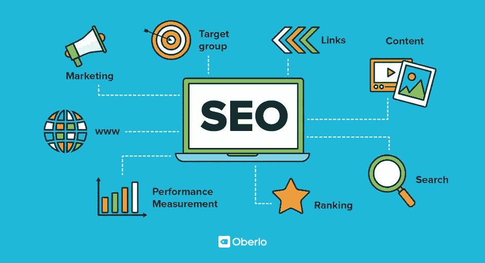

# Seo 工具垂直化商业模式

> 原文：<https://medium.com/codex/seo-tools-verticalization-business-model-da0a388522e6?source=collection_archive---------6----------------------->

Seo 工具和服务就在那里等着你去获取，并按行业进行垂直化，因为每个行业都有自己的 SEO 需求。你认为一个律师和土木工程师有相同的 SEO 需求和使用 SEO 的方式吗？在我上一篇关于词语如何帮助我们理解大脑的文章中，以及在约翰逊和莱考夫直到卡尼曼的著作中，你可能已经看到了词语是如何定义我们的。这就是为什么搜索引擎优化工具应该针对特定的行业和特定的受众。它不是关于收集关键词和统计数据，而是关于理解我们如何使用词语来表达我们的需求和愿景，它们如何描述我们寻求执行的行动，以及我们想要实现的目标。

当然，所有这些都是关于单词和数字，而数学、认知科学和心理学对它成为一个更好的 SEO 工具和更好地营销它非常重要。一旦掌握了这些领域的知识，计算机科学就可以帮助你走得更快，规模更大。

文字和数字游戏并没有消亡，你可以用这些游戏和博客做很多聪明的事情。