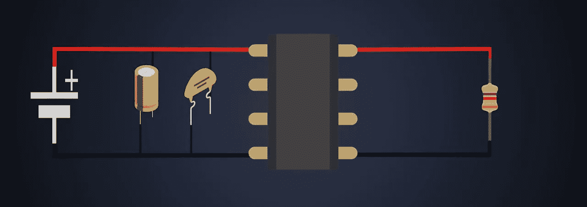
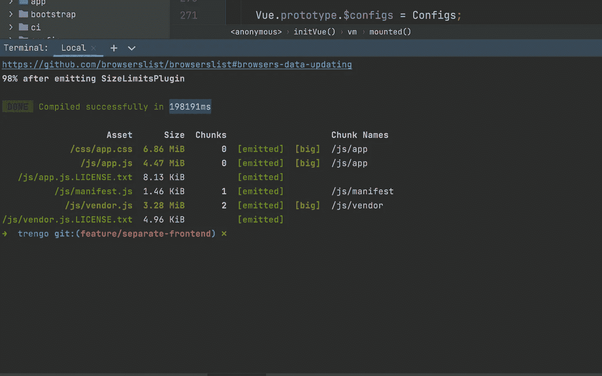
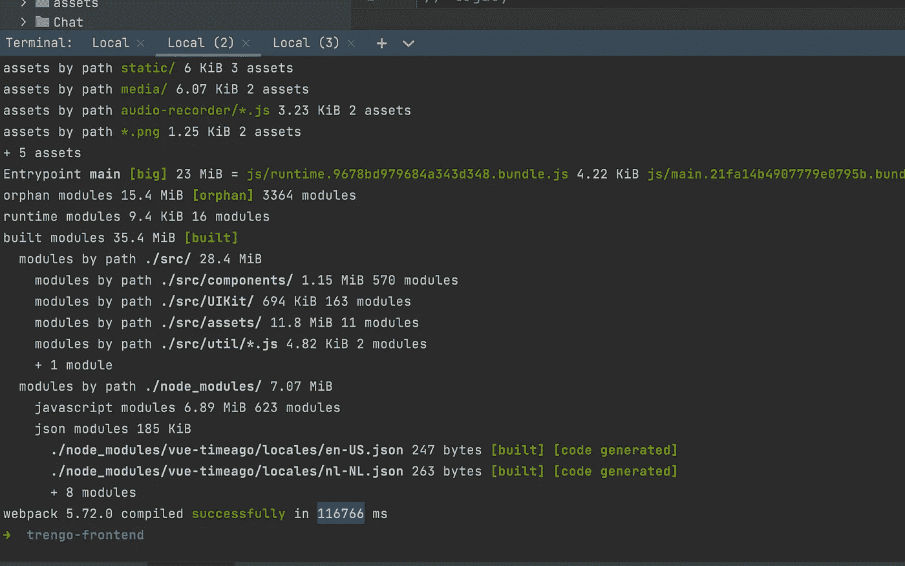
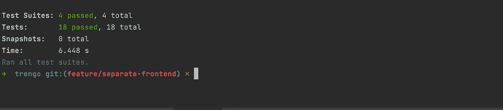
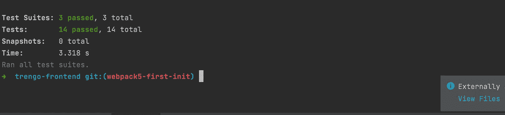

# 用 Webpack5 将 Monolith Laravel + VueJS 分隔为后端和前端

> 原文：<https://medium.com/codex/separating-monolith-laravel-vuejs-to-backend-and-frontend-with-webpack5-e34956b936d1?source=collection_archive---------0----------------------->



从整体到后端—前端的去耦

我们在[特伦戈](https://trengo.com)决定将 Monolith 架构分为后端和前端，我很荣幸这样做。当然这取决于项目的潜力，我相信了解我们如何发现兔子洞以及如何解决它们是很有用的。
我是尼玛，欢迎来到我的博客。

# 问题是

这取决于你和你的团队结构来处理 Monolith 架构或后端前端或微前端等。我不打算解释利弊，但如果你决定将你的 Laravel+Vuejs Monolith 分成后端和前端，这将是一篇适合你的好文章。
如果你有一个整体架构，很可能你有一个会在大团队中引起混乱的单一报告。从 CI/CD 和技术角度来看，拥有单独的存储库将非常有帮助。

# 解决方法

你会搜索的第一个短语是“[我能把 Vue.js 前端和 Laravel 后端完全分开吗](https://laracasts.com/discuss/channels/laravel/can-i-completely-separate-vuejs-front-end-to-laravel-back-end)”，答案是“可以”，但是怎么做呢？
我们找到了四种解决方案:
用 **Webpack5** 分离—用 Vite 分离—用 **Webpack4** 分离—用 **Laravel-mix** 本身分离。
这里有利弊，我会解释我们为什么选择 Webpack5，但这完全取决于你。

## 拉勒维尔-米克斯

当我们不打算使用其中的大部分功能时，用 Laravel-mix 分离 Monolith 架构是没有用的。Laravel-Mix 是非常强大的，只有当你打算用 Laravel 开发一个整体应用程序的时候。大量的 Webpack 配置，这是非常耗时的配置，而且你不能在将来自己将你的 Webpack 版本从 4 升级到 5 或 5 到 6，直到 Laravel-Mix 给出更新，这意味着你不能用最新的技术更新。

## **网络包 4**

用 Laravel-Mix 代替 Webpack 是一个很好的解决方案，但是用哪个版本呢？正如 Webpack 所说，如果你想拥有一个可执行的应用程序，请始终尝试使用最新版本。Webpack 4 对模块联合等新技术有太多的干扰，sass-loader@11.0.0 和 vue@2.6.12 之间的冲突会抛出 this.getOptions()在 Webpack 5 中处理的错误，等等……如果你关心应用程序更新，我强烈建议选择其他选项。

## 轻快地

也许你听说过 [Vite](https://vitejs.dev) ，

> Vite 是一个构建工具，旨在为现代 web 项目提供更快、更精简的开发体验

我对 Vite 有很好的体验，它帮助我很轻松地配置我的应用程序。但是为什么我们的 Vue 项目没有选择它呢？

> 注意:如果你有一个路线列表。js 它将尝试在开发模式下建立所有的路线，取决于你的项目，这将需要很多分钟。

Vite 还不成熟，你不能指望它进入生产模式(2022)。你不能否认 Vite 的性能，但对于遗留代码和结构，你将面临一些更大的问题。如果您想享受它的强大功能，使用动态导入来帮助代码拆分和 SplitChunk 会是一个很好的技巧。鉴于 Vite 如此强大，它不适合我们的项目和遗留结构，但如果我想从头开始一个新项目，我肯定会使用 Vite。

# 网络包 5

令人欣慰的是有各种各样的图书馆可供选择。Webpack 5 是基于我们项目的最好的库，这是一个大项目，在 Laravel-Mix 上有很多配置，需要迁移到新的 bundler。
我们不会对 PostCss 或捆绑 router.js 有任何问题，当然，Webpack HMR(热模块重新加载)不是很快，因为它使用 socket.js 使其实时，但我会向您展示它比 Laravel-Mix 5 快两倍。

# 逐步地

是时候深入代码并找到兔子洞了。首先，我们必须找到所有的挑战，找到解决它们的方法。我会根据我的经验列举一些可能性。

## 我正在使用 Laravel 路线，而不是休息

我强烈建议首先迁移到 REST，这是迁移中最重要的部分。例如，我们有一个“/authenticate/login”路由来处理用户登录过程，在这种情况下，最好的方法是将其迁移到“/api/authenticate/login”中，该路由将接受 JSON 参数并响应 JSON。如果您的整个应用程序没有处于 REST 状态，那么让我们在您的任务管理系统中创建一个带有“critical”标记的重构卡。

## 我有一个“index.blade.php”而不是 index.html

我们将稍后用 Webpack 处理它，唯一的事情是将整个文件复制/粘贴到一个新的 index.html 中，就是这样，让 Webpack 处理它。

## 如何处理环境？

所有“env”变量将从“import.meta.EnvName”更改为“process.env.EnvName”，这意味着我们必须替换所有变量并创建一个”。env”文件，其中包含所需的变量。

## “进口”方式呢？

仅替换“导入(…)”。默认“with”要求(…)。“默认”。

## 我们的代码库会改变吗？

当然不是，如果你有一个标准的代码库，你就不会有问题。

# 如何在 Vuejs 2 上配置 Webpack5？

这非常简单，我强烈建议将“开发”和“生产”配置分离，这样您就可以更好地控制每个环境配置。这两个环境之间有冲突是很常见的。
让我们从创建一个名为你的应用程序的新目录开始，并创建如下的目录结构:

```
.
|-- README.md
|-- package.json
|-- public
|-- src
-- webpack
    |-- paths.js
    |-- webpack.common.js
    |-- webpack.config.dev.js
    `-- webpack.config.prod.js
```

是时候安装依赖项了。

```
npm i -D @webpack-cli/serve clean-webpack-plugin compression-webpack-plugin copy-webpack-plugin css-minimizer-webpack-plugin dotenv-webpack html-webpack-plugin optimize-css-assets-webpack-plugin speed-measure-webpack-plugin terser-webpack-plugin webpack webpack-bundle-analyzer webpack-cli webpack-dev-server webpack-hot-middleware webpack-merge css-loader vue-loader esbuild-loader 
```

我试着安装了所有的 devDependencies，如果其中一些没有安装，我们会继续安装。
现在我们来看看“webpack.common.js”是什么样子的。

它太长了，是的，我知道，我不打算解释加载器，因为你可以在 Medium 或他们的 Git 库中找到它们，因此，如果有必要，我试图添加注释，但让我们快速回顾一下。

**SpeedMeasurePlugin** :这个插件将帮助我们测量 Webpack 的性能。找出哪一个加载程序缺乏性能是非常有用的。我们应该用它来包装我们的配置。

条目:条目应该指向运行 Vuejs 应用程序的主 javascript 文件。

**提供插件**:

> 自动加载模块，而不是到处`import`或`require`它们。

如果您正在使用一个下划线库，如“lodash”或“Jquery ”,它有一个特殊的语法，对于 Webpack 来说是不常见的，并且没有导入到文件中，那么您必须在这个插件中提供它们。

这个插件对我们来说非常有用，因为我们有来自“Laravel”的“public”文件夹，在解耦后我们将需要它。如您所知，Laravel-mix 已经“公开”连接到“Vuejs”应用程序。因此，在迁移后，没有一个图像或任何资产会正确加载，因为 Webpack 无法访问“public”文件夹(在文件夹范围之外)，该插件将尝试建立此连接。

**ESBuild** :是时候用 ES-build 替换 babel-loader 来加速我们的 Webpack 构建了。不再解释，我们来看文档:[https://github.com/privatenumber/esbuild-loader](https://github.com/privatenumber/esbuild-loader)

我们现在很好，让我们继续发展。它是如此简单。

因为太简单了，我只想解释一下 HotModuleReplacementPlugin 和 source-map。

**HotModuleReplacementPlugin**:或者 HMR 是一个插件，当我们在 IDE 中保存我们的更改时，它会重新加载页面，与其他观察器相关的好处是状态持久性，这意味着每次重新加载后，您的状态都会保持，因为插件只会重新加载特定的和相关的 DOM。

**devtool** :可能一开始并不是那么清楚。让我们看看 Webpack 文档中的 Devtool 是什么。

> `source-map-loader`从所有 JavaScript 条目中提取现有的源映射。这既包括内嵌的源地图，也包括通过 URL 链接的源地图。所有的源地图数据都传递给 webpack，按照 [webpack.config.js](https://webpack.js.org/configuration/) 中`devtool`选项指定的[源地图样式](https://webpack.js.org/configuration/devtool/)进行处理。

最常用的是在浏览器中调试代码，源映射还不是可转换的，你可以在其中看到你的 Vuejs 代码，找到哪个部分有 bug。因为它会降低性能，所以最佳实践是只让它处于开发模式。你可以在这里找到不同来源地图的列表:[https://webpack.js.org/configuration/devtool/](https://webpack.js.org/configuration/devtool/)

我更喜欢使用“内联源代码图”,它会给我足够的细节，并会增加我在开发模式下的构建和重建时间。

生产这么刺激？所以我们走吧。

首先，您会看到 devtool 是假的，在生产中不提供可调试版本是有意义的，因为这将增加包的大小、构建时间，并且客户端也不需要它。

**splitChunks** :在优化阶段，我们使用 splitChunks，通过将捆绑包分割成独立的模块，[https://webpack.js.org/plugins/split-chunks-plugin/](https://webpack.js.org/plugins/split-chunks-plugin/)

**TerserPlugin** :任何人都知道 Terser 插件会影响性能，Terser 使用了很多算法来尽可能地将 javascript 代码精简到最精简的版本。[https://webpack.js.org/plugins/terser-webpack-plugin/](https://webpack.js.org/plugins/terser-webpack-plugin/)

唯一留下的是 paths.js

```
const paths = require('path')

module.exports = {
// Source files
src: paths.resolve(__dirname, '../src'),

// Production build files
build: paths.resolve(__dirname, '../dist'),

// Static files that get copied to build folder
public: paths.resolve(__dirname, '../public'),
}
```

这太简单了，不需要解释。😄

大部分都完成了，让我们修改我们的 package.json

```
"scripts": {
  "dev": "webpack server --mode=development --config ./webpack/webpack.config.dev.js",
  "build": "webpack --mode=production --config ./webpack/webpack.config.prod.js",
  "serve:dev": "pm2 start ecosystem.config.js --env development",
  "serve:prod": "pm2 start ecosystem.config.js --env production"
},
```

很明显，只有我想解释一下“发球:dev 和 prod”。我更喜欢使用 PM2 作为我们的过程管理器，如果你不熟悉它，我会强烈建议看看它的文档:[https://pm2.keymetrics.io/.](https://pm2.keymetrics.io/.)“生态系统.配置. js”是 PM2 的主要配置文件，用于定义生产或开发的不同行为，你可以通过运行“serve:dev”在本地机器上检查构建的项目，它实际上与生产相同，尽量使开发和生产环境相同以减少错误是非常重要的。

**生态系统. config.js**

```
module.exports = {
    script: 'serve',
env_development: {
    NODE_ENV: 'development',
    PM2_SERVE_PATH: './dist',
    PM2_SERVE_PORT: 3000,
    PM2_SERVE_SPA: 'true',
},
env_production: {
    NODE_ENV: 'production',
    PM2_SERVE_PATH: './dist',
    PM2_SERVE_PORT: 8080,
    PM2_SERVE_SPA: 'true',
},
deploy: {
        development: {
          host: ['localhost', '127.0.0.1'],
        },
        production: {
          host: ['production.domain', 'production IPAddress'],
        },
    },
};
```

# 是时候处理数字了

现在是时候用当前的 Laravel-mix 项目来回顾新 Webpack 配置的基准了。当然和你的项目有关。这些基准测试与一个有很多文件的大项目有关。

**Laravel 混音制作时间— 3.30 分钟**



**Webpack5 构建时间— 1.9461 分钟**



你可以看到它几乎快了两倍。但是这不是唯一的基准，我还有另一个有趣的运行测试基准

**Laravel-mix — 6.44 秒**



**web pack 5–3.318 秒**



结果同上。这些变化让我们在特伦戈有了更好的表现。

# 结论

选择最好的模块捆绑器取决于您的项目，没有特定的方法来提高您的项目性能，对于某些项目，Laravel-mix 是最好的，或者可能是 Vite。最重要的是了解你的项目和里面的兔子洞。例如，在 Laravel Monolith 项目中，如果您使用直接路由器，如:“认证/忘记密码”，您必须将其更改为 REST API，并使用 JWT 或其他加密处理一切。

**一件重要的事情**是将整个 master.blade.php 复制到主 html 模板新结构中的“public/index.html”中。
没有别的事要提，好好享受你的编码吧😉