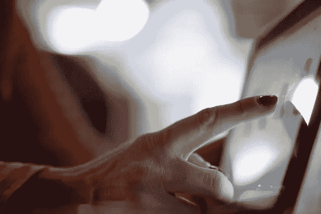

# 在 JavaScript 游戏中分离触摸和鼠标事件

> 原文：<https://medium.com/codex/separating-touch-and-mouse-events-in-your-javascript-games-62181ae949f2?source=collection_archive---------6----------------------->

蒂莫西·穆扎在 [Unsplash](https://unsplash.com/s/photos/touch-screen?utm_source=unsplash&utm_medium=referral&utm_content=creditCopyText) 上的照片

如果你开发网络游戏的时间足够长，你可能有过这样的经历:你的游戏控制在多种设备上不能同样好地工作。

特别是，让你构建的东西对鼠标点击和触摸屏点击都做出预期的响应可能是一个挑战，特别是如果它是一个需要精确用户输入的游戏。