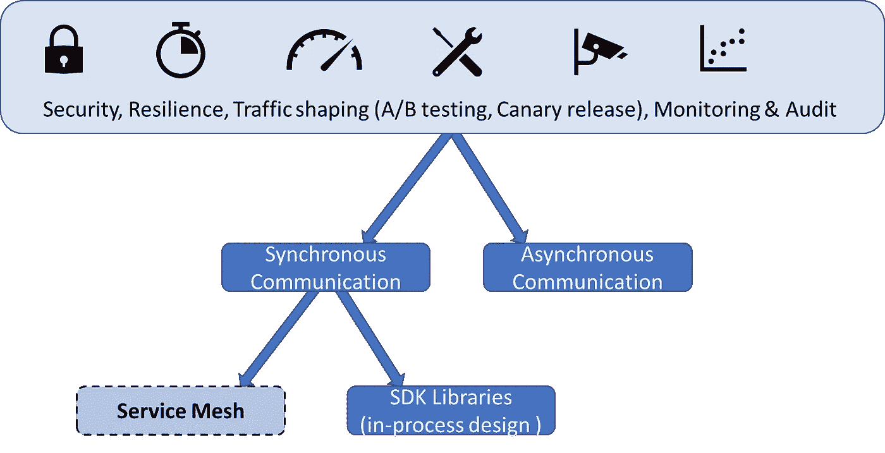
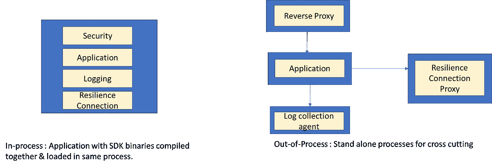
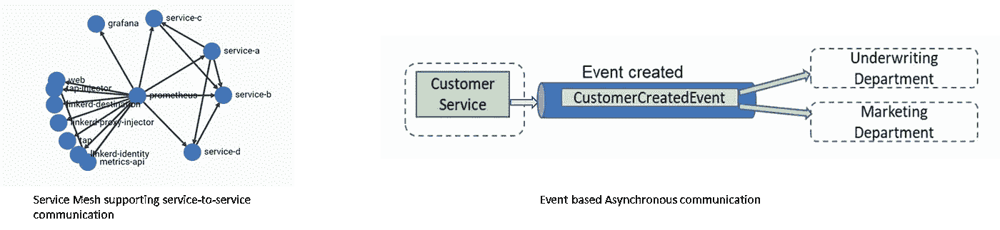
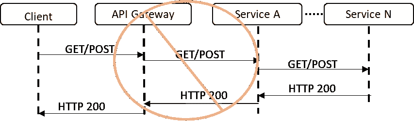

# 服务网格——有什么替代方案吗？

> 原文：<https://medium.com/codex/service-mesh-are-there-any-alternatives-to-it-c4eabd1329e0?source=collection_archive---------5----------------------->

服务网格的替代方案，以满足安全性、弹性、A/B 测试和监控的目标

每种工具在适当的环境下都能发挥最佳作用。服务网格也不例外。

我在以前的文章中写过“进程外”设计以及为什么服务网格如此受欢迎。然而，**了解备选方案以做出适合环境并满足目标的决策是很重要的，**这就是本文的目的。

# 它解决的问题和它带来的特性

服务网格在隐藏大规模**同步服务到服务通信的复杂性方面做得非常出色**，这就是为什么它的采用率在上升。

它带来的功能包括

1.  **安全-** 加密和相互认证。
2.  **弹性通信—** 能够克服网络故障的重试策略。
3.  **可观察性** —因为所有的交通都流经侧车代理。所有流量都是可以观察到的。
4.  **路由/流量整形**支持 A/B 测试和 canary 发布。

# 考虑

学习新技术，更多移动部件的技术复杂性，以及每个 pod 的额外内存和 CPU 利用率。和支持服务网格的基础设施。

# 替代品:

## 1) SDK 库

进程内架构与进程外架构

与服务网格代理所遵循的“进程外”架构不同，将库用于基础设施和横切关注点(如日志记录、弹性、配置)是传统的方法，其中应用程序由具有业务逻辑以及横切和基础设施关注点的单个流程组成。

作为单个进程有其缺点，因为这意味着 SDK 的运行时必须与应用程序的运行时兼容。以及高耦合低内聚设计的问题。

但是这种“过程中”的设计也有它的好处—

1.  简单的实现和调试。
2.  简单的部署和监控。
3.  可能导致故障的连接/移动部件更少。
4.  极低的延迟。根据另一个进程运行的位置(同一台机器或远程机器)，会有一定程度的延迟。

在我之前的文章中有更多关于进程外架构和侧车模式的内容。

## 2)使用异步通信(消息传递)代替同步的服务到服务调用。

服务到服务通信与基于事件的异步通信

服务网格支持同步的服务到服务通信。后端服务之间的同步通信被认为是利用超大规模云资源的障碍。因为它可以形成长的网络链，依赖于其他服务的可用性，并促进低内聚服务集成设计。

反模式——在服务客户端请求时，在后端服务之间创建的请求链。

另一方面，服务之间的异步通信促进了去耦服务(通过打破时间耦合),这进一步导致了独立的可伸缩性、可用性和性能。异步通信是通过消息代理或事件流完成的，消息代理或事件流向消费者服务交付小而频繁的信息包(但是也可以通过 HTTP 对异步通信建模&我将留下一篇文章的链接)。

同步调用在系统集成中有一席之地，但它需要在评估事件后有意识地做出决定

## **总结**

服务网格可以解决很多挑战。如果组织内部已经为它建立了基础设施，这将是一个不可抗拒的提议。然而，用于系统集成的异步消息传递仍然应该被考虑。

此外，如果我们谈论的是数千个或数十个吊舱，那么考虑规模也很重要。

## 相关文章

1.  流程外设计和侧车代理— [为什么我们需要多容器箱？](/codex/communication-inside-a-kubernetes-pod-why-do-we-need-multi-container-pods-3d8d0d64c2c9)

2.服务网格- [什么是服务网格？为什么我们需要它而不是 Kubernetes？](/codex/east-west-service-to-service-communication-what-is-service-mesh-4e56f94bc89c)

3.REST API 上的异步通信—[REST API 上的异步通信—客户端-服务器& WebSockets](/aws-tip/asynchronous-client-server-communication-with-rest-apis-websockets-cbfe145c145e)