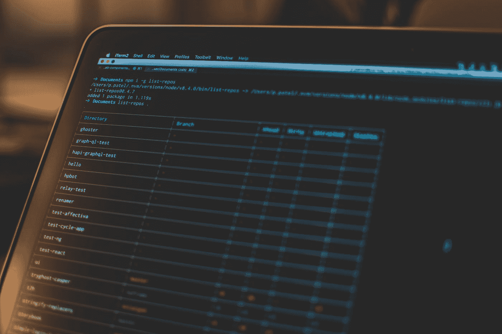

# 为 Go 应用程序建立多阶段 Docker 构建

> 原文：<https://medium.com/codex/set-up-a-multi-stage-docker-build-for-go-applications-a37113791b4f?source=collection_archive---------15----------------------->

## 好的开始是成功的一半



[Pankaj Patel](https://unsplash.com/@pankajpatel?utm_source=medium&utm_medium=referral) 在 [Unsplash](https://unsplash.com?utm_source=medium&utm_medium=referral) 上拍摄的照片

我们将为 Go 应用程序创建一个简单的多阶段 Docker 构建设置。一开始听起来可能令人畏惧，但实际上非常简单。

多阶段 Docker 构建有几个用途。首先，最终的图像尺寸比传统图像更小，其次，它更安全。

使用 dockers 分层，我们可以将构建过程抽象为多个阶段。并且只复制我们下一阶段需要的输出。例如，我们正在运行`go build -o main`创建的二进制文件。

这里的目标是最终得到一个 docker 映像，它只包含并运行最终的二进制文件。最后的二进制是什么，在这个上下文中并不重要。但是在本文中，我将使用一个简单的脚本向控制台输出文本。

## 要求

我们将需要以下工具，所以请确保您已经在机器上安装了这些工具。

*   Go 1.x 或更高版本
*   码头工人
*   VSCode 或任何其他编辑器

## 让我们写一些代码

让我们创建文件夹结构，以便我们有一个良好的基础来构建。在其中创建一个名为`src`和`cd`的目录。

现在，让我们用下面的命令`go mod init hello-world`初始化我们的 go 包。这将创建一个名为`go.mod`的文件。

完成这一部分后，让我们用 Go 编写一个简单的 Hello World。在我们的`src`目录中创建一个名为`main.go`的文件，并添加以下代码。

```
package main

import "fmt"

func main() {
  fmt.Println("Hello World!")
}
```

如果您使用`go run main.go`运行这个命令，输出将是`Hello World!`。太好了，这一部分已经完成了，我们可以从深入 Docker 开始了！

## 戈朗基地形象

将目录(`cd ..`)更改为项目根目录，在这里我们将创建一个`dockerfile`。粘贴下面的代码，然后我会解释我们在做什么。

```
FROM golang:1.16-alpine

# Create a workspace for the app
WORKDIR /app

# Download necessary Go modules
COPY src/go.mod .
RUN go mod download

# Copy over the source files
COPY src/*.go ./

# Build
RUN go build -o /main

ENTRYPOINT ["/main"]
```

这里我们要做一些事情，在`FROM`行我们要指定我们要使用哪个基础图像。设置一个`WORKDIR`就像设置一个我们将要工作的特殊文件夹。然后我们复制我们的`go.mod`，如果需要的话，下载我们的包。然后我们将复制我们的源代码。

在这之后，我们准备构建我们的 go 应用程序，我们使用，`RUN go build -o /main`。既然我们已经创建了一个单独的二进制文件，我们可以在运行 docker 映像时将它设置为入口点。

为了构建我们的图像，我们将使用`docker build . -t hello-world-golang1.16`，这将构建图像。构建完成后。我们可以使用命令`docker run hello-world-golang1.16`将我们的映像作为一个容器来运行，以测试这是否可行。您应该会得到类似于`Hello World!`的输出。

让我们也检查一下我们的图像的大小。使用`docker images`命令，我们可以看到尺寸。

```
REPOSITORY               TAG       IMAGE ID       CREATED              SIZE
hello-world-golang1.16   latest    68b776701cbe   About a minute ago   304MB
```

哇，这是一个沉重的形象！以 304 MB 的速度进来。让我们试着去掉一些脂肪。

在我研究使用多阶段 Docker 构建的过程中。我看到 Docker 文档使用了 Debian 基本映像。正因为如此，我想把它也包括在这里。

让我们用下面的代码替换我们之前创建的`dockerfile`。注意这里的两个注释，Builder 和 Runner。构建器部分用于构建 go 应用程序，仅此而已。对于 Runner 部分也是如此，因为它的唯一目的是运行我们的应用程序。

构建器将`golang:1.6-alpine`作为基础映像，因为它需要在路径中包含`Go`二进制文件。因为 Go 编译成一个二进制文件，所以运行它不需要 Go 的存在。因此，我们可以使用 Debian 的基本映像作为最终的映像来运行我们的应用程序。

```
#
# Builder
#

FROM golang:1.16-alpine AS builder

# Create a workspace for the app
WORKDIR /app

# Download necessary Go modules
COPY src/go.mod .
RUN go mod download

# Copy over the source files
COPY src/*.go ./

# Build
RUN go build -o /main

#
# Runner
#

FROM gcr.io/distroless/base-debian10 AS runner

WORKDIR /

# Copy from builder the final binary
COPY --from=builder /main /main

USER nonroot:nonroot

ENTRYPOINT ["/main"]
```

我正在更改 build 命令，这样我们就不会覆盖我们之前创建的映像。这样，我们可以看到我们的变化对最终的 docker 图像产生了什么影响。

使用`docker build . -t hello-world-debian`建立我们的新形象。让我们看看这是否改变了容器`docker run hello-world-debian`的行为。并且你应该得到和之前一样的输出:`Hello World!`。

让我们用`docker images`检查尺寸。

```
REPOSITORY               TAG       IMAGE ID       CREATED              SIZE
hello-world-debian       latest    7ad8a5965a06   About a minute ago   21.1MB
hello-world-golang1.16   latest    68b776701cbe   About a minute ago   304MB
```

看，21.1 MB，这是一个很大的缩减！

太棒了，但是我们能不能再推一点？是的，我们可以！

使用最小的 docker 基本映像。也就是`scratch`。这已经够光秃秃的了。在 docker 文件的 runner 部分，将`FROM`语句改为`scratch`，如下所示。

```
#
# Runner
#

# FROM gcr.io/distroless/base-debian10 AS runner
FROM scratch AS runner
```

使用`docker build . -t hello-world-scratch`建立我们的新形象。让我们看看这是否改变了容器`docker run hello-world-scratch`的行为。你应该得到和以前一样的输出:`Hello World!`。

让我们使用`docker images`再次检查尺寸。

```
REPOSITORY               TAG       IMAGE ID       CREATED              SIZE
hello-world-scratch      latest    eb41c9777973   58 seconds ago       1.94MB
hello-world-debian       latest    7ad8a5965a06   About a minute ago   21.1MB
hello-world-golang1.16   latest    68b776701cbe   About a minute ago   304MB
```

你看看，1.94 兆！太完美了。

## 包装它

我希望我已经启发你在下一个项目中使用多阶段 Docker 构建。这仍然是一个简单的两阶段 Docker 构建，如果你需要或者当你的项目需要时，你甚至可以使用更多的阶段。

这里有一些有用的链接和源代码，所以你可以自己尝试一下。

*   [戈朗](https://golang.org)
*   [码头工人](https://docs.docker.com/language/golang/build-images/#multi-stage-builds)
*   [源代码](https://github.com/koenverburg/article-source-code/tree/main/multi-stage-docker-build-go)