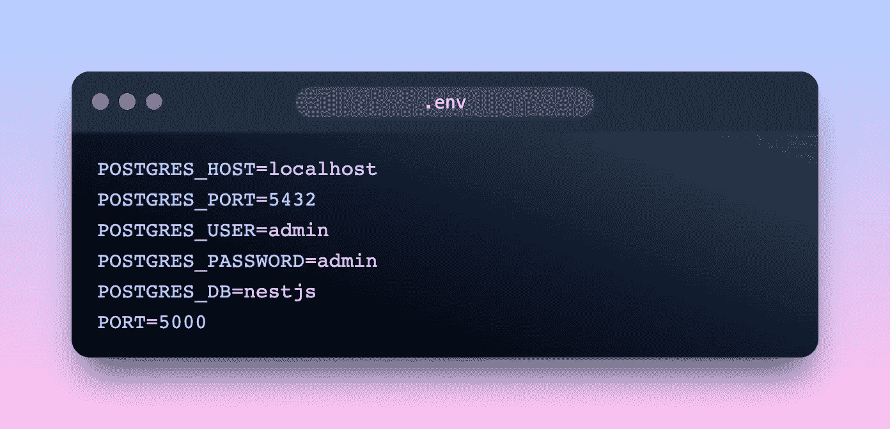

# 设置一个 PostgreSQL 数据库并用 TypeORM 连接到 NestJS

> 原文：<https://medium.com/codex/set-up-a-postgresql-database-and-connect-to-nestjs-with-typeorm-4a2a2f67339b?source=collection_archive---------1----------------------->

# 介绍

学习后端开发最重要的是如何存储数据。在本文中，我们将研究如何使用 **PostgreSQL** 创建一个数据库，并将其连接到 **NestJS** 。为了更容易地管理数据库，我们将使用一个名为 **TypeORM 的**对象关系映射** (ORM)工具。**

# 创建数据库

PostgreSQL ，通常简称为“Postgres”，是一个对象关系数据库管理系统。为了快速创建 PostgreSQL 数据库，我们将使用 **Docker** (确保您安装了 Docker)

首先，我们用这些配置创建了`docker-compose.yml`文件

然后我们创建`docker.env`文件来存储环境变量:

好了，现在我们有了 Docker 和 PostgreSQL，接下来我们要做的是用 NestJS 连接数据库

# 连接数据库

在将 NestJS 应用程序与数据库连接之前，我们需要安装一些依赖项:

*   `@nestjs/typeorm typeorm`:关于 TypeORM 的 2 个库
*   `pg` : PostgreSQL 客户端
*   `@hapi/joi @types/hapi__joi`:模式验证

然后，我们需要创建包含更多数据库变量的`.env`文件和`database.module.ts`来获取所有的 env 和 config 类型表单:

在`MessageModule`旁边，你可以看到我用 Joi 和数据库的模块配置了模式验证，并将它们全部导入到我们的根模块(app)

# 实体

如果你了解数据库，你可能会了解表，在 TypeORM 中，关于它最重要的概念是**实体**，它映射到数据库表:

我创建了一个名为`Message`的简单实体，你可以把它想象成一个`message`表，ID 是它的主键，另一列是`content`

# 让我们写一些 API

设置完毕后，我们将 NestJS 与数据库连接起来并创建一个表。接下来我们要做的是创建控制器和服务

使用 TypeORM 的存储库，我用简单的方法创建了一些 RESTful APIs:

*   **getAllMessages** :我使用了`find`方法，你可以传递很多选项给它，如果没有，它会得到表中的所有记录
*   **getMessageById** :我们可以使用上面的`find`方法，但是我建议使用`findOne`方法，它只返回符合我们标准的第一条记录
*   **createMessage:** 一个简单的创建新消息的方法

# 测试

首先，我们需要用`docker-compose up`启动 Docker

然后，我们用`yarn start:dev`启动我们的 NestJS 服务器

我用邮递员来创建新的信息，它工作得很好

# 结论

在本文中，我们介绍了将 NestJS 应用程序与 PostgreSQL 数据库连接起来的基础知识，并使用 TypeORM 轻松管理查询。

如果文章不清楚，你可以在这里找到[的源代码](https://github.com/leduc1901/nestjs-websocket)

# 遗言

虽然我的内容对每个人都是免费的，但是如果你觉得这篇文章有帮助，[你可以在这里给我买杯咖啡](https://www.buymeacoffee.com/kylele19)