# 用虚拟 Python 环境设置一个基于 Ubuntu 的 EC2 实例

> 原文：<https://medium.com/codex/set-up-an-ubuntu-based-ec2-instance-with-a-virtual-python-environment-ae7c434fccc6?source=collection_archive---------4----------------------->

## 如何使用 Ubuntu 20.04 AMI 创建 EC2 实例，然后通过 AWS CLI 安装 Python 虚拟环境。

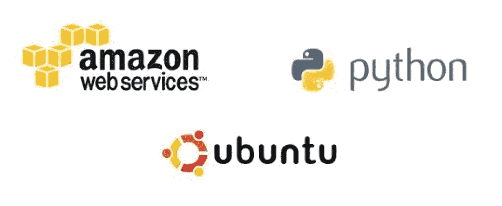

使用 AWS CLI 和 AWS 控制台，我们将完成实现七个目标所需的步骤:

1.  创建用户、下载凭据并设置 AWS CLI。
2.  创建一个 Ubuntu 20.04 Ec2 实例(t3.small)。
3.  使用您的密钥对连接并登录到实例。
4.  刷新更新并升级实例上的所有包。
5.  创建一个名为“environment”的目录，并在该目录中创建一个虚拟 python 环境。
6.  激活虚拟环境并确认环境已启动。
7.  创建一个名为 [hello.py](http://hello.py/) 的程序，打印“hello，World！”在该文件中，退出 vim/nano，并运行程序。

# 步骤 1:用户和 CLI 设置

登录 AWS 管理控制台(控制台)，转到 IAM 仪表板，然后单击“添加用户”

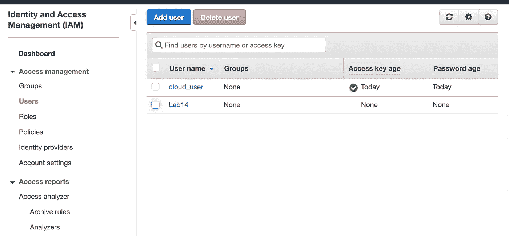

当该选项出现在“用户设置”中时，选中该框以授予新用户编程权限，并在用户的“摘要”选项卡中确认权限设置。

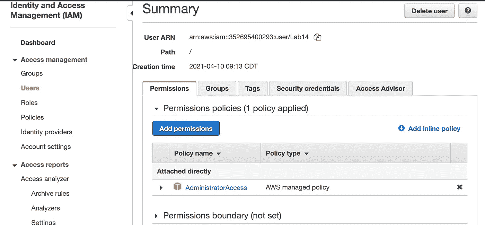

为新用户创建并下载一个**密钥对**——配置 AWS CLI 需要此凭证。

如果您的本地机器上没有安装 AWS CLI，请按照[用户指南第](https://docs.aws.amazon.com/cli/latest/userguide/cli-chap-install.html)页上针对您的操作系统的说明进行安装。

接下来，要通过新用户运行 AWS CLI 命令，您必须在您选择的文本编辑器中更新 AWS 帐户的凭据和配置文件。但是首先，为新用户创建一个登录配置文件:

```
aws iam create-login-profile — user-name <your-user> — password <your-password>
```

*   In ~/。aws/credentials，括号内添加新用户的用户名，添加 *aws_access_key_id* 和 *aws_secret_access_key。*
*   In ~/。aws/config，在括号中添加新用户的 profile ID，并列出 *source_profile* 和 *region* 。

要使用 AWS 资源作为新用户，请输入“export AWS_PROFILE= <new-user>”命令。</new-user>

# 步骤 2:创建一个 Ubuntu 20.04 EC2 实例

回到 AWS 控制台，导航到 EC2 仪表板并单击“启动实例”在这个实例中，设置步骤 1，在搜索字段中输入“Ubuntu”以显示实例选项。选择 **Ubuntu Server 20.04 LTS** 并点击“下一步”

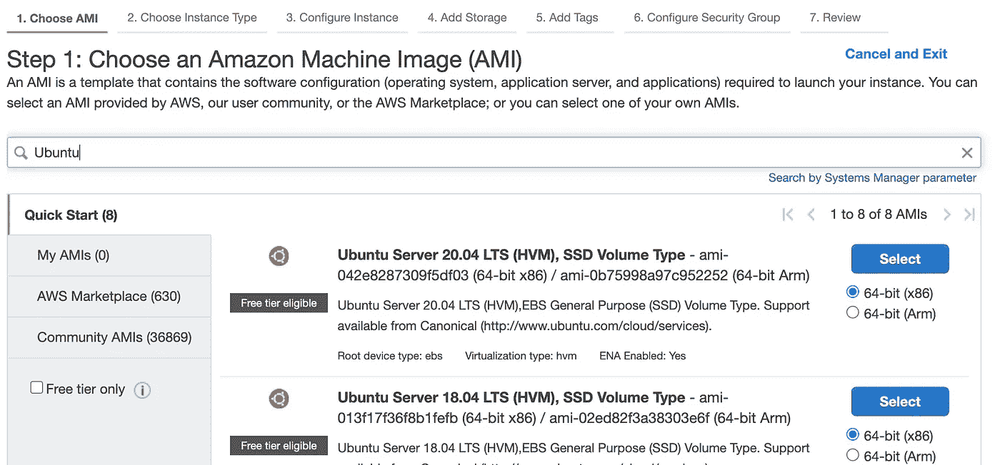

例如，键入，选择“ **t3.small** ”确保在配置步骤中选择“启用”公共 IPv4 地址，并将您的安全组设计为允许从您选择的 IP 范围进行 SSH 访问。

为实例选择或创建一个**密钥对**，然后点击“启动实例”

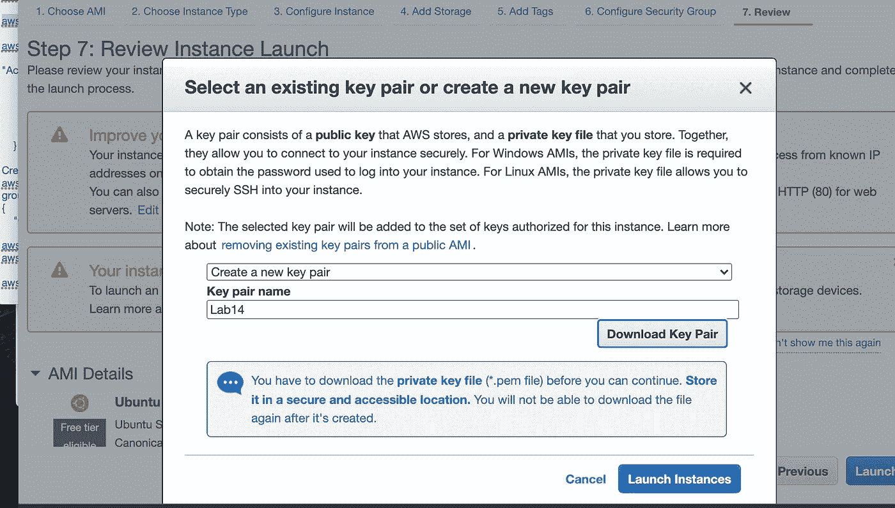

在 EC2 仪表板的 Instances 页面上，确认实例已成功启动并通过了两次状态检查。

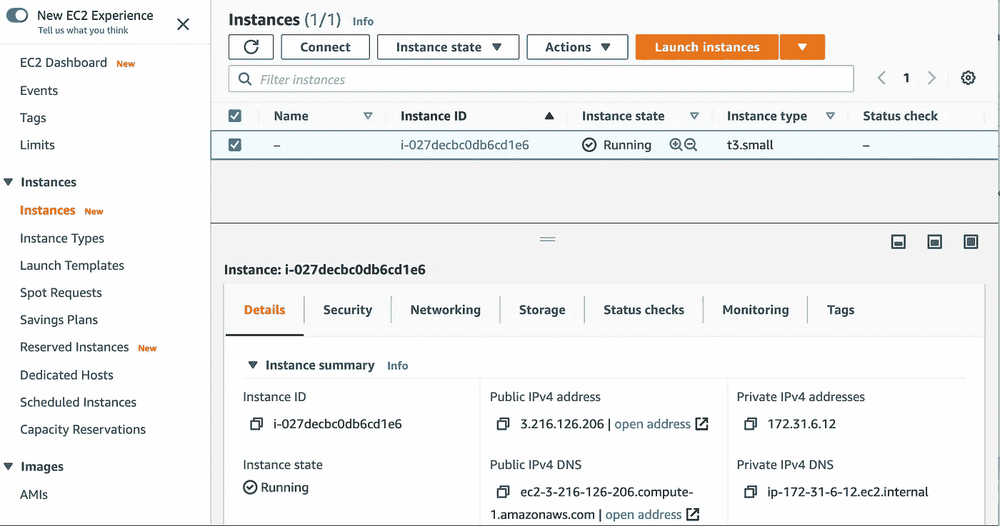

# 步骤 3:连接并登录

当实例准备就绪时，单击“ **Connect** ”并选择用于 SSH 访问的选项卡。按照说明通过 SSH 登录到您的实例。我的输入和输出如下所示:

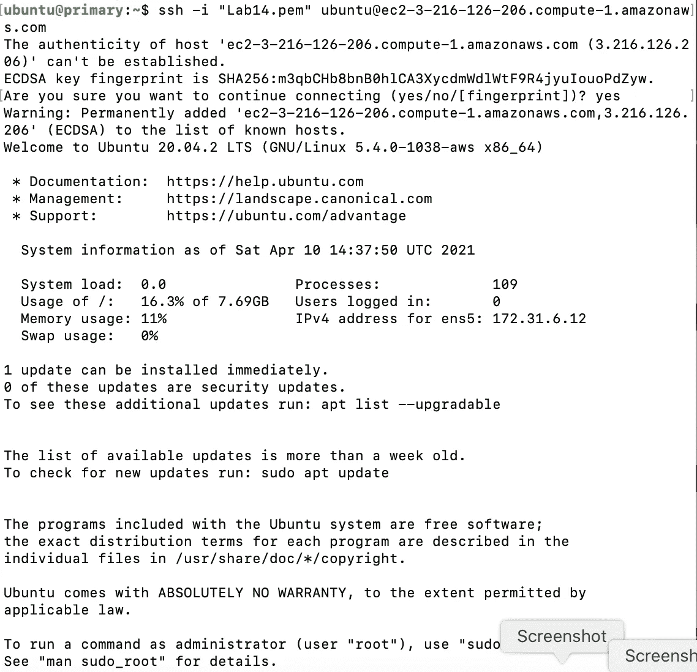

# 步骤 4:更新和升级 Ubuntu 服务器

使用 Ubuntu 命令更新和升级实例及其包，如下所示:

*   为了**更新**，运行 *sudo apt 更新*
*   为了**升级**，运行 *sudo 来升级*(这可能需要一分钟才能完成)。

# 步骤 5:包含虚拟 Python 环境的环境目录

首先，创建一个新目录，运行 ***mkdir 环境*** ，然后将 cd 放入那个目录*。*

其次，使用 Python 的 [**venv**](https://docs.python.org/3/library/venv.html) **模块**在新目录下安装一个虚拟环境。下面的命令应该管用:

```
sudo apt install python3-ven*v*
```

第三，创建包含虚拟环境和库的目录的路径:

```
python3 -m venv <your-env>
```

# 步骤 6:激活虚拟环境并确认

要激活新目录中的 venv 模块，请运行:

```
source <your-env>/bin/activate
```

如果激活成功，您应该会看到您的环境名称出现在命令行的前面，例如:

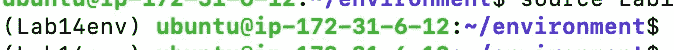

# 步骤 7:创建并运行“hello.py”

要创建一个测试 Python 程序，使用 vim、nano 或您选择的文本编辑器来创建文件“hello.py”。例如 *vim hello.py.*

在新的 Python 文档中，只需输入 Python 命令“print('Hello World！)，”退出文本编辑器，并运行命令:

```
python3 hello.py
```

输出应该立即显示“Hello World！”

例如，我的步骤 5、6 和 7 的 CLI 历史如下所示:

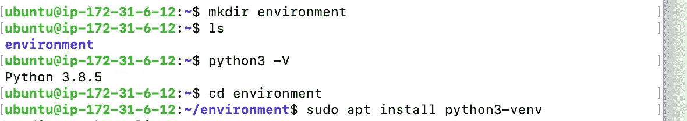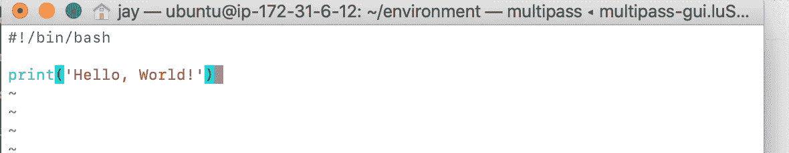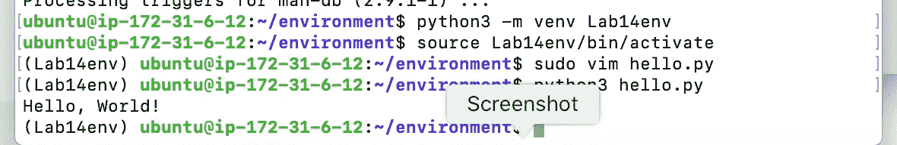

恭喜您，您成功地在 Ubuntu EC2 实例中设置的虚拟环境中创建和运行了一个 Python 程序！

## 感谢您的阅读！