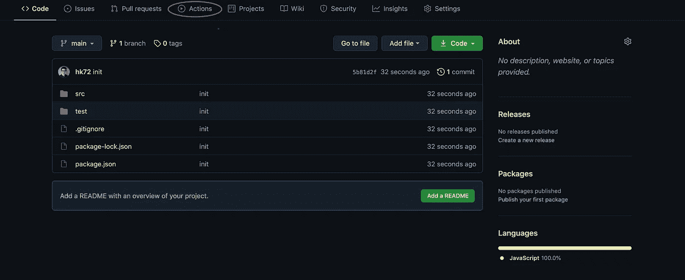
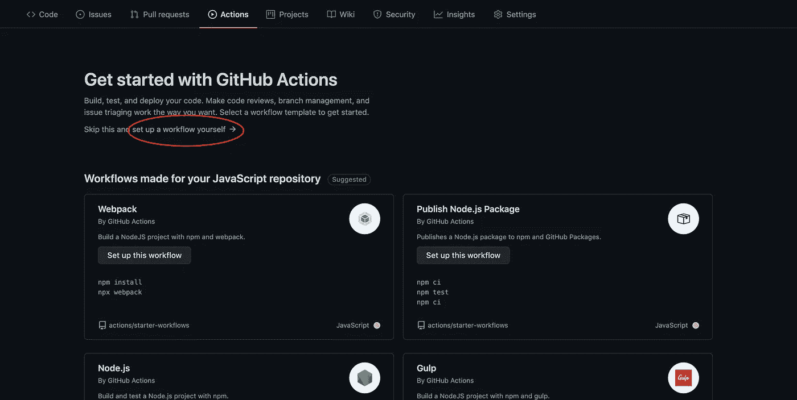
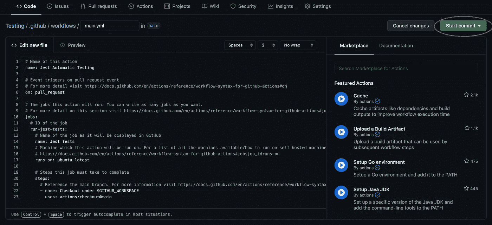
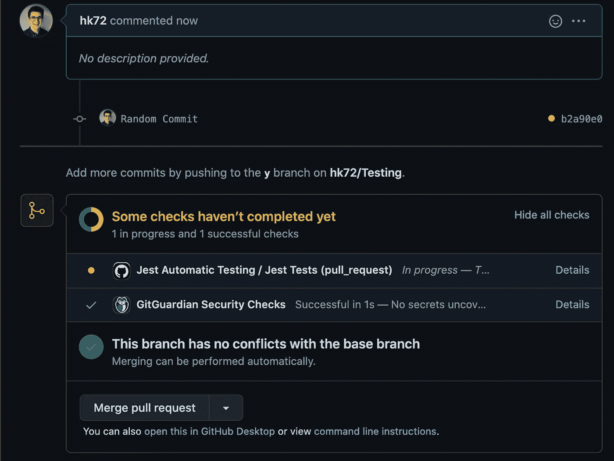
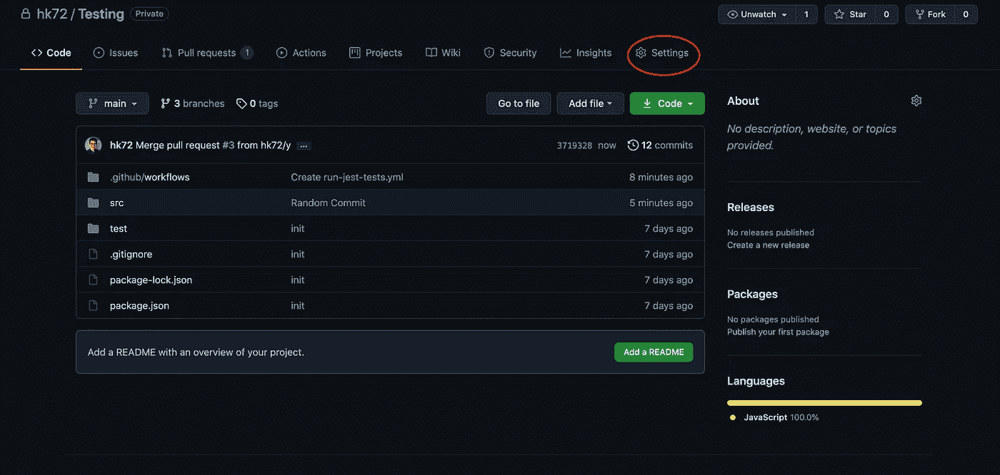
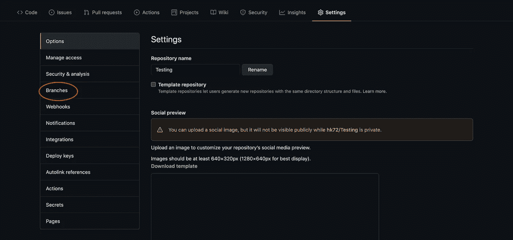
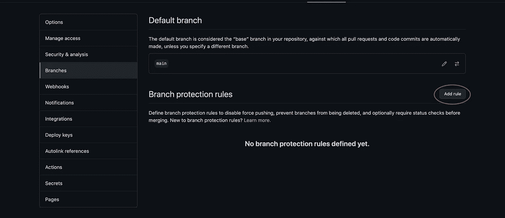
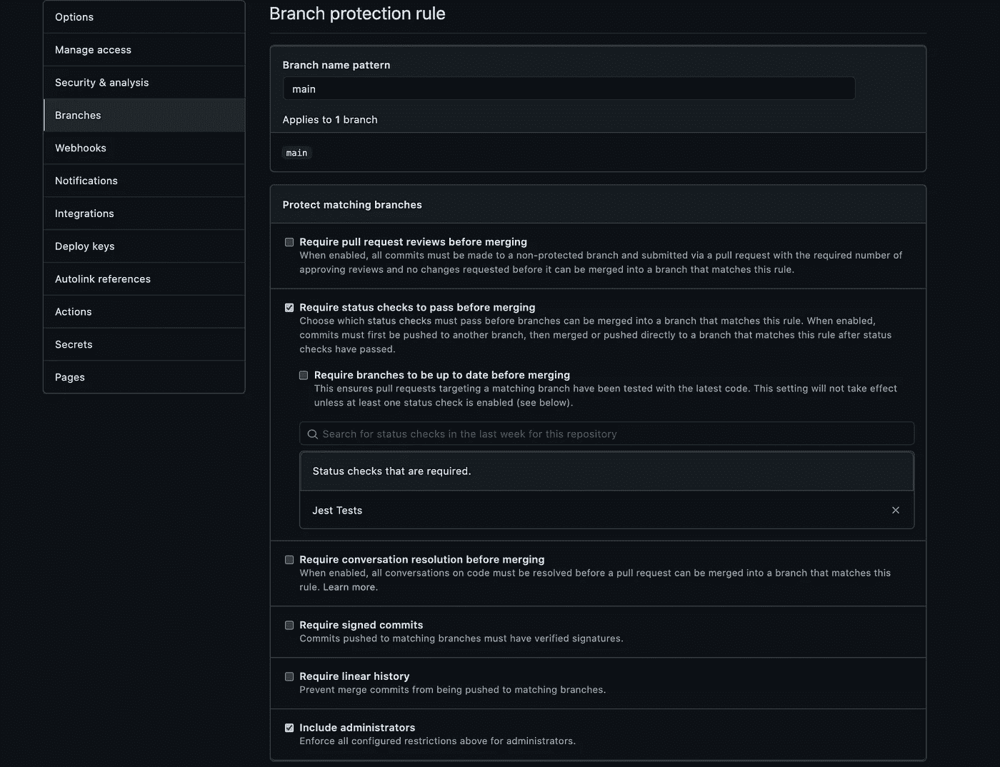
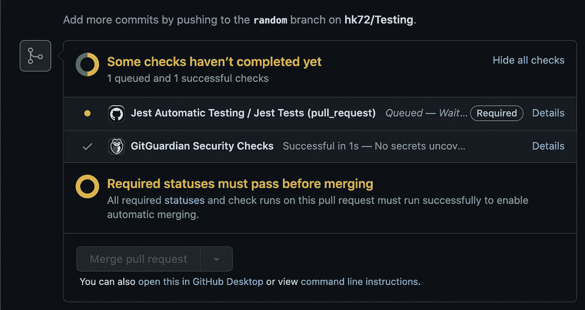
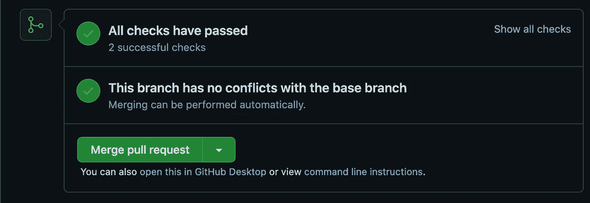

# 设置自动测试

> 原文：<https://medium.com/codex/set-up-automatic-testing-2507dfb94cbe?source=collection_archive---------5----------------------->

## Github 操作

[梁杰森](https://unsplash.com/@ninjason)在 [Unsplash](https://unsplash.com/s/photos/robot) 上的照片

从我之前的博客[如何使用 Jest](https://javascript.plainenglish.io/how-to-write-javascript-unit-tests-using-jest-422b3c4e050f) 编写 JavaScript 单元测试开始，我将解释如何使用 GitHub 动作设置自动测试。

在我看来，设置自动测试是必须的，太多次我忘记运行命令`npm run test`并确保我所有的测试用例在合并到主分支之前通过。在我为创建测试做了这么多工作之后，我仍然忘记运行它们并推出错误的代码，这种想法是疯狂的。在团队项目中，这种情况会变得更糟，因为团队项目中更容易出现 bug。

# 入门指南

在开始之前，我们需要将代码放在 GitHub 库中。如果你不知道如何将你的代码添加到 GitHub 库，你可以遵循这个[指南](https://dev.to/marianyp/git-github-put-in-5-simple-steps-egl)。

一旦你在 Github 上托管了你的代码，我们就可以开始创建一个 GitHub 动作。每当针对主分支发出 Pull 请求(PR)时，我将创建的操作将简单地运行所有 Jest 测试。除非所有测试都通过，否则该操作将阻止所有合并到主分支中，从而降低主分支中出现随机错误的几率。

在存储库中，单击位于顶部的 actions 选项卡。

GitHub 提供了许多流行的操作，你可以在这里看到它们。然而，我们将从头开始创建我们自己的 GitHub 动作。为此，请点击“自行设置工作流程”。

这将打开一个 UI，我们可以在其中创建自己的 GitHub 操作。默认代码如下所示:

当你第一次看到它的时候，它肯定看起来很吓人，但是我保证它没那么糟糕(评论本身解释了每一步，非常棒)。如果你想获得更多关于你看到的所有命令的信息，请访问 Github 操作页面，位于[这里](https://docs.github.com/en/actions)。

我们可以用下面的代码替换上面的代码:

写完这段代码后，点击“开始提交”，将这段代码合并到主分支中。

通过这段代码，我们成功地创建了一个 GitHub 动作，每次创建 PR 时都会运行这个动作。为了测试这一点，创建一个新的分支并创建一个 PR。它应该是这样的:

在这里，我们可以看到 GitHub 操作正在运行我们所有的 Jests 测试。但是，正如您所看到的，我们能够在所有测试完成之前合并这个 PR。显然，我们希望在测试通过之前阻止所有到主分支的合并。为此，我们将设置“分支保护规则”。

为此，请单击“设置”。

接下来点击“分支”。

最后是“添加规则”。

在此页面上，我们将能够设置规则来保护我们的分支机构。在这种情况下，我将只设置一个规则，要求我们的 Jests 测试在合并到主分支之前通过。

为此，我们将首先指定要保护的分支。为此，在“分支名称模式”输入字段中写入`main`。

之后，我们将需要指定“在合并之前需要通过的状态检查”。为此，只需搜索 Github 动作的名称并选择该动作。

最后，我们还需要指定将应用于管理员的规则。如果不选中此框，无论测试是否通过，管理员都可以合并分支。

完成后，点击“Create ”,这将在允许合并到主分支之前将 GitHub 动作状态添加为“通过”。

最后，我们将再次测试这一点。再次，创建一个随机公关。

当 GitHub 操作运行时，您应该看到“合并拉取请求”按钮被禁用。

操作结束后，如果所有测试都通过,“合并拉取请求”按钮将变为启用状态，否则将保持禁用状态。

这总结了如何在 GitHub 上设置自动测试。下次见。编码快乐！