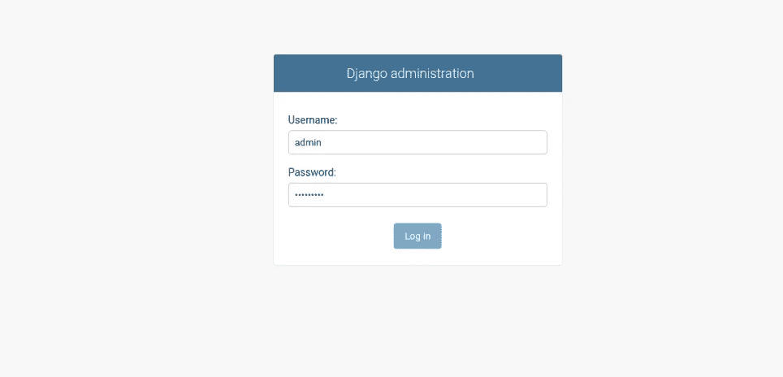
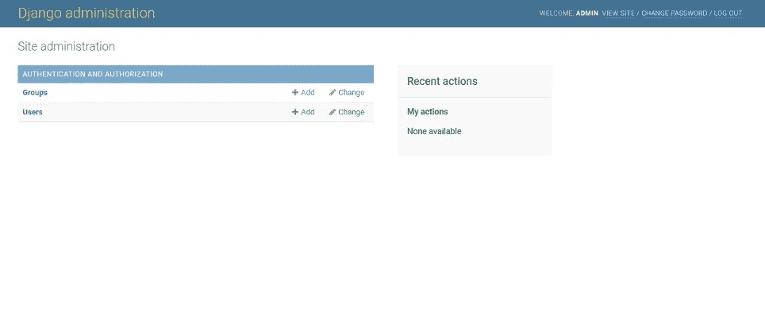

# 在 Ubuntu 20.04 上用 Postgres、Nginx 和 Gunicorn 设置 Django

> 原文：<https://medium.com/codex/set-up-django-with-postgres-nginx-and-gunicorn-on-ubuntu-20-04-a56c6a2f4675?source=collection_archive---------6----------------------->


# 介绍

Django 是一个开源的 Python 框架，可用于部署 Python 应用程序。它附带了一个开发服务器，用于在本地系统中测试您的 Python 代码。如果您想在生产环境中部署 Python 应用程序，那么您将需要一个强大且更安全的 web 服务器。在这种情况下，您可以使用 Gunicorn 作为 WSGI HTTP 服务器，使用 Nginx 作为代理服务器，以健壮的性能安全地为您的应用程序提供服务。

# 先决条件

*   运行 Ubuntu 20.04 的服务器。
*   指向您的服务器 IP 的有效域名。
*   您的服务器上配置了超级用户密码。

# 安装所需的软件包

首先，您需要在服务器上安装 Nginx 和其他 Python 依赖项。您可以使用以下命令安装所有软件包:

`apt-get install python3-pip python3-dev libpq-dev curl nginx -y`

安装完所有软件包后，启动 Nginx 服务，并使其能够在系统重启时启动:

`systemctl start nginx`

`systemctl enable nginx`

# 安装和配置 PostgreSQL

接下来，您需要在您的服务器上安装 PostgreSQL 服务器。您可以使用以下命令安装它:

`apt-get install postgresql postgresql-contrib -y`

安装完成后，使用以下命令登录到 PostgreSQL shell:

```
su - postgres
psql
```

接下来，使用以下命令为 Django 创建一个数据库和用户:

```
CREATE DATABASE 
	djangodb;
CREATE USER 
	djangouser 
	WITH PASSWORD 'password';
```

接下来，使用以下命令授予一些必需的角色:

```
ALTER ROLE djangouser 
	SET client_encoding 
	TO 'utf8';
ALTER ROLE djangouser 
	SET default_transaction_isolation 
	TO 'read committed';
ALTER ROLE djangouser 
	SET timezone 
	TO 'UTC';
GRANT ALL PRIVILEGES 
	ON DATABASE djangodb 
	TO djangouser;
```

接下来，使用以下命令退出 PostgreSQL shell:

`\qexit`

# 创建一个 Python 虚拟环境

接下来，您需要为 Django 项目创建一个 Python 虚拟环境。

首先，将 PIP 包升级到最新版本:

```
pip3 install --upgrade pip
```

接下来，使用以下命令安装 virtualenv 软件包:

```
pip3 install virtualenv
```

接下来，使用以下命令为 Django 项目创建一个目录:

```
mkdir ~/django_project
```

接下来，将目录更改为 django_project，并创建一个 django 虚拟环境:

```
cd ~/django_project
virtualenv djangoenv
```

接下来，激活 Django 虚拟环境:

```
source djangoenv/bin/activate
```

接下来，使用以下命令安装 Django、Gunicorn 和其他包:

```
pip install django gunicorn psycopg2-binary
```

# 安装和配置 Django

接下来，运行以下命令来创建 Django 项目:

```
django-admin.py startproject django_project ~/django_project
```

接下来，编辑 settings.py 并定义您的数据库设置:

```
nano ~/django_project/django_project/settings.py
```

查找并更改以下行:

```
ALLOWED_HOSTS = ['django.example.com', 'localhost']
DATABASES = {  
	'default': {     
		'ENGINE': 'django.db.backends.postgresql_psycopg2',       
		'NAME': 'djangodb',       
		'USER': 'djangouser',        
		'PASSWORD': 'password',        
		'HOST': 'localhost',       
		'PORT': '',    
	}
}
STATIC_URL = '/static/'
import os
STATIC_ROOT = os.path.join(BASE_DIR, 'static/')
```

保存并关闭文件，然后将初始数据库模式迁移到 PostgreSQL 数据库:

```
./manage.py makemigrations
./manage.py migrate
```

接下来，使用以下命令创建一个管理员用户:

```
./manage.py createsuperuser
```

如下所示设置您的管理员用户名和密码:

```
Username (leave blank to use 'root'): admin
Email address: admin@example.com
Password: 
Password (again): 
Superuser created successfully.
```

接下来，将所有静态内容收集到目录中

```
./manage.py collectstatic
```

# 测试 Django 开发服务器

现在，使用以下命令启动 Django 开发服务器:

```
./manage.py runserver 0.0.0.0:8000
```

您应该会看到以下输出:

```
Watching for file changes with StatReloader
Performing system checks...
System check identified no issues (0 silenced).
June 22, 2021 - 11:15:57
Django version 3.2.4, using settings 'django_project.settings'
Starting development server at http://0.0.0.0:8000/
Quit the server with CONTROL-C.
```

现在，打开您的网络浏览器，使用 URL【http://django.example.com:8000/admin/. 访问您的 Django 应用程序，您将被重定向到 Django 登录页面:



提供您的管理员用户名和密码，然后点击登录。您应该在下一页看到 Django 仪表板:



现在，回到您的终端，按 CTRL + C 停止 Django 开发服务器。

# 测试 Gunicorn

接下来，你需要测试 Gunicorn 是否能为 Django 服务。您可以使用以下命令启动 Gunicorn 服务器:

```
gunicorn --bind 0.0.0.0:8000 django_project.wsgi
```

如果一切正常，您应该得到以下输出:

```
[2021-06-22 11:20:02 +0000] [11820] [INFO] Starting gunicorn 20.1.0
[2021-06-22 11:20:02 +0000] [11820] [INFO] Listening at: http://0.0.0.0:8000 (11820)
[2021-06-22 11:20:02 +0000] [11820] [INFO] Using worker: sync
[2021-06-22 11:20:02 +0000] [11822] [INFO] Booting worker with pid: 11822
```

按下 **CTRL + C** 停止 Gunicorn 服务器。

接下来，使用以下命令停用 Python 虚拟环境:

```
deactivate
```

# 为 Gunicorn 创建一个 Systemd 服务文件

为 Gunicorn 创建一个`systemd`服务文件来启动和停止 Django 应用服务器是一个好主意。

为此，使用以下命令创建一个套接字文件:

```
nano /etc/systemd/system/gunicorn.socket
```

添加以下几行:

```
[Unit]
Description=gunicorn socket
[Socket]ListenStream=/run/gunicorn.sock
[Install]
WantedBy=sockets.target
```

保存并关闭文件，然后为 Gunicorn 创建一个服务文件:

```
nano /etc/systemd/system/gunicorn.service
```

添加以下与 Django 项目路径匹配的行:

```
[Unit]
Description=gunicorn daemon
Requires=gunicorn.socket
After=network.target
[Service]
User=root
Group=www-data
WorkingDirectory=/root/django_project
ExecStart=/root/django_project/djangoenv/bin/gunicorn --access-logfile - --workers 3 --bind 
unix:/run/gunicorn.sock          django_project.wsgi:application
[Install]
WantedBy=multi-user.target
```

保存并关闭文件，然后为 Django 项目目录设置适当的权限:

```
chown -R www-data:root ~/django_project
```

接下来，使用以下命令重新加载`systemd`守护进程:

```
systemctl daemon-reload
```

接下来，启动 Gunicorn 服务，并使其能够在系统重启时启动:

```
systemctl start gunicorn.socket
systemctl enable gunicorn.socket
```

要检查 Gunicorn 的状态，请运行以下命令:

```
systemctl status gunicorn.socket
```

您应该得到以下输出:

```
● gunicorn.socket - gunicorn socket     
Loaded: loaded (/etc/systemd/system/gunicorn.socket; enabled; vendor preset: enabled)     
Active: active (running) since Tue 2021-06-22 12:05:05 UTC; 3min 7s ago   Triggers: ● gunicorn.service     
Listen: /run/gunicorn.sock (Stream)     
CGroup: /system.slice/gunicorn.socket
Jun 22 12:05:05 django systemd[1]: Listening on gunicorn socket.
```

# 将 Nginx 配置为 Gunicorn 应用程序的反向代理

接下来，您需要将 Nginx 配置为反向代理，以服务于 Gunicorn 应用服务器。

为此，创建一个 Nginx 配置文件:

```
nano /etc/nginx/conf.d/django.conf
```

添加以下几行:

```
server {  
	listen 80;     
	server_name django.example.com;    
	location = /favicon.ico { access_log off; log_not_found off; }    
	location /static/ {         
		root /root/django_project;     
	}    
	location / {         
		include proxy_params;         
		proxy_pass http://unix:/run/gunicorn.sock;     
	}
}
```

保存并关闭文件，然后验证 Nginx 是否存在任何配置错误:

```
nginx -t
```

输出:

```
nginx: the configuration file /etc/nginx/nginx.conf syntax is ok
nginx: configuration file /etc/nginx/nginx.conf test is successful
```

最后，重启 Nginx 服务以应用更改:

```
systemctl restart nginx
```

现在，您可以使用 URL[http://django.example.com/admin.](http://django.example.com/admin.)访问 Django 应用程序

# 结论

在上面的指南中，您学习了如何使用 Gunicorn 和 Nginx 作为反向代理来部署 Django 应用程序。现在，您可以在生产环境中使用这种设置来部署安全和高性能的 Python 应用程序。

Gerry Sabar 的专题图片:[https://gerrysabar . medium . com/deploying-django-3-nginx-postgre-to-Ubuntu-18-04-VPS-220 c 529 b 588](https://gerrysabar.medium.com/deploying-django-3-nginx-postgre-to-ubuntu-18-04-vps-220c529b588)"