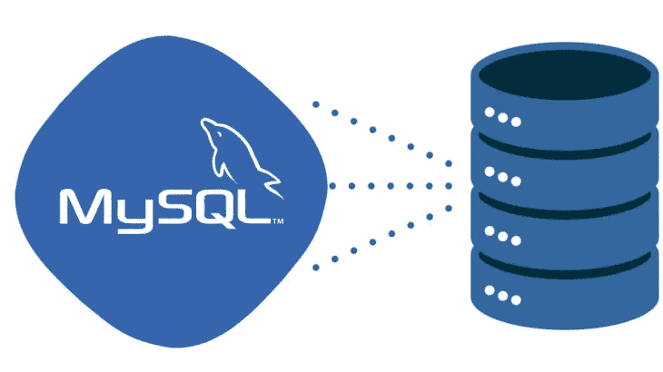

# 在 Ubuntu 20.04 上设置 MySQL 8 主从复制

> 原文：<https://medium.com/codex/set-up-mysql-8-master-slave-replication-on-ubuntu-20-04-dd965a3af40a?source=collection_archive---------7----------------------->



MySQL 是开源的，也是使用最广泛的关系数据库管理系统之一。设置一个单独的 MySQL 备份服务器在发生故障时是必不可少的，因为备份服务器包含成功恢复所需的一切。

MySQL 中的复制特性允许您维护 MySQL 数据的多个副本。主服务器中的所有数据将自动同步到从服务器。如果您的主服务器出现故障，您可以将从服务器提升为主服务器进行提交操作。

# 先决条件

*   两台运行 Ubuntu 20.04 的服务器。
*   两台服务器上都配置了 root 密码。

对于本教程，我们将使用以下配置:


# 安装 MySQL 8

首先，您需要在两台服务器上安装 MySQL 8 服务器。

运行以下命令在两台服务器上安装 MySQL 8 服务器。

`apt install mysql-server -y`

安装 MySQL 服务器后，您需要在两台服务器上设置 MySQL root 密码。

运行以下命令设置 root 密码:

`mysql_secure_installation`

您将被问到以下问题:

`Press y|Y for Yes, any other key for No:`

只需按下**键，输入**即可设置 root 密码:

```
Please set the password for root here. 
New password: 
Re-enter new password:
```

设置您的 MySQL root 密码，并回答如下所示的其余问题:

```
Remove anonymous users? (Press y|Y for Yes, any other key for No) : Y
Disallow root login remotely? (Press y|Y for Yes, any other key for No) : Y
Remove test database and access to it? (Press y|Y for Yes, any other key for No) : Y
Reload privilege tables now? (Press y|Y for Yes, any other key for No) : Y
```

# 配置主服务器

首先，您需要在主服务器上编辑 MySQL 默认配置文件，以允许远程访问并启用二进制日志。

`nano /etc/mysql/mysql.conf.d/mysqld.cnf`

添加或修改以下行:

```
[mysqld]
pid-file = /var/run/mysqld/mysqld.pid
socket = /var/run/mysqld/mysqld.sock
datadir = /var/lib/mysql
bind-address            = 0.0.0.0  
log_error = /var/log/mysql/error.log
server-id = 1
log_bin = /var/log/mysql/mysql-bin.log
max_binlog_size = 500M
slow_query_log = 1
```

保存并关闭文件，然后重启 MySQL 服务以应用更改。

`systemctl restart mysql`

# 在主服务器上创建复制用户

接下来，您需要在主服务器上创建一个复制用户来管理复制。

为此，使用以下命令连接到 MySQL shell:

`mysql -u root -p`

提供您的 MySQL root 密码，然后运行以下命令创建一个复制用户:

```
mysql> CREATE USER slaveuser@45.58.40.60 IDENTIFIED WITH mysql_native_password BY 'password';
```

接下来，向复制用户授予复制从属权限:

`mysql> grant replication slave on *.* to slaveuser@45.58.40.60;`

接下来，刷新权限以应用更改:

`mysql> flush privileges;`

接下来，使用以下命令检查权限:

`mysql> show grants for slaveuser@45.58.40.60;`

样本输出:

```
+-------------------------------------------------------------+
| Grants for slaveuser@45.58.40.60                            |
+-------------------------------------------------------------+
| GRANT REPLICATION SLAVE ON *.* TO `slaveuser`@`45.58.40.60` |
+-------------------------------------------------------------+
```

接下来，使用以下命令退出 MySQL shell:

`mysql> exit;`

**注意**:将**45.58.40.60**替换为**从**服务器的 IP 地址。

# 配置从属服务器

接下来，您需要编辑 MySQL 主配置文件并进行一些更改:

`nano /etc/mysql/mysql.conf.d/mysqld.cnf`

添加或修改以下行:

```
pid-file        = /var/run/mysqld/mysqld.pid
socket = /var/run/mysqld/mysqld.sock
bind-address            = 0.0.0.0  
datadir = /var/lib/mysql
log_bin = /var/log/mysql/mysql-bin.log
server-id = 2
read_only = 1
max_binlog_size = 500M
slow_query_log   = 1
```

保存并关闭文件，然后重启 MySQL 服务以应用更改:

`systemctl restart mysql`

# 在从属服务器上初始化复制

接下来，您需要在从属服务器上启动复制过程。

首先，使用以下命令连接到主服务器上的 MySQL shell:

`mysql -u root -p`

接下来，使用以下命令检查主机状态:

`mysql> show master status\G`

样本输出:

```
*************************** 1\. row ***************************
             File: mysql-bin.000002
         Position: 1047
     Binlog_Do_DB: 
 Binlog_Ignore_DB: 
Executed_Gtid_Set: 
1 row in set (0.00 sec)
```

从上面的输出中，记下主日志文件和位置号

接下来，转到从属服务器并连接到 MySQL shell:

`mysql -u root -p`

接下来，使用从主服务器获得的信息，用以下命令配置从服务器:

```
mysql> CHANGE MASTER TO MASTER_HOST='45.58.41.25', MASTER_USER='slaveuser', MASTER_PASSWORD='password', MASTER_LOG_FILE='mysql-bin.000002', MASTER_LOG_POS=1047;
```

接下来，使用以下命令启动从属服务器:

**注意**:用**主**服务器的 IP 地址替换 IP**45.58.41.25**。

`mysql> start slave;`

接下来，使用以下命令验证从机状态:

`mysql> show slave status\G`

您应该得到以下输出:

```
*************************** 1\. row ***************************
               Slave_IO_State: Waiting for master to send event
                  Master_Host: 45.58.41.25
                  Master_User: slaveuser
                  Master_Port: 3306
                Connect_Retry: 60
              Master_Log_File: mysql-bin.000002
          Read_Master_Log_Pos: 1047
               Relay_Log_File: slave-relay-bin.000002
                Relay_Log_Pos: 324
        Relay_Master_Log_File: mysql-bin.000002
             Slave_IO_Running: Yes
            Slave_SQL_Running: Yes
```

# 验证主从复制

至此，MySQL 主从复制配置完成。现在，是时候测试复制是否工作了。

首先，转到主服务器，使用以下命令创建一个数据库:

```
mysql -u root -p 
mysql> create database replicadb;
```

接下来，使用以下命令验证所有数据库:

`mysql> show databases;`

样本输出:

```
+--------------------+
| Database           |
+--------------------+
| information_schema |
| mysql              |
| performance_schema |
| replicadb          |
| sys                |
+--------------------+
```

接下来，退出 MySQL shell:

`mysql> exit;`

接下来，转到从属服务器并连接到 MySQL

`mysql -u root -p`

接下来，使用以下命令列出所有数据库:

`mysql> show databases;`

样本输出:

```
+--------------------+
| Database           |
+--------------------+
| information_schema |
| mysql              |
| performance_schema |
| replicadb          |
| sys                |
+--------------------+
```

上面的输出表明 MySQL 主从复制按预期工作，因为数据库**‘replica db’**在服务器 2 上被复制。

# 结论

在上面的指南中，您学习了如何在 Ubuntu 20.04 上设置双节点 MySQL 8 主从复制。现在，您可以在生产环境中实现此设置，以执行数据库的实时拷贝。