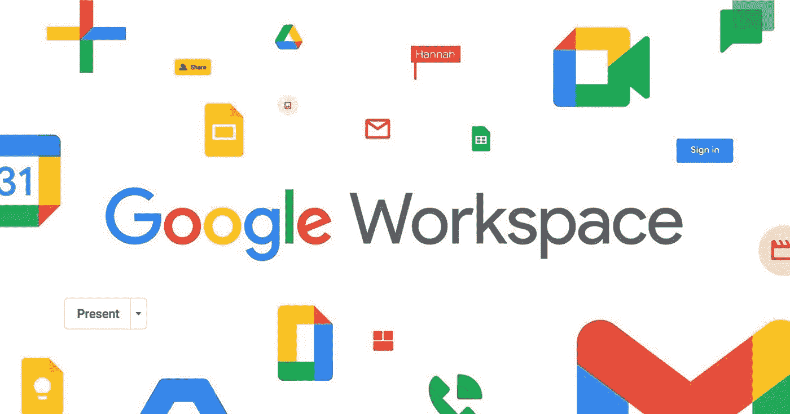
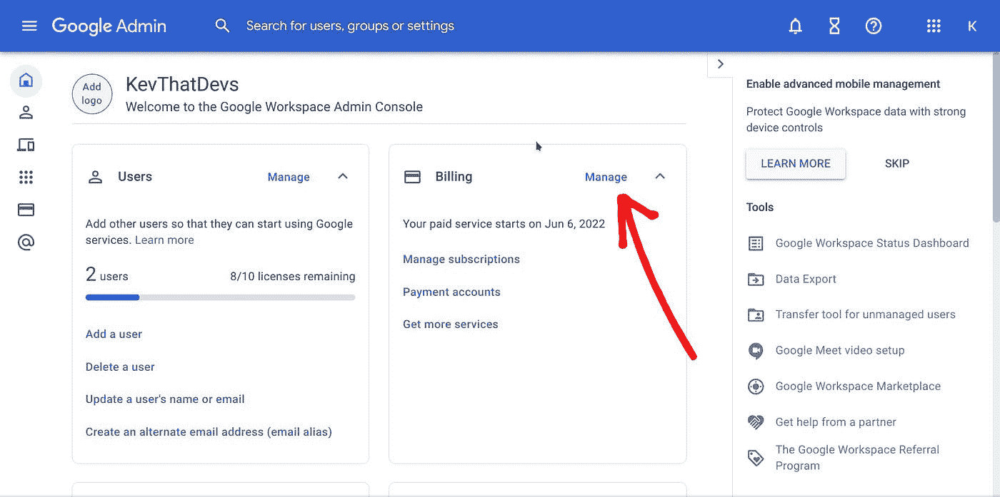

# 使用 Google Workspace 设置自定义域 Gmail

> 原文：<https://medium.com/codex/setting-up-a-custom-domain-gmail-with-google-workspace-18c94375dfc9?source=collection_archive---------15----------------------->

# 领域

有很多热门的地方可以获得域名站点(想想[google.com](http://google.com))。热门的有[谷歌域名](https://domains.google/)和 [GoDaddy](https://www.godaddy.com/) 。我用了 [Porkbun](https://porkbun.com/) ,因为他们提供最低利润的最便宜的域名。我从 2020 年初就开始使用 Porkbun，我可以确认它们非常棒。

*注意:对于临时域名(长达一年)，我使用了*[*Ionos*](https://www.ionos.com/)*，因为他们有一吨 1 美元的第一年特别优惠。*

# 谷歌工作区

[Google Workspaces](https://workspace.google.com/) 让您可以访问整套 Google 产品，如 Google Gmail 和 Google Drive。我个人为我的一个域名建立了一个谷歌工作空间，以创建一个定制的 gmail，这是谷歌工作空间的一个常见用例。

在创建工作空间的过程中，谷歌给出了很好的指导，你可以根据你的域名提供商来遵循。然而，在他们的注册过程中有一些不清楚的随机漏洞。

浏览他们的步骤，他们不会向你展示他们所有的计划。他们默认您使用他们的业务标准计划，即每个用户每月 12 美元。如果您想以每个用户每月 6 美元的价格注册 Business Starter 计划，您必须向下滚动并单击他们的 [Get started](https://workspace.google.com/business/signup/welcome?hl=en&source=gafb-pricing-businessstarter-en&ga_region=noram&ga_country=us&ga_lang=en&sku=businessstarter) 按钮，或者在 14 天的免费试用期内从 Business Standard 计划手动降级。我选择了后者。

*注意:对于后者，在创建帐户并验证一切后，您只需进入计费- >管理，然后点击您的计划，并点击“升级或降级”，将商业标准计划降级为更便宜的商业启动计划*

在购买过程中，如果您有促销代码，可能会要求您提供。幸运的是，我有一些权利[这里](https://gcodes.wso.host/)。我知道这个网站看起来很可疑，但是相信我它是有效的。

经过这些环节后，你必须配置你的 DNS 记录，只需按照他们给出的指示。出于某种原因，他们会要求您创建额外的用户；我不认为有任何方法可以跳过这一点，所以你可能只需要创建一些虚拟的，然后删除它们。

然后你就有了你的第一个 gmail！10 美元，你的第一个 gmail 就是@了。

# 可选向您的 Gmail 添加别名

如果您想为 gmail 添加别名，这是一个可选部分。别名是添加额外 gmails 的方法，而不需要为额外的用户付费。这些 Gmail 没有自己的 YouTube 和 Google Drive 服务，但你可以通过这些 Gmail 收发电子邮件。

如果你想为不同的目的添加额外的参考 gmails，如垃圾邮件、联系人等，这些都很好。要设置别名，在您的 Google Admin 选项卡中，类似于 Billing -> Manage 所在的位置，转到 Users -> Manage，单击该按钮，然后单击您想要为其创建别名的用户并滚动到 User information(第一个窗格)，然后编辑名为**Alternate email addresses(email alias)**的第二个窗格，并键入您想要添加的备用电子邮件。

接下来，打开您的 [gmail](https://blog.kevthatdevs.com/mail.google.com) ，登录您的原始电子邮件(不是别名)并在 gmail 中添加您的别名。以下说明的屏幕截图如下。

首先，点击屏幕右上角附近的设置齿轮图标，这将打开一个右边栏。点击“快速设置”下的“查看所有设置”，或者侧边栏顶部的第一个窗格。

接下来，点击设置栏中的账户，查看第二个名为**的窗格，发送邮件为:**。在那里，向下看，点击“添加另一个电子邮件地址。”这将打开另一个弹出窗口。输入您在 Google Workspace 中输入的别名电子邮件地址，然后选中“视为别名”然后，点击**下一步> >** 后，您应该已经创建好别名了！

我们走吧！祝贺您使用别名设置了 Google Workspace gmail。

我开发了一个名为方言的应用，这是一个编程帮助的优步。如有任何编程问题，请寻求帮助，一位经过审查的专业人士将与你进行视频通话，帮助你解决问题。来[方言修复你的 bug . so](https://dialect.so/)

*原载于*[*https://blog.kevthatdevs.com*](https://blog.kevthatdevs.com/setting-up-a-custom-domain-gmail-with-google-workspace)*。*