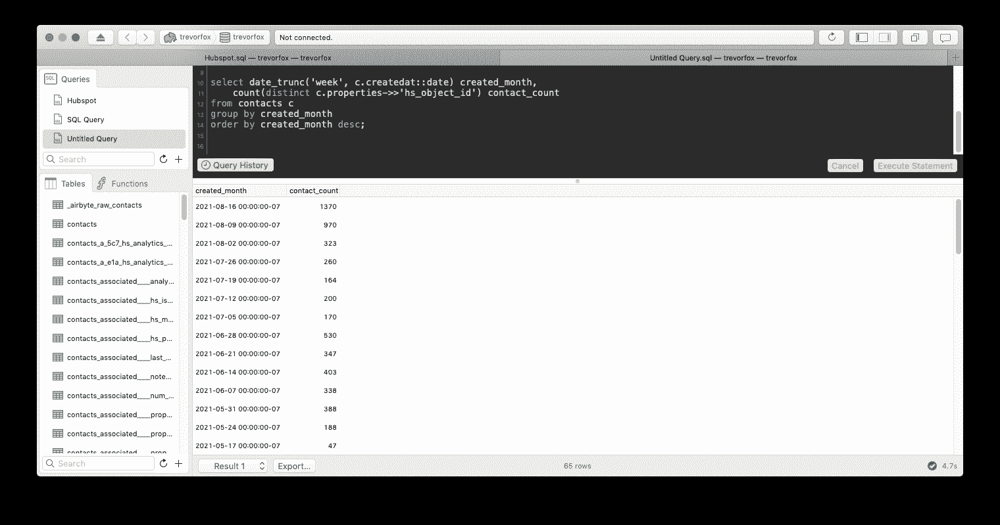

# 设置 Airbyte ETL:最小可行数据栈第二部分

> 原文：<https://medium.com/codex/setting-up-airbyte-etl-minimum-viable-data-stack-part-ii-c5f8bbfb406d?source=collection_archive---------10----------------------->


在最小可行数据堆栈系列的第一篇文章中，我们设置了一个使用 SQL 分析 CSV 数据的进程来启动 T2。我们在 Mac 个人电脑上设置了一个 Postgres 数据库实例，上传了一个 CSV 文件，并编写了一个查询来分析 CSV 文件中的数据。

**这是一个好的开始！**您可以按照这种模式对不适合 Excel 或 Google 工作表的 CSV 文件进行一些有趣的分析。但是这种模式很慢，并且需要您在新数据可用时不断上传新数据。

这篇文章将展示如何直接连接到数据源，这样你就可以在数据可用时自动加载数据。

这个过程被称为 ETL，是提取、转换、加载的缩写。简单地说，ETL 仅仅意味着，*“连接到一个数据源，以一种可以存储在数据库表中的方式组织数据，并将其加载到那些表中。”如果你真的想深入了解的话，还有更多的东西，但就我们的目的而言，你现在只需要知道这些。*

对于教程的这一部分，**我们将使用一个名为 Airbyte 的开源 ETL 工具来连接 Hubspot，并将一些联系人数据加载到我们之前设置的同一个 Postgres 数据库中。**然后我们将运行几个分析查询来吊起你的胃口！

## **设置 ETL 工具(Airbyte)**

我为这个演示选择了 [Airbyte](https://airbyte.io/) ,因为它是开源的，这意味着只要你有一台运行它的计算机或服务器，它就可以免费使用。它很大程度上基于另一个 ETL 工具的开源工作，这个工具叫做 [Stitch](https://www.stitchdata.com/) 在被 Talend 收购之前一直在推广。那个项目叫[歌手](https://www.singer.io/)。

对于我们最小可行的数据堆栈来说，Airbyte 最好的一点是，它们使运行开源代码变得如此容易，因为它被打包在另一个名为 [Docker](https://www.docker.com/) 的软件框架中。是的，如果你在家做记录，这意味着我们正在使用一个开源框架，它被打包在另一个开源框架中，又被打包在另一个开源框架中。哦，开源的美妙之处！

为了使本教程易于管理，我将完全“手动”Docker 设置。幸运的是，这很容易做到。由于本教程是针对 Mac 的，**遵循** [**Docker 针对 Mac 的安装说明**](https://docs.docker.com/desktop/mac/install/) **。**

*🎵安装 Docker 时会播放插曲音乐🎵*

**一旦你安装了 Docker** ，你就可以运行 Docker 应用程序，这将允许你运行名为“容器”的应用程序把容器想象成*“一个应用程序需要的所有代码和依赖项，打包后你只需点击“开始”*(而不是一个接一个地加载所有独立的依赖项！)


我们将只在 Docker 上下载和运行一个应用程序:Airbyte！

**注意:**如果你在接下来的几个步骤中需要帮助， [Airbyte 有一个 Slack 社区](https://airbyte.io/community)真的很有帮助。

下载 Airbyte 的指令很简单。打开你的终端就行了(使用 Mac 的 spotlight 搜索[cmd+space]输入“终端”就能找到这个)。在终端中只需粘贴以下三个命令:

```
git clone https://github.com/airbytehq/airbyte.git
cd airbyte
docker-compose up
```

**这些命令告诉你的电脑**将 Github 存储库中的所有代码复制到你的电脑中一个名为“airbyte”的文件夹，然后将“cd”也就是“changing the directory”复制到“airbyte”目录，然后告诉 Docker 运行 Airbyte 应用程序容器。

它的美妙之处在于，一旦你第一次从命令行运行它，你就可以通过点击“play”按钮从 Docker UI 启动 Airbyte。


Airbyte 将做一些设置，然后您的终端将显示上面显示的文本。此时，Airbyte 正在你的电脑上运行，要使用它，你所要做的就是打开浏览器，进入 [http://localhost:8000](http://localhost:8000) 。

**如果你想知道这是如何工作的**，Airbyte 正在运行一个 web 服务器来提供一个 web 接口，与完成所有繁重的 ETL 工作的代码进行交互。如果这是一个普通的 ETL 工具，如 [Stitch](https://www.stitchdata.com/) 或 [Fivetran](https://fivetran.com/) ，网络服务器和 ETL 进程将运行在一个真实的服务器上，而不是你的个人电脑上。

如果一切都按计划进行，你可以访问 [http://localhost:8000](http://localhost:8000) 并看到 Airbyte 应用程序 UI 正在运行并准备开始 ETL-ing！


## **设置您的第一个 ETL 作业(Hubspot 到 Postgres)**

我承认，最后一部分有点可怕，但不要担心，从这里开始会变得更容易(只要一切按计划进行……)

从这里开始，我们必须将数据库和数据源都连接到 Airbyte，这样它就可以访问源数据并获得写入数据库的权限。

我选择从 Hubspot 加载数据，因为它真的很容易连接，因为它显示了 ETL 的起伏……当然，我们仍在使用 Postgres。

## **创建 Postgres 目的地**

你所要做的就是从 Postgres.app 中粘贴你的数据库凭证。

这些是我们在上一篇文章中用来连接 Postico 的相同 ODBC 凭证。您可以通过点击您的数据库名称在 Postico 主页屏幕上找到它们。注意


在我的例子中，这些是设置:

*   我称它为“Postgres.app ”,但它可以是你想要的任何东西
*   **主机:**使用**Host . docker . internal**(localhost 不支持 Docker。参见上面的说明)
*   **端口:** 5432
*   **数据库名称:**我的是“trevorfox”这是我默认的 Postgres.app 数据库的名称
*   **模式:**我将其保留为“public”你可能希望[将模式用于组织目的](https://docs.airbyte.io/understanding-airbyte/namespaces)。模式是“名称空间”,您可以将它们视为表的文件夹。
*   用户:同样，我的名字是“trevorfox ”,因为这是我设置 Postgres.app 时的默认设置
*   **密码:**除非您在 Postgres.app 中设置了密码，否则可以留空

从那里，您可以测试您的连接，您应该会看到一条消息说，“所有连接测试通过！”

## **创建轮毂点源**

您首先需要[检索您的 API 密钥](https://knowledge.hubspot.com/integrations/how-do-i-get-my-hubspot-api-key)。一旦你得到了它，你可以在 Airbyte 中创建一个新的 Hubspot 源。

我使用了这些设置:

*   **名称:**轮毂点
*   **源类型:**轮毂点
*   **API 密钥:**我的 Hubspot API 密钥
*   **start_date:** 我用的是**2017–01–25t 00:00:00Z**2017 年 1 月 1 日的机器可读时间戳


*这里有一张可爱的图片来庆祝走了这么远！*


## **创建 ETL 连接**

既然我们已经创建了一个目的地和一个源，我们所要做的就是告诉 Airbyte 我们想从源中提取数据并将数据加载到目的地。

返回目的地屏幕，打开 Postgres.app 来源，点击“添加来源”，然后选择您的来源。对我来说，这是我创造的名为“中枢点”的来源

然后，Airbyte 将去测试源和目的地。一旦两个测试都成功，您就可以设置您的同步。


**设置很多！幸运的是，你可以让它们保持原样，直到你想更具体地了解如何存储和组织你的数据。**

现在，将**同步频率**设置为“手动”，取消选中除联系人之外的所有 Hubspot 对象。

将来，您可以选择加载更多的对象来进行更复杂的分析，但是从联系人开始比较好，因为完成第一次加载会快很多，而且分析仍然会很有趣。

单击屏幕底部的“设置连接”按钮。


**您已经创建了您的第一个连接！**点击“立即同步”,启动 ETL 作业！

同步运行时，您会看到大量日志。如果你仔细看，你会看到一些写着“…记录读取:3000”等。这将让您了解同步的进度。


**现在 Postgres 在发生什么？**

Airbyte 正在创建临时表并将所有数据加载到这些表中。然后，它会将该数据复制到最终状态表中。这些表将以一种更容易分析的方式进行组织。这是 ETL 过程中更多的 **T** 和 **L** ！

当同步运行时，您可以返回 Postico 并刷新表列表(cmd+R ),以查看生成的新表。

## **我们来看数据！**

当作业完成时，您会注意到 Airbyte 已经在数据库中创建了许多表。有一个“contacts”表，但是还有很多其他表以“contacts_”为前缀。

## 为什么这么多桌子？

这些都是从一个 [JSON](https://en.wikipedia.org/wiki/JSON) [REST API](https://trevorfox.com/2016/08/what-is-an-api/) 中获取数据并将其全部转换成表格的残余。JSON 是一种非常灵活的组织数据的方式。桌子不是。因此，为了让所有嵌套的 JSON 数据很好地适应表格，您最终会用很多表格来表示所有的嵌套。仅 Contacts API 资源就生成了 124 个“contacts_”表。自己看:

```
​​select count(tablename)
from pg_tables t
where t.tablename like 'contacts_%'
```

该查询查询名为 pg_tables 的 Postgres 系统表，正如您可能猜到的那样，该表包含每个表的一行和一些元数据。通过对匹配前缀“contacts_”的表进行计数，您将看到所有来自 contacts 资源的表。

## **你为什么关注数据建模和英语教学**

为了以更适合分析的方式组织这些数据，您必须将表连接在一起，并选择想要保留的列。这个清理过程加上其他业务逻辑和过滤被称为[数据建模](https://panoply.io/analytics-stack-guide/data-modeling-examples-for-analytics/)。

最近越来越普遍的做法是，一旦数据进入数据库，就用 SQL 对其建模(而不是在数据被提取之后、加载到数据库之前)。这就产生了术语 E *L* T，用来说明大多数转换都是在数据进入数据库之后发生的。这里有很多要讨论的。在某个时候，我可能不得不原路返回…


幸运的是，我们可以忽略这些表格中的大部分。我们将重点关注“联系人”表。

## **分析数据**

让我们首先检查数据，感受一下它的样子。最好从健全检查开始，确保你所有的联系人都在里面。这个查询将告诉您有多少联系人进入了数据库。这应该与你在 Hubspot 应用程序中看到的一致。

```
select count(*)
from contacts
```

你可能会问的第一个问题是**随着时间的推移，我的联系人是如何增长的？这是一个很好的查询，可以展示一些东西:ETL 工具将数据写入表格的不完美方式，数据建模的重要性，以及 ELT 的实际应用。**

在上面的截图中，您会注意到“contacts”表有一堆列，但其中一列充满了大量数据。“属性”列表示 [Hubspot 联系人 API 响应](https://legacydocs.hubspot.com/docs/methods/contacts/contacts-overview#:~:text=Contacts%20will%20return%20the%20following%20data%2C)中的嵌套对象。该对象包含联系人的所有有趣属性，如创建时间、来自哪个国家，以及企业可能存储在 Hubspot 中的其他联系人数据。

默认情况下，Airbyte 将整个对象作为 JSON 字段转储到 Postgres 中。这意味着为了将数据分解成列，你必须变得狡猾。以下是如何获得联系人的 id，即创建它的数据。(随着时间的推移，这将是联系计数的第一步)

```
select c.properties->>'hs_object_id' id, 
	c.createdat::date
from contacts c
limit 10;
```

请注意字段“c . properties--> >‘hs _ object _ id’。”“--> >”是从 JSON 类型的字段中获取 JSON 对象字段的方式。

要按月统计新联系人，我们可以在上面的查询中添加一点聚合。

```
select date_trunc('week', c.createdat::date) created_month,
	count(distinct c.properties->>'hs_object_id')  contact_count
from contacts c
group by created_month
order by created_month desc;
```

**就是它了！**这就是使用适当的分析堆栈进行分析的美妙之处。明天、第二天以及未来的每一天，您都可以运行 Hubspot sync 并在此报告中查看最新指标！

您将了解到，您运行的查询越多，您就越厌倦清理和格式化数据。我的朋友们，这就是为什么数据建模和 ELT！



自从上一篇帖子之后，我就换成了黑暗模式:]

## **期待**

在这一点上，堆栈是非常可行的。我们有一个 Postgres 数据库(我们的数据仓库)，一个将我们的数据与源系统中的数据保持同步的 ETL 过程(Airbyte)，以及用于分析这些数据的工具(SQL 和 Postico)。现在，你可以以任何你喜欢的频率回答任何关于你的 Hubspot 数据的问题——而且你永远也不需要接触电子表格！

基础已经奠定，但前方仍有更多灵感。从这里开始，自然要深入分析和可视化。

在下一篇文章中，我们将设置[元数据库](https://www.metabase.com/)来可视化 Hubspot 数据，并基于一些 SQL 查询创建一个简单的仪表板。从那里，我想象我们将走向[反向 ETL](https://blog.getcensus.com/what-is-reverse-etl/) 并将分析推回到 Hubspot。=]

如果你有足够的勇气跟随，我希望这至少是有趣的和有帮助的。请在评论中告诉我你是否被挂住了，或者是否有我应该添加的说明。