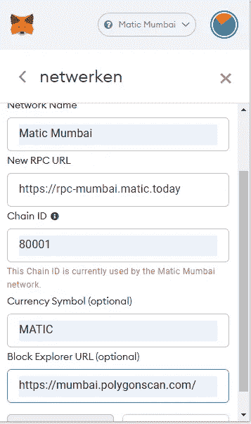
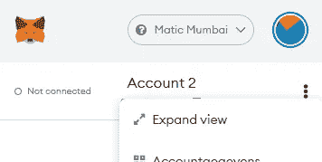
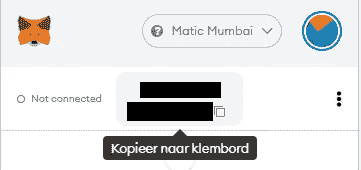

# 为多边形区块链开发设置元掩码

> 原文：<https://medium.com/codex/setting-up-metamask-for-polygon-blockchain-development-af058d0fab2e?source=collection_archive---------1----------------------->

## 关于设置和获取孟买测试网自动令牌的完整指南。


在 [Unsplash](https://unsplash.com/s/photos/blockchain?utm_source=unsplash&utm_medium=referral&utm_content=creditCopyText) 上由 [Hitesh Choudhary](https://unsplash.com/@hiteshchoudhary?utm_source=unsplash&utm_medium=referral&utm_content=creditCopyText) 拍摄的照片

区块链开发现在很热。这可能是某些商业领域的未来，并且很快被越来越多的人采用。但有时正因为如此，以太坊的油价飙升。

[多边形](https://polygon.technology/)在某种程度上修复了这个问题。Polygon 的汽油费要低得多。我正在进行的一个秘密项目需要铸造>2000 NFT，这将花费大约。ETH 中 2000 美元，但 Polygon 中只有 0.70 美元。(是的，我可以使用惰性铸造，我正在研究我的选择)

Polygon 的优势还在于它是一个以太坊兼容的区块链，至少被 NFT 最大的市场 OpenSea 所采用。因此，考虑到这一点，我正试图传播 Polygon 的“福音”,希望提高它的采用率。

# 打开元掩码钱包

我最近写了一篇关于第一次设置元掩码钱包的文章。您可以阅读那篇文章，然后回到这里开始多边形开发。**如果你已经有了以太坊钱包，可以跳过这个。**

[](/quick-programming/opening-a-metamask-wallet-for-cryptocurrencies-the-quick-guide-f28bdd8d6c00) [## 为加密货币打开 MetaMask 钱包——快速指南

### 易于安装、安全且易于使用。

medium.com](/quick-programming/opening-a-metamask-wallet-for-cryptocurrencies-the-quick-guide-f28bdd8d6c00) 

# 为孟买测试网配置钱包

当你点击网络下拉框时(默认为“主网络”)，你会注意到“孟买”不是一个选项。它可能有 Goerli，Ropsten 和其他一些人，但没有孟买。谢天谢地，我们可以很容易地用[添加正确的信息](https://wiki.polygon.technology/docs/develop/metamask/config-polygon-on-metamask/#add-the-polygon-network-manually)。

按下网络下拉菜单，并选择“自定义 RPC”。系统会提示您输入一些信息。该 URL 可能包含更多最新信息。

```
Matic Mumbai
https://rpc-mumbai.maticvigil.com/
80001
MATIC
https://mumbai.polygonscan.com/
```



添加孟买

## 什么是 RPC？

在我们继续之前，让我们快速讨论一下什么是 RPC。RPC 代表远程过程调用，这是一种通信协议。它将我们的客户机(一个 dApp)与服务器(一个 RPC 节点)连接起来。

一个 RPC 节点运行一个区块链节点，例如它可能运行 Algorand、Tezos、Polygon 或 Ethereum。所以我们的 RPC Url 本质上充当了我们与区块链的连接，反过来，也是我们 dApps 的后端。

*如果你想了解更多关于 RPC 的知识，可以在这里* *查阅另一篇文章* [*。*](https://www.alchemy.com/overviews/rpc-node)

## 发生

上面截图中我的钱包给出了一个关于 ChainID 的警告，因为我已经输入了，你不能两次添加同一个网络。输入正确的信息后，您可以保存它。

***如果您在聚焦丢失时无法关闭元蒙版:*** *您可以单击这三个点，然后选择“扩展视图”在单独的选项卡中打开元蒙版。*



展开视图以便于使用。

# 从水龙头获取 Testnet MATIC

唯一能得到的就是钱包里的一些免费的自动代币。你可以从一个所谓的水龙头接收这些。多边形龙头可以在 这里找到 [**。**](https://faucet.matic.network/)

只需通过在元掩码中单击您的公钥来复制您的公钥。



复制你的钥匙

然后您可以将其输入到水龙头的文本栏中。我们需要默认选项: **MATIC token & Mumbai** 。

点击“提交”，之后核对信息，点击“确认”即可领取代币。你应该可以很快看到你钱包里的自动代币。

# 结论

您现在已经准备好开始多边形区块链开发。恭喜你。

如果你需要的话，你可以从水龙头得到更多的 MATIC，只是不要过度。它有一个轻微的冷却时间来防止垃圾邮件。你不能出售代币来换取真钱，所以无论如何也没有理由获得超过你需要的。

非常感谢您的阅读，祝您度过美好的一天。