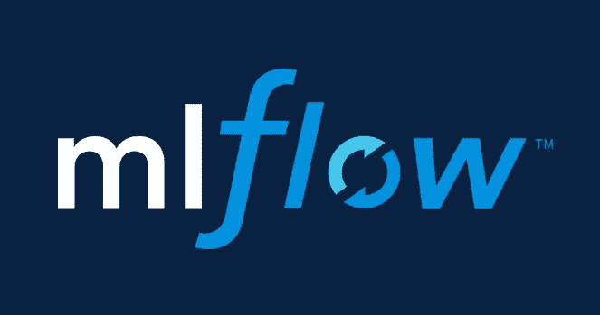

# 为 ultralytics/YOLOv5 设置 MLFlow

> 原文：<https://medium.com/codex/setting-up-mlflow-for-ultralytics-yolov5-1380b5f8cac5?source=collection_archive---------0----------------------->



[https://mlflow.org/docs/latest/index.html](https://mlflow.org/docs/latest/index.html)

最近我决定设置 YOLOv5 来使用 MLFlow APIs。虽然 YOLOv5 提供了权重和偏差(wandb)集成，但 wandb 是一种专有技术，而 MLFlow 仍然是一种开源软件。此外，作为一名 ML 工程师，MLFlow 对我来说似乎更直观，而不是 DevOps。

作为一名 ML 工程师，我更习惯于从概念到生产建立模型，而不太担心所使用的基础设施。因此，我一直在寻找平台无关的解决方案，MLFlow 对我来说是一个完美的选择。MLFlow 不需要设置特定的基础设施。您可以设计您的 ML 管道，然后根据您的需要进行调整。例如，由于我没有 AWS 的开发环境，我可以用我的本地配置来设置开发环境。然后，当转移到生产时，我可以设置 AWS 配置。

好吧，你可以说这很麻烦，因为我不会有一个接近生产环境的开发环境。但这有助于我让事情开始运转。

也就是说，让我们开始吧。

首先，让我们克隆 ultralytics/yolov5 git 存储库:

```
git clone [https://github.com/ultralytics/yolov5.git](https://github.com/ultralytics/yolov5.git)
```

`ultralytics/yolov5` repo 已经包含了一个 Dockerfile，它带有运行培训和测试任务的容器映像。因此，我们将利用这一点。此外，由于我们已经有了`wandb`集成，我们可以利用现有的格式通过 MLFlow 进行日志记录。

在深入细节之前，我们需要将 MLFlow 库安装到我们的 Python3 环境中。为此，我们创造了一个独立的`virtualenv`:

```
virtualenv -p python3 env
pip install mlflow
```

安装 MLFlow 后，我们需要启动服务器。在这里，我们将启动我们主机中的服务器:

```
**mlflow** server \ 
--backend-store-uri sqlite:///**mlflow**.db \
--default-artifact-root ./artifacts \
--host 0.0.0.0 --port 8000 &
```

MLFlow 支持不同的存储和数据库系统，用于记录参数、指标和模型。但是，需要注意的是: **MLFlow 不上传工件**。也就是说，如果您使用本地设置，没有第三方存储系统，如 AWS S3 或 Databricks 文件系统，您将无法上传您的工件。

设置 MLFlow 服务器后，我们需要从 MLFlow 跟踪 API 开始，以便存储参数和指标。

在`train.py`脚本中，我们在`main()`中插入下面一行:

```
mlflow.set_experiment("ultralytics/yolov5")
mlflow.start_run()
```

同样，在`main`例程结束时，我们需要结束实验:

```
mlflow.end_run()
```

在`train()`函数中，我们插入了日志记录函数:

```
# Logtags = ['train/box_loss', 'train/obj_loss', 'train/cls_loss', 'metrics/precision', 'metrics/recall', 'metrics/mAP_0.5', 'metrics/mAP_0.5:0.95','val/box_loss', 'val/obj_loss', 'val/cls_loss', 'x/lr0', 'x/lr1', 'x/lr2']for x, tag in zip(list(mloss[:-1]) + list(results) + lr, tags):
    # existing code (...)
    tag = re.sub('[^a-zA-Z0-9\/\_\-\. ]', '-', tag)
    # we remove not allowed characters from the tags.
    mlflow.log_metric(tag, float(x))
```

就这样，我们已经介绍了**物流跟踪 API** 。现在，我们继续学习 MLFlow 项目 API。跟踪处理日志记录，项目处理打包 ML 代码，以确保实验的可重复性和可重用性。

对于 MLFlow 项目，我们创建一个文件`MLproject`:

```
name: ultralytics/yolov5docker_env:
  image: ultralytics/yolov5:latest
  network: host # This can be commented if the URI can be accessed externally.entry_points:
  main:
    parameters:
      data_file: {type: string, default: "./data/coco128.yaml"}
      cfg_file: {type: string, default: "./models/yolov5s.yaml"}
      batch_size: {type: int, default: 16}
      workers: {type: int, default: 2}
    command: |
      python train.py \
      --data {data_file} \
      --cfg {cfg_file} \
      --batch-size {batch_size} \
      --workers {workers}
```

注意我们是如何使用 docker 图像`ultralytics/yolov5:latest`的。因此，我们需要从存储库中遇到的`Dockerfile`构建这个映像。为了构建图像，我们运行:

```
t=ultralytics/yolov5:latest && sudo docker build -t $t .
```

成功构建映像后，我们可以运行`MLproject`，但是在此之前，我们需要设置`MLFLOW_TRACKING_URI`，因为我们使用的是非默认的 URI。

```
export MLFLOW_TRACKING_URI="http://0.0.0.0:8000"
```

注意`http://`，如果它不存在，它将失败。现在我们可以运行`MLproject`。

```
**mlflow** run \
--experiment-name ultralytics/yolov5 . \
-P workers=8 \ 
-A gpus=all
```

`-P`标志设置在`MLproject`文件中定义的参数。`-A`标志设置可输入到`docker run`命令的附加参数。因此，`-A gpus=all`启用了 docker 容器的 GPU 驱动程序。

就这样，我们处理了 MLFlow Projects API，用于将 ML 代码打包成可重用和可复制的组件。

最后，我们需要服务这些模型，为此，我们将使用 **MLFlow Models API** 来打包*训练过的*模型，并通过 REST API 部署它。

首先，我们需要定义模型特征，包括输入和输出张量的定义。我们使用函数`mlflow.models.signature.infer_signature`获得了模型签名。

```
from mlflow.models.signature import infer_signature# we init the signature object
def train():
    # previous code (...)     signature = None

    # existing code (...) # Forward
    with amp.autocast(enabled=cuda):
    pred = model(imgs)  # forward

    # It produces the signature to MLFlow model if is not set yet. if signature is None:
        signature = infer_signature(
                        imgs.cpu().numpy(),
                        pred[0].detach().cpu().numpy()
                    )
```

所获得的签名将定义用户必须如何将其张量输入到 REST API 端点，并且还定义了预期的输出。

获得 ModelSignature 之后，我们需要将模型保存为 MLmodel 格式。

```
def train():

     if best_fitness == fi:
         torch.save(ckpt, best)
         # Store the best model in the MLmodel format. 
         mlflow.pytorch.log_model(
             ckpt['model'], 
             "yolov5", 
             signature=signature
         )
```

观察我们如何不保存整个模型元数据`ckpt`，而是只存储存储在`ckpt['model']`中的权重。

设置好`MLmodel`后，我们可以再次运行来获取它。

```
**mlflow** run \
--experiment-name ultralytics/yolov5 . \
-P workers=8 \ 
-A gpus=all
```

MLFlow 将创建一个文件夹`yolov5`到你的`runs:/some-run-uuid/yolov5`中，存储在你的`./artifacts`文件夹中。尽管如此，我们可以为打包的模型构建一个 docker 映像:

```
mlflow models build-docker -m "runs:/some-run-uuid/yolov5" -n "yolov5-mlflow-deploy"
```

然后，我们可以通过以下方式在主机上的端口`5001`公开该模型:

```
docker run -p 5001:8080 "yolov5-mlflow-deploy"
```

瞧！

**故障排除:**

由于我的 Python、Pytorch 和 Torchvision 版本在`conda`时不可用，我遇到了一个特殊的问题，因为 MLFlow 是在`conda`之上构建其环境的，我不得不手动将这些版本重新调整到`conda.yaml`文件中。

此外，需要注意的是 MLFlow 模型中的`build-docker`仍然不提供 GPU 支持。您可能可以通过将标准的`Dockerfile`修改为`mlflow`库来实现这一点，但是我们稍后会谈到这一点。

无论如何，如果对你有用，请告诉我！

亲切的问候，

克里斯托夫。