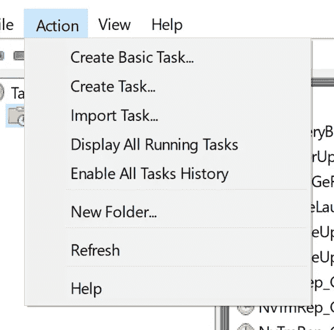
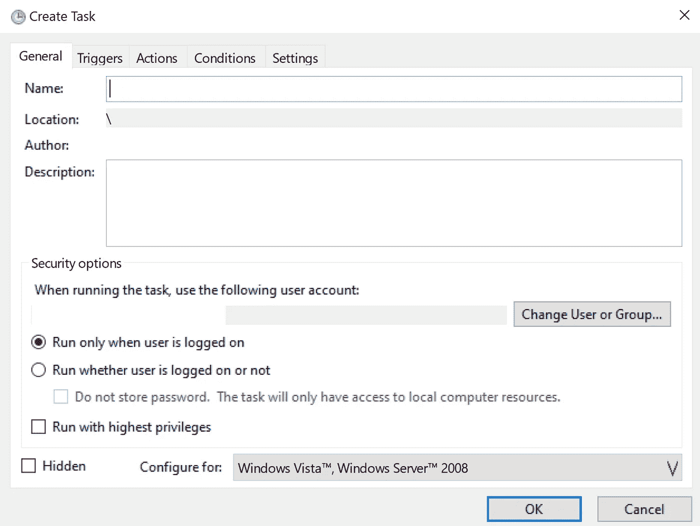
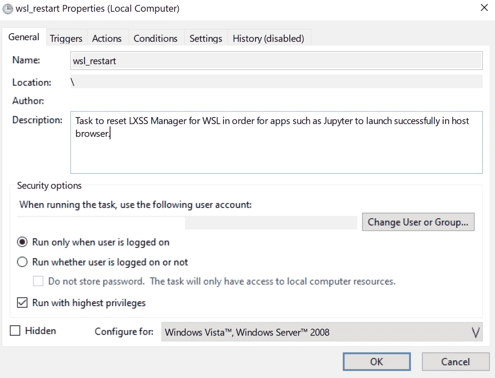
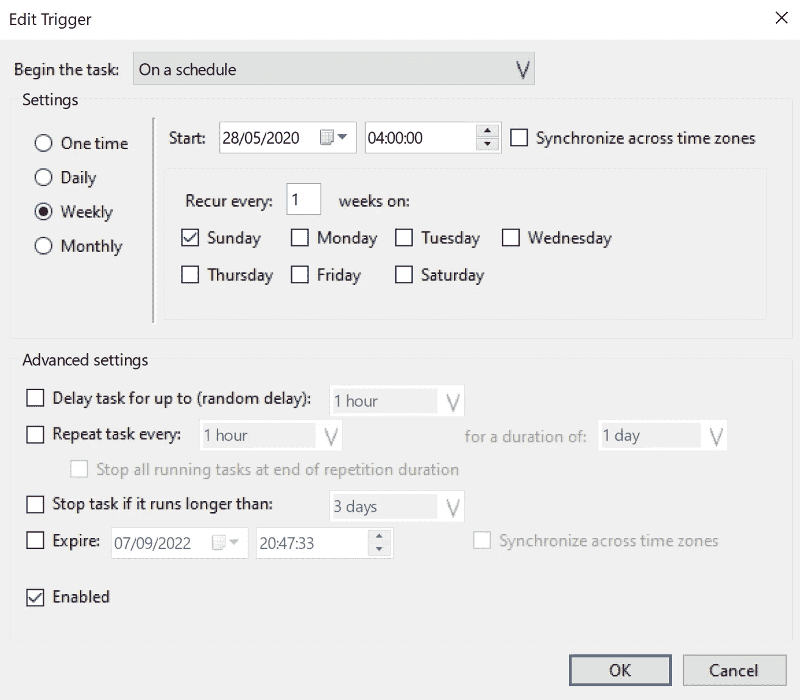
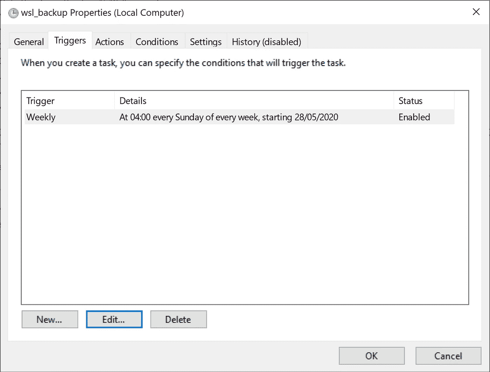
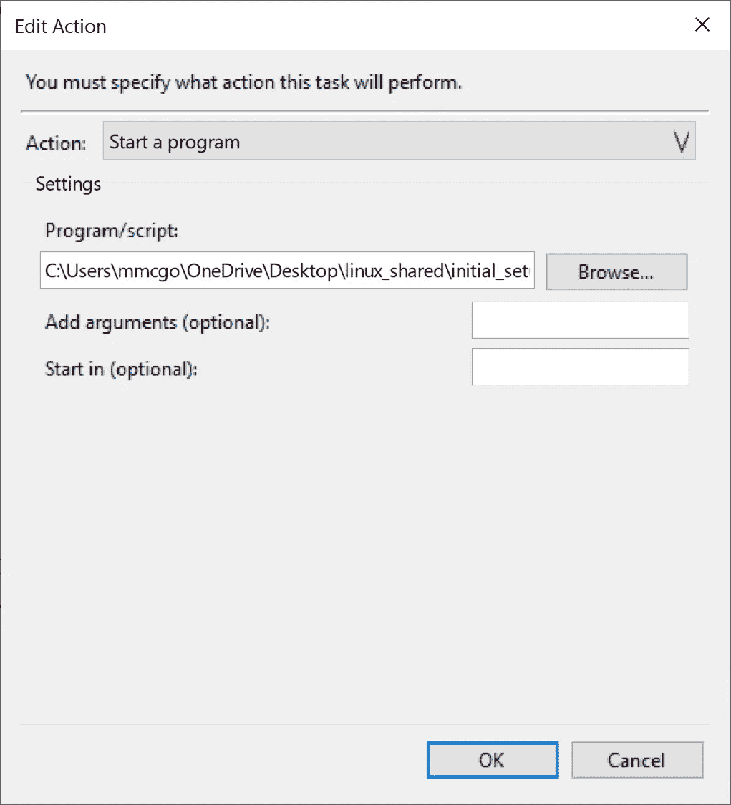
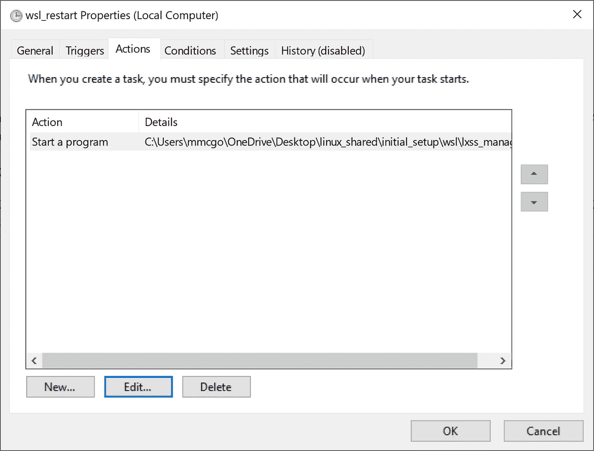
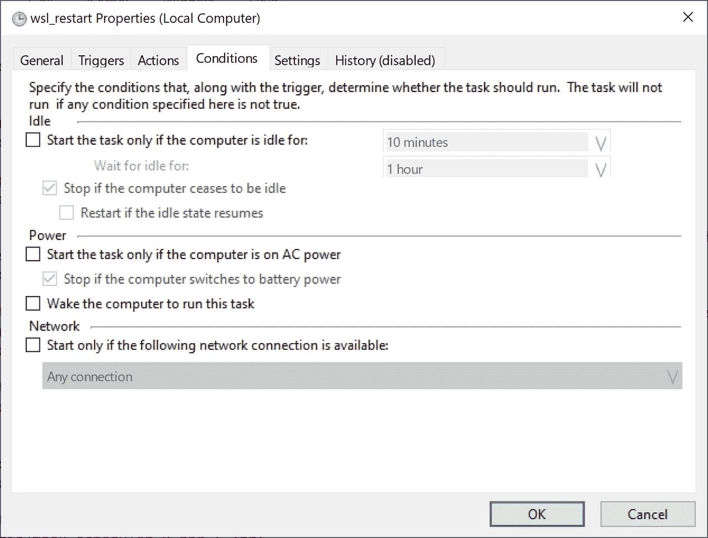

# WSL2 的计划备份

> 原文：<https://medium.com/codex/setting-up-regular-automatic-backup-of-your-windows-subsystem-for-linux-wsl2-data-using-task-b36d2b2519dd?source=collection_archive---------3----------------------->

## **如何使用任务计划程序来计划 WSL2 设置的自动备份，包括数据**

WLinux 的 Windows 子系统非常棒，因为它基本上在 Windows 操作系统上提供了一个完整的 Linux 内核，它还可以访问您存储在 Windows 操作系统以及 WSL 本身中的数据。

建议最佳实践是将所有与 Linux 结合使用的数据存储在 WSL 安装中，而不是通过 windows C:驱动器不断地访问它。通过将所有数据存储在 WSL 中，可以实现更快的读/写速度，还可以省去 Linux 和 Windows 文件之间的文件/目录权限之间的一些麻烦。

然而，这里的风险是**如果您的 *WSL 安装由于某种原因损坏，那么您可能会丢失存储在其中的所有数据*** 。为了解决这个问题，我计划每周将我的整个 WSL 系统自动备份到一个 tar 文件。

这导致一个包含所有 WSL 数据和安装细节的 tar 文件被存储为一个安全可靠的备份。然后，我可以使用这个文件轻松地完全恢复我的 WSL 安装和所有数据，作为一个额外的好处，它给了我可移植性，我可以将我的 WSL 安装转移到一个闪存驱动器，并在另一台计算机上使用它。

# 如何手动备份/恢复/删除 WSL2

为了备份和恢复 WSL2 设置，我们在 PowerShell 中运行以下命令。

## 去除

只需使用下面的命令删除一个名为 Ubuntu-test
`wsl --unregister Ubuntu-test`的设置

## **备份**

要创建当前设置的备份，只需运行下面的代码:
`wsl --export distro_name file_name.tar`

例如，要将一个名为 Ubuntu-18.04 的 WSL 发行版备份到一个名为 ubuntu.tar 的文件中，只需运行:
`wsl --export Ubuntu-18.04 ubuntu.tar`

## **恢复**

要恢复备份，只需运行:
`wsl --import distro_name install_location file_name.tar`

例如，从以前的名为`ubuntu.tar`的 WSL 设置文件中创建一个名为`Ubuntu-18.04`的设置，然后在`C:\Users\martin\ubuntu`运行中保存该设置:
`wsl --import Ubuntu-18.04 C:\Users\martin\ubuntu ubuntu.tar`

如果你想匹配 Windows 通常默认安装它们的位置，它们通常在`C:\Users\NAME\AppData\Local\Packages`中自己的文件夹中。

例如，基于名为 wsl_ubuntu_20.tar
`wsl --import ubuntu_test C:\Users\mmcgo\AppData\Local\Packages\ubuntu_test .\wsl_ubuntu_20.tar --version 2`的备份文件创建一个名为 ubuntu_test 的设置

## **为恢复的设置修正注册表键**

注意，这个新的恢复发行版将以 root 用户身份登录，因此您需要将注册表项更改为默认的 UUID 1000。

首先通过点击 Windows 按钮+ R 打开注册表，然后输入 regedit 并点击 return。这应该会打开注册表。接下来移动到文件夹`aHKEY_CURRENT_USER\Software\Microsoft\Windows\CurrentVersion\Lxss`

现在查看那里的注册表条目列表，看看哪一个与您为您的发行版指定的名称相匹配。然后转到 DefaultUid，并将其更改为十进制 1000，而不是十六进制，因为这将不起作用。

下次启动恢复的 WSL 安装程序时，它应该会正常启动，而不是以 root 用户身份启动。

# 为 WSL2 设置登录时的常规备份

为此，我们使用任务计划程序，但首先我们需要创建一个运行实际 WSL 备份命令的 PowerShell 脚本，其次我们需要创建一个 CMD 脚本，以确保正确的执行策略，使我们能够通过任务计划程序执行文件，然后运行我们刚刚创建的 PowerShell 脚本。

## 用于创建 WSL 备份的 PowerShell 脚本

在任意编辑器中创建一个新的 PowerShell 脚本，并将其命名为`wsl_backup.ps1.`。PowerShell 脚本应该包含以下几行。以下命令将名为 Ubuntu-20.04 的发行版备份到名为 wsl_ubuntu_20.tar 的文件中(如果该文件已经存在，它将覆盖该文件)。

`wsl --export Ubuntu-20.04 C:\Users\mmcgo\OneDrive\Desktop\wsl_setup\wsl_backups\wsl_ubuntu_20.tar`

## 用于更改执行策略和运行 PowerShell 脚本的 CMD 脚本

该脚本将更新执行策略，以允许任务调度程序运行您在上一步中创建的 powershell 脚本，然后它将运行我们称为`wsl_backup.ps1.`的 PowerShell 脚本

`PowerShell -Command "Set-ExecutionPolicy Unrestricted"`
`PowerShell C:\Users\mmcgo\OneDrive\Desktop\wsl_setup\wsl_scripts\wsl_backup.ps1`

## 设置任务计划程序，每周运行一次 CMD 脚本

现在我们已经编写了 PowersShell 和 CMD 脚本，我们只需要设置任务调度程序来每周运行一次 CMD 脚本。

首先打开任务计划程序。

接下来创建一个新任务。

您将看到以下选项

首先在“常规”选项卡中填写简短描述，如下例所示。还可以选择该任务是针对所有用户还是仅针对某些用户。下面我只选择了我的个人资料。

接下来，在“triggers”选项卡中创建新的触发器，如下例所示，在本例中为该任务选择 on-a-schedule 和特定用户。然后指定日期和时间，我选择每周日凌晨 4 点。请记住，它被设置为仅在用户从上一步登录时运行，这意味着如果由于计算机关闭等原因错过了预定时间，它将在周一等预定时间后下次打开计算机时运行。

这应该会出现在如下所示的触发器列表中

接下来，在“操作”中选择“启动程序”选项，并指向您之前创建的 CMD 文件。

这应该会出现在如下所示的动作列表中

最后，在条件中，通过取消选择仅在连接到交流电源时运行，将任务设置为始终运行，如下所示。

您可以忽略此任务的其余选项卡。您应该可以通过重启进行测试了。

这个备份过程只需要几分钟，这意味着在最坏的情况下，您只会丢失当天对 Linux 发行版中的文件所做的更改。像这样定期备份很重要，因为 WSL 在 OneDrive 文件之外，因此不会像其他 windows 文件一样自动备份。