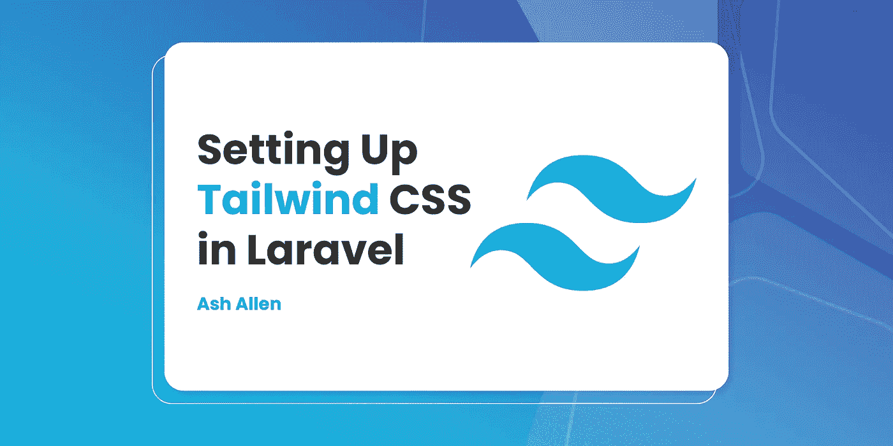

# 在 Laravel 中设置顺风 CSS

> 原文：<https://medium.com/codex/setting-up-tailwind-css-in-laravel-9fc2bebb78e8?source=collection_archive---------9----------------------->



# 介绍

T4 是一个非常酷的 CSS 框架，你可以用它来构建你的应用和网站。事实上，我认为自从它发布以来，我已经不再使用 [Bootstrap](https://getbootstrap.com/) 作为新项目首选框架，而是使用 Tailwind，这很酷。

在本文中，我们将快速了解一下什么是 Tailwind CSS，以及为什么我认为它很有用。然后，我们将逐步介绍如何在您的 [Laravel](https://laravel.com/) 项目中设置 Tailwind 的两种不同方式。

# 什么是顺风 CSS？

Tailwind 是一个实用的 CSS 框架，你可以用它直接在你的 HTML 中设计你的网站。例如，它为您提供了 CSS 类，如`flex`、`pt-4`、`text-center`，以便您可以进行粒度控制。

举个例子，让我们看看如何使用 Tailwind 制作一个按钮:

```
<button class="bg-blue-500 hover:bg-blue-700 text-white font-bold py-2 px-4 rounded">
  Button
</button>
```

如果我们想用 Bootstrap 制作同样样式的按钮，我们可能会这样做:

```
<button class="btn btn-primary">
  Button
</button>
```

如你所见，我们在标记中添加了单独的 CSS 类，而不是像 Bootstrap 中那样有一两个类。

现在，不要担心，我知道你在想什么…”那个 HTML 看起来真的很乱，太复杂了。Bootstrap 版本看起来好得多，也更容易理解！”。我刚开始用顺风的时候也是这么想的。我只是认为这是一种时尚，可能会在几个月后消失。但是，我还是试了一下，这样我可以做出更明智的决定。我喜欢它！

当然，刚开始感觉有点奇怪，但是一两个小时后，使用起来感觉很自然。当我在使用 Bootstrap 的时候，我总是觉得我在和内置的 CSS 样式做斗争。这对于快速搭建网站来说很棒，但是为了让它们符合我的喜好，我必须覆盖很多样式。但是使用 Tailwind，如果我想快速地给一个按钮添加一个样式，就像直接把它添加到 HTML 一样简单。

如果你有兴趣阅读更多关于为什么顺风有用的信息，亚当·瓦森(顺风的创造者)有一篇关于顺风的非常有趣的文章，我推荐你阅读。

# 使用 CDN

开始使用 Tailwind 最简单(但不一定是最好)的方法是使用 CDN 将样式表添加到 HTML 中。如果你想快速原型化一个想法，或者只是尝试一下框架，这是非常有用的。

首先，您只需要将下面一行添加到 HTML 的`<head>`部分:

```
<link href="https://unpkg.com/tailwindcss@^2/dist/tailwind.min.css" rel="stylesheet">
```

尽管这是将顺风添加到您的项目的最快方法，但我可能会建议不要在任何实时项目中使用它，因为:

*   CSS 文件的大小比通过 NPM 安装后捆绑的要大。
*   您不能自定 Tailwind 的默认主题。
*   您不能使用任何指令，如@apply、@variants 等。
*   不能启用`group-focus`之类的附加变体。
*   不能安装第三方插件。
*   你不能树摇未使用的样式。

# 使用 NPM

如果你打算在一个即将上线的项目中使用 Tailwind，那么使用 NPM 安装它会好得多。这样做，你就不会像使用 CDN 一样受到我上面提到的缺点的影响。那么，让我们来看看如何开始:

# 安装顺风

要安装 Tailwind，您只需运行以下命令:

```
npm install -D tailwindcss@latest postcss@latest autoprefixer@latest
```

# 设置顺风配置

现在我们已经安装了 Tailwind，我们可以运行下面的命令来创建一个空白的`tailwind.config.js`文件:

```
npx tailwindcss init
```

您现在应该有一个看起来像这样的`tailwind.config.js`:

```
module.exports = {
  purge: [],
  darkMode: false, // or 'media' or 'class'
  theme: {
    extend: {},
  },
  variants: {
    extend: {},
  },
  plugins: [],
}
```

当你需要修改你的主题或者安装插件的时候，你可能会用到这个文件。例如，如果我们想将“Poppins”定义为默认的“sans”字体，我们可以这样更新文件:

```
module.exports = {
  purge: [],
  darkMode: false, // or 'media' or 'class'
  theme: {
    fontFamily: {
      'sans': ['Poppins', 'ui-sans-serif', 'system-ui'],
    },
    extend: {},
  },
  variants: {
    extend: {},
  },
  plugins: [],
}
```

# 配置 Laravel 混合

既然我们已经安装并配置好了 Tailwind，我们可以设置 [Laravel Mix](https://laravel-mix.com) 以便在构建资产时绑定 CSS。

我在这里假设你使用的是默认的`app.css`文件，这个文件是新安装的 Laravel 附带的。但是如果没有，您可以更新`postCss()`方法中的第一个参数来匹配您的主 CSS 文件路径。

我还将假设您的`webpack.mix.js`文件看起来与新的默认 Laravel 安装中的文件一样。

让我们将必要的`require()`方法添加到`webpack.mix.js`文件中的`postCss()`方法中，如下所示:

```
const mix = require('laravel-mix');

mix.js('resources/js/app.js', 'public/js')
    .postCss("resources/css/app.css", "public/css", [
        require("tailwindcss"),
    ]);
```

# 将 Tailwind 添加到应用程序的 CSS 中

我们快到了！现在我们已经安装并配置了 Tailwind，我们需要将样式添加到我们的主 CSS 文件中。

我在这里假设我们使用的是上面提到的`resources/css/app.css` CSS 文件。我们需要做的就是打开文件，在顶部添加以下内容:

```
@tailwind base
@tailwind components
@tailwind utilities
```

现在，Tailwind 应该被添加到项目的 CSS 文件中，您应该可以立即开始使用它了。您还需要记住将它添加到 HTML 的顶部:

```
<!doctype html>
<head>
    <meta charset="UTF-8" />
    <meta name="viewport" content="width=device-width, initial-scale=1.0" />
    <link href="{{ asset('css/app.css') }}" rel="stylesheet">
</head>
```

恭喜你，现在你已经安装了 Tailwind，可以在你的项目中使用了！

# 清除未使用的 CSS 类

我建议将 Tailwind 配置为从应用程序的 CSS 文件中清除未使用的 CSS 类。

作为一个非常基本的例子，让我们假设您在应用程序中只使用了`text-blue-500`类。对我们来说，在应用程序的 CSS 中包含 Tailwind 提供的所有其他类是没有意义的。如果我们包含所有未使用的类，我们将增加 CSS 文件的大小，这会对 Google 中的搜索排名产生负面影响。

因此，为了清除任何未使用的 CSS 类，我们可以更新我们的`tailwind.config.js`文件，如下所示:

```
module.exports = {
   purge: [
     './resources/**/*.blade.php',
     './resources/**/*.js',
     './resources/**/*.vue',
   ],
    darkMode: false, // or 'media' or 'class'
    theme: {
      extend: {},
    },
    variants: {
      extend: {},
    },
    plugins: [],
  }
```

正如你所看到的，我们在文件的`purge`部分增加了三行。这几行允许我们保留在以`.blade.php`、`.js`或`.vue`结尾的`resources`文件夹中的任何文件中找到的 CSS 类。

但是，确保在标记中以可保存的方式编写样式是非常重要的。让我们看看 Tailwind 文档给出的关于如何不编写类的例子。

由于用于检测 CSS 类的 regex 规则的工作方式，它将检测没有被空格、引号或尖括号分隔的字符串。这意味着如果您的类中有任何这样的元素(例如，如果您正在添加条件类)，它们可能会被忽略和清除。

例如，假设在一个 Vue.js 文件中，您添加了条件 CSS 类。如果有错误，您想要添加`text-red-600`类，但是如果没有错误，您想要添加`text-green-600`。你可以这样写:

```
<div class="text-{{ error ?  'red' : 'green' }}-600"></div>
```

然而，这将检测到`text-{{`、`error`、`?`、`red`、`:`、`green`、`}}-600`。正如您可能猜到的，这意味着因为它没有检测到`text-red-600`或`text-green-600`，您需要的类将从您的 CSS 中清除(假设它们没有包含在您的标记中的其他地方)。

相反，要以一种可以被检测到而不会被清除的方式编写类，您应该像这样编写条件:

```
<div class="{{ error ? 'text-red-600' : 'text-green-600' }}"></div>
```

要了解更多，我建议阅读一下官方的 Tailwind 文档中关于编写可清除的 HTML 的章节。

# 将 HTML 拆分成组件

随着应用程序的增长，您可能会发现您将在许多不同的地方重用标记的公共部分。因此，以类似于你试图保持代码干燥的方式(不要重复)，你可以在 Laravel 中用你的视图做同样的事情。

在这一特定部分，我们将使用刀片组件作为示例，但是如果您使用 Vue 之类的东西构建前端，这个概念仍然适用。

因此，为了获得一点上下文，让我们假设我们有一个在前端的许多地方使用的按钮，它具有以下标记:

```
<button class="bg-blue-500 hover:bg-blue-700 text-white font-bold py-2 px-4 rounded">
  Button
</button>
```

现在，让我们说，在发布最初的网站几个月后，我们想更新所有的按钮为绿色而不是蓝色。当然，我们可以对所有刀片文件进行“查找和替换”。但是，正如您可能猜到的那样，这将会很麻烦，并且会留下出错的空间。如果忘了换其中一个会怎么样？或者，如果您不小心更改了另一个正在使用`bg-blue-500`类但不打算更新的元素呢？

为了解决这个问题，我们可以使用 Laravel 组件。组件允许我们创建可以在我们的刀片文件中使用的可重用元素。

为了更好地理解它们是什么以及如何使用它们，让我们想象下面的 HTML:

```
<div>
  <button class="bg-blue-500 hover:bg-blue-700 text-white font-bold py-2 px-4 rounded">
    Button One
  </button>

  <button class="bg-blue-500 hover:bg-blue-700 text-white font-bold py-2 px-4 rounded">
    Button Two
  </button>
</div>
```

我们将把这两个按钮拆分成我们可以使用的组件。让我们通过创建一个新的`resources/views/components/button.blade.php`文件来开始创建我们的组件。

然后，我们可以将按钮的 HTML 移动到新的`button.blade.php`文件中，如下所示:

```
<button class="bg-blue-500 hover:bg-blue-700 text-white font-bold py-2 px-4 rounded">
  Button One
</button>
```

但是，我们需要确保按钮文本是动态的，这样我们就可以在整个系统中重用这个组件。我们可以通过输出一个将传递给组件的`$text`属性来做到这一点。我们的新按钮标记将如下所示:

```
<button class="bg-blue-500 hover:bg-blue-700 text-white font-bold py-2 px-4 rounded">
  {{ $text }}
</button>
```

现在，我们可以用这两个按钮更新我们的原始 HTML，以使用我们的新组件，而不是按钮的重复标记:

```
<div>
  <x-button text="Button One"/>

  <x-button text="Button Two"/>
</div>
```

这意味着如果我们想将按钮的颜色从蓝色更新为绿色，我们需要做的就是在我们的`resources/views/components/button.blade.php`文件中修改一次。

你可能会发现，在你的前端的一部分，你想保持按钮的一般外观，但改变一些东西(例如字体大小)。我们可以让组件的 CSS 类动态化，而不需要创建一个新组件或者手动创建没有组件的按钮。

为此，我们可以像这样更新组件:

```
<button {{ $attributes->merge(['class' => 'bg-blue-500 hover:bg-blue-700 text-white font-bold py-2 px-4 rounded']) }}">
  {{ $text }}
</button>
```

然后我们可以调用我们的组件:

```
<x-button text="Button One" class="text-xl"/>
```

这将导致输出以下 HTML:

```
<button class="bg-blue-500 hover:bg-blue-700 text-white font-bold py-2 px-4 rounded text-xl">
  Button One
</button>
```

要了解更多关于 Laravel 组件的信息，我强烈建议阅读一下官方文档。它展示了可以用组件做的不同类型的事情，并给出了一些非常有用的例子。

# 结论

希望这篇文章能让你对如何为你的 Laravel 应用程序和网站设置 Tailwind CSS 有一个大致的了解。它还应该向您展示了如何设置 Laravel Mix 来清除任何未使用的 CSS，然后简要地向您展示了如何将可重用的 HTML 拆分成组件。

如果这篇文章对你有所帮助，我很乐意听听。同样，如果你对这篇文章有任何改进的反馈，我也很乐意听到。

如果你有兴趣在我每次发布新帖子时得到更新，请随意[注册我的简讯](https://ashallendesign.co.uk/blog)。

继续建造令人敬畏的东西！🚀

【https://ashallendesign.co.uk】最初发表于[](https://ashallendesign.co.uk/blog/setting-up-tailwind-css-in-laravel)**。**