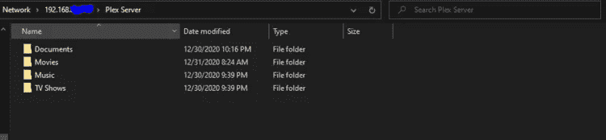

# 在 Raspberry Pi 4 上设置 PLEX 服务器

> 原文：<https://medium.com/codex/setting-up-your-plex-server-on-raspberry-pi-4-28855b906679?source=collection_archive---------0----------------------->


随着办公室离开网飞，我最终决定对我的 Plex 服务器进行技术更新，以确保它好用且便宜。在过去的七年里，我一直在利用一台从旧游戏电脑上拆下来的未升级的服务器来处理我的大部分家务，但是我已经厌倦了每年 10-50 美元的电力成本来为这个庞然大物供电。

进入树莓 Pi 4。随着迷你电脑技术在过去十年里取得了如此大的进步，现在似乎是时候为我的家庭服务器需求换一个更优雅的解决方案了。一台十年前的 unRAID 服务器仍然比我现在使用的要强大一些，但是 Plex 不需要太多的电力就可以在你的家庭网络内部运行。也就是说，如果你计划从家庭网络之外流式传输(或让其他人流式传输)你的内容，那么你应该坚持为你的 Plex 服务器使用 unRAID。

然而，如果你打算只在家里使用 Plex，那么树莓 Pi 4 就可以了。所以，如果你来这里只是为了找到那个答案(这个答案很难找到！)，你找到了:树莓 Pi 4 会运行内部 Plex 媒体服务器！谢谢你来听我的 Ted 演讲。在本文的其余部分，我将逐步介绍如何设置一个 Raspberry Pi 4 Plex 媒体服务器。

首先，你要购买所需的材料。我使用了一个 [CanaKit Raspberry Pi 4GB 入门套件](https://amzn.to/3hzNCEu)，尽管他们现在提供了 [8GB 入门套件](https://amzn.to/2Mey8Ke)，也可以用于 Plex 媒体服务器；虽然额外的 4GB RAM 对于 Pi 运行其他功能的速度来说确实是一个方便因素，但这并不是说转码 Plex 在两种型号中都使用了相同的 1.5 GHz 中央处理器。你还需要一个支持 USB 2.0 的外置硬盘驱动器(HDD)，像这个 [8TB 的外置硬盘驱动器](https://amzn.to/2WYy7MH)。这些东西很难找到，因为很多地方都不生产支持 USB 2.0 的驱动器，生产有外部电源的驱动器的地方就更少了。但是，您的硬盘需要同时具备这两种功能，因为 Rasbperry Pi 无法为旋转的硬盘供电。你可以购买一个外部固态硬盘(SSD)，但如果你可能需要两到三个这些 2TB 的 SSD，它们每个都比 8TB 的 HDD 贵 20 美元。

一旦你得到了所有的装备，你需要把它安装到箱子里，如下视频所述。在将顶盖放入机箱之前，请参阅随您的 CanaKit 附带的快速入门指南，并在您的 CPU、RAM 和千兆位控制器以及微型机箱风扇上安装微型散热器。

一旦安装好所有这些组件，并将外壳放在 Pi 上，将 microSD 卡面朝下安装(标签应朝向外壳底部)。SD 卡不会与 Pi 本身齐平，但不会超出 CanaKit。

将鼠标和键盘插入 USB 1.0(黑色)插槽，将 micro-HDMI 电缆插入 HDMI 0 插槽，最后将电源插入 USB 3.0 插槽。Raspberry Pi 应该在不到 3 分钟的时间内启动，如果没有，请关闭 Pi 并确保 SD 卡[正确安装](https://www.youtube.com/watch?v=xQdCoA5T8Tk)并重试。如果 Pi 仍然无法启动，请浏览这个[论坛帖子](https://www.raspberrypi.org/forums/viewtopic.php?t=58151#p1485558)以获取故障排除技术。可能是您的 SD 卡没有正确安装，SD 卡没有安装 NOOBs，或者 EEPROM 没有正确配置。

一旦 Raspberry Pi 启动，您应该会看到 NOOBS 安装页面，在这里您将安装操作系统(OS)。安装 Raspbian(推荐)选项；在 4GB 的机型上，这大约需要 30 分钟。出现提示时，在安装完成后重新启动。

Raspbian 操作系统启动后，会提示你做几件事，比如设置语言、密码和更新操作系统。遵循这些提示，并在出现提示时重新启动。当提示停止时，您就可以开始了。

在您的 Raspberry Pi 上设置 Plex 媒体服务器的第一步是首先将您的 Raspberry Pi 设置为网络服务器。这是一个相当简单的过程。首先，你要插上外置硬盘；大多数预格式化的将自动安装和现成的工作([推荐希捷做到了！](https://amzn.to/3aY0C5y))，但如果你的没有，就跟着[这个教程](https://www.raspberrypi.org/documentation/configuration/external-storage.md)。硬盘运行后，在设置所需的 Plex 媒体服务器文件夹结构之前，使用图形用户界面(鼠标点击)找到硬盘并删除其上的文件(如果有)。您可以在终端中这样做，但是，老实说，如果您不熟悉基于 Linux 的操作系统，在 GUI 中这样做也很容易。但是，这是一个临时的解决方案，因为基于 GUI 的挂载有一些奇怪的隐藏权限，因此 Plex 将永远无法对其进行读/写操作！

因此，您需要永久安装驱动器，为了做到这一点，您需要打开您的 GUI 文件资源管理器并卸载(防止 Plex 对临时安装的 HDD 进行读/写的隐藏权限可以防止从终端卸载)您的硬盘驱动器，打开终端并键入以下命令。如果您需要帮助，请点击[这篇文章](https://forums.plex.tv/t/using-ext-ntfs-or-other-format-drives-internal-or-external-on-linux/198544)了解您正在做的事情的更多详细信息，但是对于那些不需要额外信息的人，请进行以下操作:

```
**mkdir /plex/media****sudo sh** (enter your password)**df****blkid** (enter the /dev/sd### for your HDD; copy the UUID for this drive)**nano /etc/fstab** (and enter a new line “UUID=######## /plex/media ntfs 
 default,auto,rw,nofail 0 1”)**CTRL+X, Y, ENTER****mount /plex/media**
```

如果您没有得到错误，尝试导航到/plex/media(*CD/plex/media*)并显示内容( *ls -latr* )，看看您的文件是否显示。如果是这样，您就可以开始了，并且完成了这一步！如果没有，[本文](https://forums.plex.tv/t/using-ext-ntfs-or-other-format-drives-internal-or-external-on-linux/198544)将帮助您排除*故障。*如果继续，您将到达末尾，Plex 将不会显示任何媒体，并且您可以返回到此步骤进行修复。接下来，您需要安装 Samba，这样您就可以通过键入以下命令在网络间共享文件:

```
sudo apt-get updatesudo apt-get upgradesudo apt-get install samba samba-common-bin
```

这些命令将 Samba 文件共享服务安装到您的 Raspbian 操作系统中，这是基于 Linux 的操作系统在网络上共享文件的方式。接下来，您需要通过修改其配置(或 conf)文件来配置服务。如果你想知道更多关于操作系统、服务和“sudo”的意思，请查阅我的书 [*了解它:解码技术和商业*](https://amzn.to/3hxuZkz) *。*对于本教程来说，重要的是要知道 sudo 告诉终端窗口以管理员的身份做一些事情(这相当于在 Windows 10 的那些弹出窗口上点击“继续”的基于文本的操作)，如果你在互联网上找到的命令看起来有些可疑，你不希望只是随意键入 sudo 后跟命令。

```
sudo nano /etc/samba/smb.conf
```

当该文件打开时，向下滚动到底部，并使用以下文本添加另一个块。我建议您按照 smb.conf 文件中的方式缩进文本，以便于阅读，但这最终取决于您。

```
[Pi Plex Share]path = /plex/mediawriteable=Yescreate mask = 0777directory mask = 0777public = Yes
```

编辑完文件后，您会希望使用 nano 控件来保存和退出(CTRL+X，Y 和 ENTER)。Tada，只要你遵循这些步骤，那么这些文件夹应该可以在你的网络上被发现。您可能希望最终将该文件编辑为" ***public = No*** "，并设置用户名和密码以在有人来访时保护您的文件，但是在设置时，更容易限制潜在的挂起次数。

要测试是否成功，请转到将要访问共享的 Windows 10 计算机，并启用 SMB 1.0/CIFS 文件共享支持，方法是进入控制面板，单击程序，然后*“打开或关闭 Windows 功能”*


一旦启用了 SMB 1.0，重启你的电脑，进入你的 Raspberry Pi 的终端窗口，输入 ***hostname -I*** 并记下 IP 地址。当你的 Windows 10 电脑重启后，点击 Windows-R，输入\\192.168.X.X\其中 X.X 是你记下的 IP 地址，点击运行。如果你做的一切都是正确的，你会看到你在树莓 Pi 上创建的文件夹！



如果你看到了那个屏幕，那么它工作了！接下来，如果你像我一样，从另一台服务器传输数据，你现在就需要这样做。你可以用慢而简单的方式来完成(只需使用你的 Windows 10 电脑通过网络拷贝)，或者你可以设置第二个外部硬盘来更快地传输数据位。我，呃，选择了懒惰的方法，花了很长时间。


一旦完成，或者如果您没有要传输的数据，您就可以进入下一步，将 Plex 媒体服务器安装到您的新 Raspberry Pi 上！在您等待的时候，您可能想要确保 SSH 已经安装(通过 [GUI](https://www.raspberrypi.org/documentation/remote-access/ssh/) )或者通过在终端中键入 *sudo raspi-config* ，选择**界面选项，SSH，Yes，OK，**，最后**完成**。一旦 SSH 被启用，尝试进入您的 Raspberry Pi 并输入 *sudo whoami* 。如果你根本无法 SSH 到你的 Raspberry Pi，或者那个命令没有用 **root** 响应，如果你现在通过分别对这里的[和这里的](https://www.raspberrypi.org/documentation/linux/usage/users.md#:~:text=You%20can%20create%20additional%20users,don't%20want%20a%20password.)进行故障诊断来解决这些问题，事情会变得容易得多。

确保你的 Raspberry Pi 有一个静态 IP 地址也是一个好主意，要么通过配置你的路由器(或任何在你的网络中处理 DHCP 的东西)来保留那个 IP，要么通过配置 [Raspberry Pi 本身](https://pimylifeup.com/raspberry-pi-static-ip-address/)。

现在，您的 Raspberry Pi 是一个网络服务器，您可以通过打开一个终端并键入以下命令来使它成为一个 Plex 媒体服务器。

```
sudo apt-get install apt-transport-httpscurl [https://downloads.plex.tv/plex-keys/PlexSign.key](https://downloads.plex.tv/plex-keys/PlexSign.key) | sudo apt-key add -echo deb [https://downloads.plex.tv/repo/deb](https://downloads.plex.tv/repo/deb) public main | sudo tee /etc/apt/sources.list.d/plexmediaserver.listsudo apt-get updatesudo apt install plexmediaserver
```

如果您得到错误/usr/lib/apt/methods/https not found，那么重试—您可能忽略了在*sudo apt-get install apt-transport-https*中的一个错误或警告。完成后，您可以通过 IP 地址:32400/web/通过您的 Web 浏览器导航到 Plex Web 应用程序，它应该是这样的！


在这一点上，将媒体内容抓取到您的 Plex 服务器中对于 Raspberry Pi 来说仍然是与 unRAID 相同的过程:手刹！你可以点击下面的按钮来阅读教程，一旦你完成了，你就有了自己的网飞！