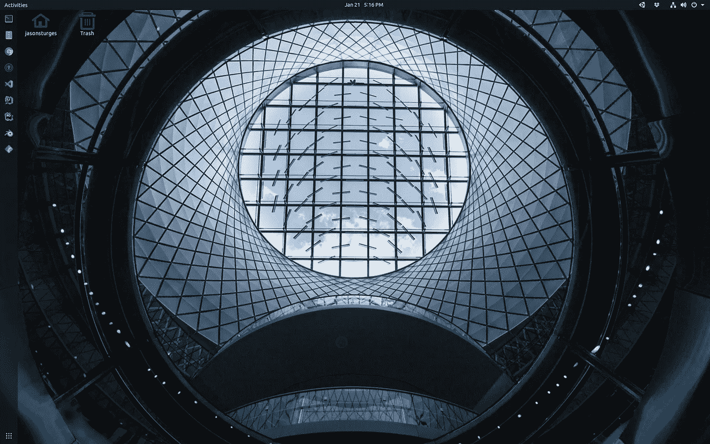

# 免费在 Ubuntu Linux 上设置 3D 和视频工作室

> 原文：<https://medium.com/codex/setup-a-3d-and-video-environment-on-ubuntu-for-free-934eb074c594?source=collection_archive---------7----------------------->

## [抄本](http://medium.com/codex)

## Unity 和 Blender 使用 Ubuntu 强大的免费工具进行 3D 游戏开发、建模、动画和视频编辑



在本演练中，我将从一些面向游戏开发人员的常见开发人员开始；否则，跳到 3D 或视频部分。

此外，我还制作了一个演示这些步骤的视频:

但首先，我们先从一些通用的 app 说起。

# 一般应用

在开始之前，我要提几个人们可能没有意识到的 Ubuntu 应用。

## 谷歌浏览器

就我个人而言，我不是 Ubuntu 桌面自带的 [Firefox](https://www.mozilla.org/) 的狂热粉丝。这是一个偏好问题——有些人使用 [Chromium](https://www.chromium.org/) ，但请注意[谷歌 Chrome](https://www.google.com/chrome/) 浏览器是可用的。

## Dropbox

与 Ubuntu 上的 [Dropbox](http://dropbox.com/) 的文件共享整合非常巧妙，但请注意，就你可能在 PC 或 Mac 上发现的“仅在线”功能而言，选择性同步存在局限性。

# 发展

在使用我们的应用程序之前，我们需要安装一些有用的开发工具。

## 构建要素

安装一组用于构建的基本包，包括库、编译器和一些实用程序。在终端中执行以下操作:

```
sudo apt-get install build-essential
```

## 饭桶

为分布式版本控制安装 git，通过在终端中执行以下命令来跟踪文件的更改:

```
sudo apt install git
```

## 卷曲

有些软件会要求`curl`(客户端 URL)通过命令行传输数据，但这对于开发者来说也是一个很棒的实用工具。在终端中执行以下操作:

```
sudo apt install curl
```

## Wget

同样，一些软件需要`wget` (GNU Wget)来传输数据。在终端中执行以下操作:

```
sudo apt install wget
```

## 节点. js

[Node.js](https://nodejs.org/) 构建在 [Chrome 的 V8 JavaScript](https://v8.dev/) 引擎上的运行时很不错，但是要找到由 [NodeSource](https://nodesource.com/) 提供的安装程序有点棘手。

在 Node 的[下载页面](https://nodejs.org/en/download/)，通过包管理器 找到安装 Node.js 的 [*，找到基于*](https://nodejs.org/en/download/package-manager/) *[*Debian 和 Ubuntu 的 Linux 发行版*](https://nodejs.org/en/download/package-manager/#debian-and-ubuntu-based-linux-distributions) 说明。*

这将重定向到您的 NodeSource 的[二进制发行版](https://github.com/nodesource/distributions/blob/master/README.md) GitHub repo。在自述文件中找到基于 Debian 和 Ubuntu 的发行版的安装说明，这将更新您的源代码列表和安装节点:

```
curl -sL https://deb.nodesource.com/setup_15.x | sudo -E bash -
sudo apt-get install -y nodejs
```

## 。网络核心

我们要两个[。微软提供的. NET Core](https://dotnet.microsoft.com/) SDK 和运行时。

在[下载页面](https://dotnet.microsoft.com/download)上，找到 Linux 组并选择*安装。NET* 会带你去[微软的安装。NET 上的 Linux](https://docs.microsoft.com/en-us/dotnet/core/install/linux) 文档。在 Ubuntu 下，选择版本， [20.04 LTS](https://docs.microsoft.com/en-us/dotnet/core/install/linux-ubuntu#2004-) 。

首先，更新您的:package 存储库:

```
wget [https://packages.microsoft.com/config/ubuntu/20.04/packages-microsoft-prod.deb](https://packages.microsoft.com/config/ubuntu/20.04/packages-microsoft-prod.deb) -O packages-microsoft-prod.debsudo dpkg -i packages-microsoft-prod.deb
```

安装 SDK:

```
sudo apt-get update; \
  sudo apt-get install -y apt-transport-https && \
  sudo apt-get update && \
  sudo apt-get install -y dotnet-sdk-5.0
```

然后，安装运行时:

```
sudo apt-get update; \
  sudo apt-get install -y apt-transport-https && \
  sudo apt-get update && \
  sudo apt-get install -y aspnetcore-runtime-5.0
```

## 码头工人

为了管理多个开发环境之间的依赖或变化，Docker 是一个非常有价值的工具。它与我们要完成的目标并不完全相关，因此可以跳过，但是我将把它作为开发环境的一个组成部分。

安装有点迟钝，所以找到 Ubuntu 上的[*Install Docker Engine*](https://docs.docker.com/engine/install/ubuntu/)安装文档并向下滚动到指南的*Install using the repository*部分。

首先，添加一些依赖项

```
sudo apt-get install \
    apt-transport-https \
    ca-certificates \
    curl \
    gnupg-agent \
    software-properties-common
```

添加 Docker 官方 GPG 键:

```
curl -fsSL https://download.docker.com/linux/ubuntu/gpg | sudo apt-key add -
```

添加存储库，对于大多数人来说是 x84_64 / amd64:

```
sudo add-apt-repository \
   "deb [arch=amd64] https://download.docker.com/linux/ubuntu \
   $(lsb_release -cs) \
   stable"
```

更新并安装 Docker 引擎:

```
sudo apt-get updatesudo apt-get install docker-ce docker-ce-cli containerd.io
```

启动服务:

```
sudo service docker start
```

最后，将您的用户添加到 docker 组，以方便管理实例。否则，您可能会发现各种各样的安全问题和持续的`sudo`操作。

```
sudo usermod -aG docker [username, as in: jason]
```

此更改应在注销并重新登录后生效；不过，我发现需要完全重启才能工作。重新启动机器并重新登录以测试实例。

当我们在 Docker 上时，这将是添加 [Docker Compose](https://docs.docker.com/compose/) 的好时机——一个定义和运行多个 Docker 应用程序的工具。

找到[*Install Docker Compose*](https://docs.docker.com/compose/install/)文档，选择 *Install Compose* 下的 *Linux* ，在终端中执行以下命令，下载`docker-compose`并赋予其可执行权限:

```
sudo curl -L "https://github.com/docker/compose/releases/download/1.28.0/docker-compose-$(uname -s)-$(uname -m)" -o /usr/local/bin/docker-composesudo chmod +x /usr/local/bin/docker-compose
```

## 基特克拉肯

对于那些喜欢使用 GUI 而不是命令行进行 git 操作的人来说，我真的很喜欢 GitKraken，这是一个具有强大功能的免费 git 客户端。

只需进入[下载](https://www.gitkraken.com/download)页面，选择[。deb 包](https://www.gitkraken.com/download/linux-deb)。下载完成后，双击。deb 文件通过 Ubuntu 软件安装。

# 编辑

## VS 代码

微软的 [Visual Studio Code](https://code.visualstudio.com/) 是一个精简、快速、出色的编辑器，能够跨多个平台运行。

选择下载并选择 64 位[。deb 包](https://code.visualstudio.com/docs/?dv=linux64_deb)。下载完成后，双击并通过 Ubuntu 软件安装。

## JetBrains IntelliJ 想法

我个人最喜欢的代码编辑器是 JetBrains [IntelliJ IDEA](https://www.jetbrains.com/idea/) ，作为社区版免费提供；或者，通过终极公平定价。

安装以快照包的形式提供—在终端中执行以下操作:

```
sudo snap install intellij-idea-ultimate --classic
```

## JetBrains 骑手

对于使用 Unity 的游戏开发，JetBrains [Rider](https://www.jetbrains.com/rider/) 提供了一个与 Unity 极其健壮和胜任的集成，用于编辑 C#脚本。

它也可以作为一个快照包使用—在终端中执行以下操作:

```
sudo snap install rider --classic
```

# 三维（three dimension 的缩写）

终于有好东西了！无论你对 3D 可视化、游戏开发还是动画感兴趣，Unity 和 Blender 都是 Ubuntu 操作系统上的强大组合。

## 一致

最近 [Unity](https://unity.com/) 发布了他们的 Linux 编辑器——它仍然有点原始，安装起来很奇怪。当然，我认为这种情况很快就会改变。


但是现在去 Unity 博客上的 [Unity Editor for Linux](https://blogs.unity3d.com/2019/05/30/announcing-the-unity-editor-for-linux/) 公告。

向下滚动到*如何获得*部分，并转到 [*Unity Hub*](https://forum.unity.com/threads/unity-hub-v-1-6-0-is-now-available.640792/) 链接。

奇怪的是，这是一个论坛帖子，列出了安装程序的链接。请注意，该链接自第一篇帖子以来已经更新—您将需要[导航到此处安装应用程序映像](https://public-cdn.cloud.unity3d.com/hub/prod/UnityHub.AppImage?_ga=2.143525168.420039533.1611204874-1623907679.1611035938)。

一个[应用程序映像](https://appimage.org/)是一个完全包含的 Linux 应用程序，可以在任何地方运行。

在我们的例子中，将它移动到`/opt`并赋予它可执行的权限。

```
sudo mv ~/Downloads/UnityHub.AppImage /opt
sudo chmod +x /opt/UnityHub.AppImage
```

然后，只需双击运行 Unity Hub 来管理 Unity editor 安装和项目。

从 Unit Hub，转到 *Install* s 以添加 Unity 编辑器的实例:


要将 JetBrains Rider 与 Unity 集成为 C# Unity 脚本的代码编辑器，请转到*编辑首选项*，并在*外部工具*下选择 *Rider 2020*


## 搅拌机

对于 3D 建模，2D 油脂铅笔和动画工作， [Blender](https://www.blender.org/) 是开源 3D 创作的领导者。


在[下载](https://www.blender.org/download/)页面，选择 Linux 作为 [snap 包](https://snapcraft.io/blender)安装。在终端中执行以下操作:

```
sudo snap install blender --classic
```

启动应用程序:


检查来自 [Blender Cloud](https://cloud.blender.org/welcome/) 的所有样本项目。


# 录像

最后是一些后期制作和转码的视频工具。

## 手闸

我真正喜欢的实用工具是[手刹](https://handbrake.fr/)——一个将视频从几乎任何格式转换为一系列现代的、广泛支持的编解码器的工具。

从[下载](https://handbrake.fr/downloads.php)，在 *Linux 下，Ubuntu deb* 我推荐安装为 [PPA](https://launchpad.net/~stebbins/+archive/ubuntu/handbrake-releases) 。通过在终端中执行以下命令来添加存储库并进行安装:

```
sudo add-apt-repository ppa:stebbins/handbrake-releasessudo apt-get updateapt-get install handbrake-gtk
```

## 达芬奇决心

专业视频编辑软件 [DaVinci Resolve](https://www.blackmagicdesign.com/products/davinciresolve/) 确实令人惊叹，它提供视频编辑、色彩校正、视觉效果、动画和音频后期制作。


向下滚动到*下载*按钮，选择*达芬奇解析工作室 16*Linux 版。在下载之前，系统会提示您在注册表中输入一些个人信息。

完成后，您将得到一个包含 PDF 安装说明的 zip 文件和一个`.run`安装程序文件。

双击 ZIP 并按提取。

提取后，向`.run`安装程序添加可执行权限，并通过在终端中执行以下命令来启动:

```
chmod +x ./DaVinci_Resolve_16.2.8_Linux.run
sudo ./DaVinci_Resolve_16.2.8_Linux.run
```

这将启动一个安装程序—按照步骤安装软件。