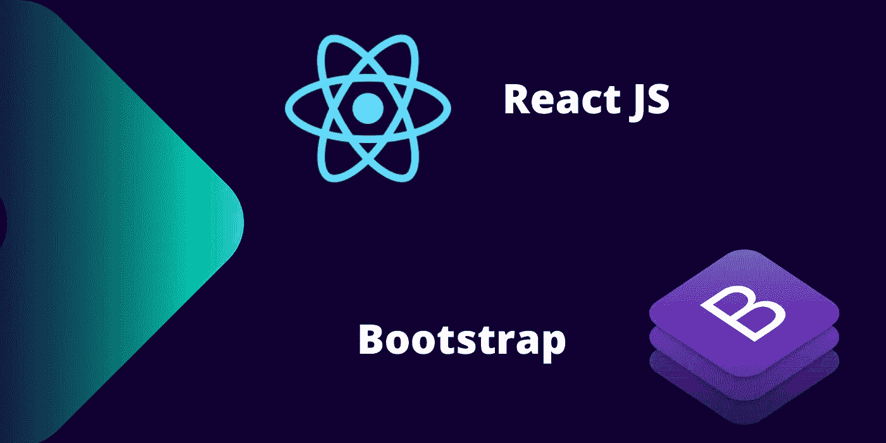

# 为 React 设置引导

> 原文：<https://medium.com/codex/setup-bootstrap-for-react-da1eb0dc51c4?source=collection_archive---------8----------------------->

## 为 React 项目安装引导程序。并学习各种 Bootstrap UI 组件。

反应引导示例

在本教程中，我们将学习如何为 React 安装引导程序，以及如何在 React 中使用引导程序组件。Bootstrap 是 Twitter 开发的一个非常流行的 CSS 框架。Bootstrap 是一个开源的 CSS 框架。Bootstrap 是一个非常易用的 CSS 框架。它不会…