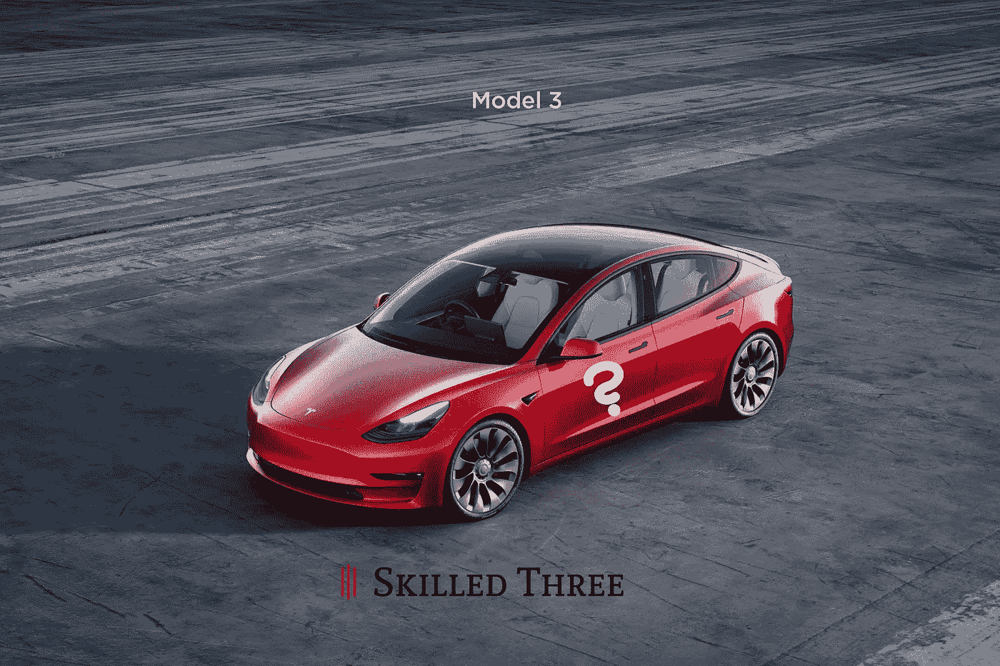

# 关于电动汽车的七个问题

> 原文：<https://medium.com/codex/seven-concerns-about-electromobility-d16c9ca59793?source=collection_archive---------6----------------------->

## 人们仍然看不起电动汽车也许是因为这些原因

图片由作者提供

## 它们充电的时间长得令人难以置信

汽车通常在一天的大部分时间都停在某个地方。白天在公司车库，晚上在家。对于缓慢充电的电池来说，这是足够的时间，需要四…