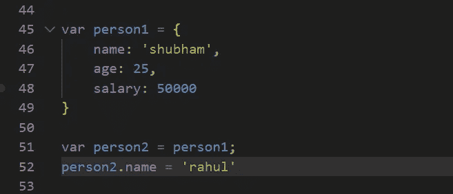
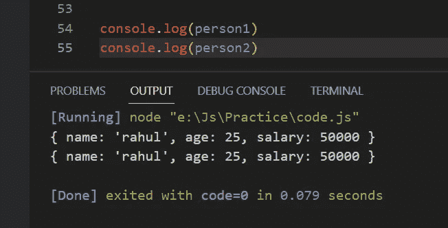
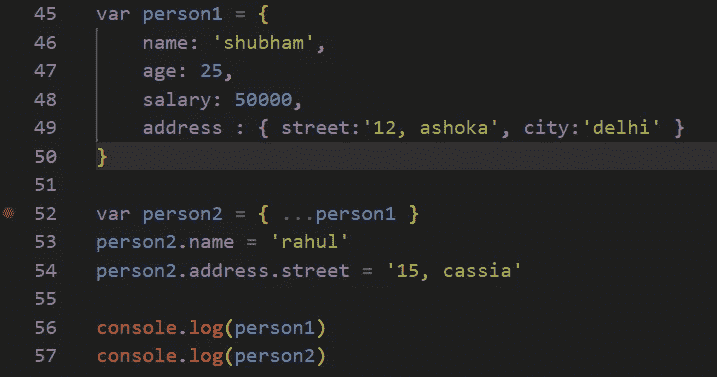
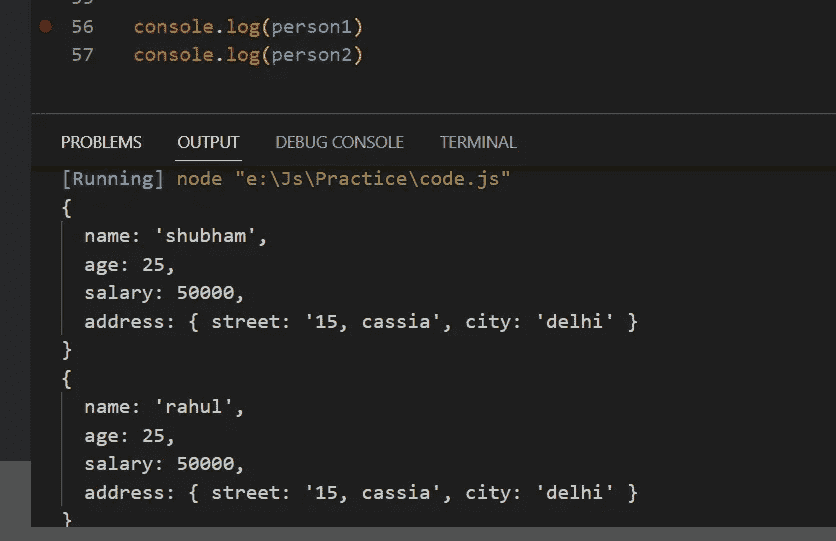
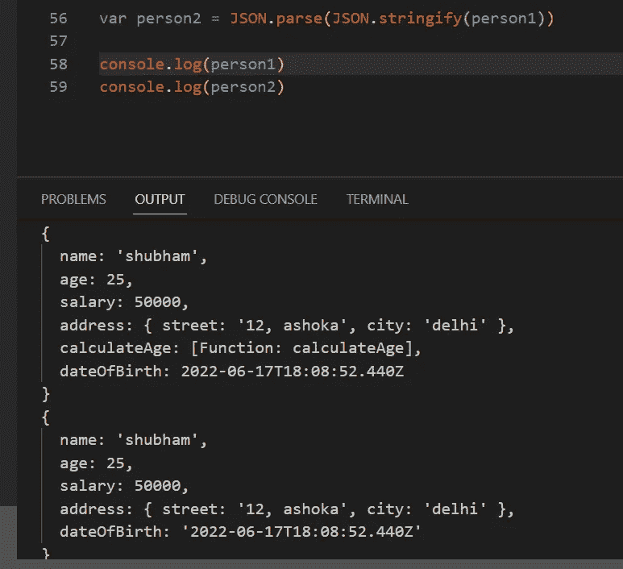
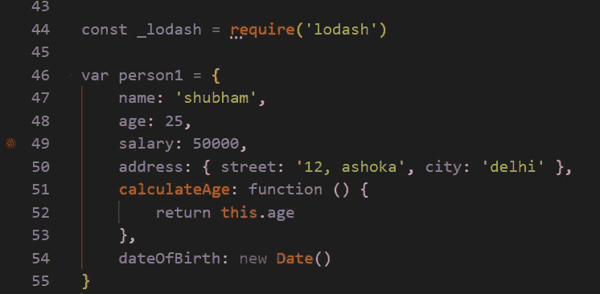
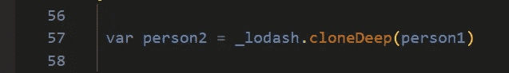
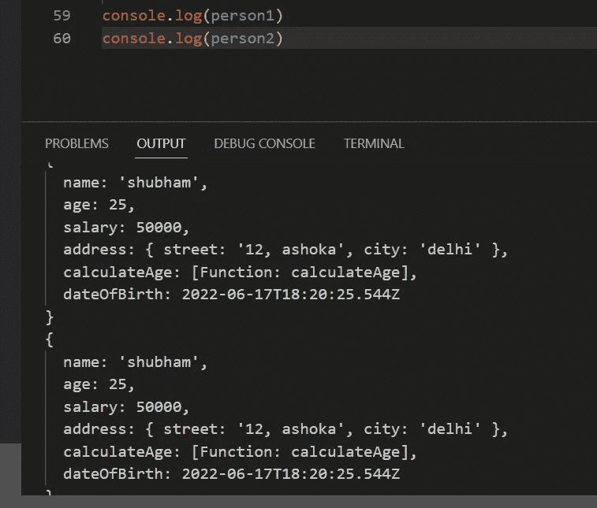

# 浅层克隆与深层克隆|对象| JavaScript

> 原文：<https://medium.com/codex/shallow-cloning-vs-deep-cloning-objects-javascript-fc15280e5a6d?source=collection_archive---------19----------------------->

对象是 JavaScript 的核心和灵魂。很多时候，我们出于很多原因想要在 JavaScript 中创建一个对象的副本/克隆。JavaScript 中基本上有两种可能的克隆类型，今天我们将深入探讨它们。

## 1.浅层克隆

让我们举一个简单的例子来理解浅层克隆

在上图中，你可以看到我创建了一个简单的 person 对象，名为 **person1** ，它有一些属性。在第 51 行，我创建了一个新对象(是吗？)称为**人员 2** 并将其分配为人员 1。之后，我只是更改 person2 的 name 属性。如果我控制台记录这两个对象，您认为输出会是什么？想一想！

令人惊讶的是，person1 的 name 属性也被更改了。为什么会这样？因此，明确的答案是，person2 实际上不是一个单独的对象，而只是对 person1 所指向的同一个对象的引用。这个创建对象克隆的过程被称为**浅层克隆**。

## 2.深度克隆

在我们深入探讨深度克隆之前，还有另一种类型的克隆叫做**部分深度克隆**。我给你举个例子来帮助你更好地理解。

在这里，我刚刚向 person 对象添加了一个名为 address 的新属性，它是一个嵌套对象，我没有直接将 person1 分配给 person2，而是使用[扩展运算符](https://developer.mozilla.org/en-US/docs/Web/JavaScript/Reference/Operators/Spread_syntax)将值赋予 person2 对象。

在第 53 和 54 行，我只是更新了 person2 对象的一些值。那么，当我控制台记录它们时，您认为这次的输出会是什么呢？

正如您所看到的，这一次，person1 的名称并没有随着 person2 的名称的改变而改变，但是如果您已经注意到了，person1 的嵌套对象(地址)的 street 属性也随着我们对 person2 的改变而改变，因此，实际上，spread 操作符并没有对该对象进行精确的深度复制。这是对象的部分深层副本。类似地，在 JavaScript 中我们有 **Object.assign()** 。

在这个场景中，我们也将得到相同的输出。因此，作为结论，我们可以说 JavaScript 中的 spread 操作符和 Object.assign()对对象进行了部分深度克隆。还有另一种克隆对象的方法，那就是借助于 **JSON.stringify()** 和 **JSON.parse()** 但是它们的问题是，如果我们在一个对象中有一个函数和一些类型为 object 的属性，比如一个新的 Date()，那么它不会被带到另一个对象，或者当它被带到另一个对象时，如果某个对象的属性在一个对象的字符串中发生了变化。下面是一个修改后的例子，修改后的代码与我们在本文中看到的一样。

如您所见，person2 对象没有 calculateAge()，并且 person2 中的 dateOfBirth 属性被转换为字符串，这是我们不希望发生的。

现在，为了在 JavaScript 中执行对象的完美深度克隆，我们将依赖一个名为 lodash 的第三方库，我们将通过 npm 安装它，因此请确保您的系统上安装了 node。现在，我们在您的终端中运行以下命令:

> npm i lodash

这将把 lodash 安装到您的项目中。要使用这个库，我们必须将这个库包含到我们的文件中，然后使用其中的方法来执行深度克隆。下面是我们的做法

如您所见，我使用了 require('lodash ')并将其赋给了一个名为 _lodash 的常量，这样我就可以在文件中的任何地方使用它。现在，要创建 person1 对象的深层克隆，我们需要做的事情如下

现在，当我们控制台记录两个人对象时，我们将得到以下输出

现在，我们已经成功地用 JavaScript 实现了该对象的 100%深度克隆，而没有之前遇到的任何问题。

总之，浅层拷贝只不过是由不同引用指向的相同对象，部分深层克隆是那些引用不同但不完全相同的对象，然后使用 lodash 我们可以得到该对象的完全深层克隆。希望你明白浅层克隆和深层克隆的区别。如果你有什么反馈或者你认为我错过了什么，请告诉我。谢了。快乐阅读。