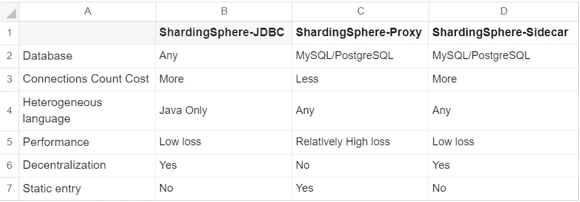

# sharding sphere-on-Cloud & Pisanix 取代 Sidecar，实现真正的云原生体验

> 原文：<https://medium.com/codex/shardingsphere-on-cloud-pisanix-replace-sidecar-for-a-true-cloud-native-experience-bb48ebef71b4?source=collection_archive---------8----------------------->

# 背景

有一段时间，我们的很多博文都显示[**sharding sphere**](https://shardingsphere.apache.org/)**由三个独立的产品组成:**[**sharding sphere-JDBC**](https://shardingsphere.apache.org/document/current/en/overview/#shardingsphere-jdbc)**、**[**sharding sphere-Proxy**](https://shardingsphere.apache.org/document/current/en/quick-start/shardingsphere-proxy-quick-start/)**和 ShardingSphere-Sidecar。**

随着 ShardingSphere 变得越来越流行，JDBC 和 Proxy 已经在许多生产环境中使用，但是 Sidecar 的状态仍然是“**规划中”**。您可能已经在我们的 GitHub `READ ME`或我们的网站上注意到了这一点。

随着云原生数据库的发展势头越来越猛，许多企业选择使用云上的数据库或云原生数据库。这对 ShardingSphere-Sidecar 来说是一个绝佳的机会，它在[**Kubernetes**](https://kubernetes.io/)中被定位为**云原生数据库代理。**

然而，你们中的一些人可能已经注意到，任何关于 Sidecar 的内容都已经从 ShardingSphere 的最新文档中消失了。ShardingSphere-Sidecar 取消了吗？ShardingSphere 的云原生未来会是什么样子？接下来是。

# ShardingSphere 对云有什么计划？

## 停止 R&D 的 ShardingSphere-Sidecar

就 ShardingSphere 用户而言，ShardingSphere-JDBC 和 ShardingSphere-Proxy 已经可以满足大部分需求。ShardingSphere-Sidecar 与它们的唯一区别在于部署形式。JDBC 和代理在功能上是相同的，但各有独特的优势。

ShardingSphere-JDBC 被定位为一个轻量级 Java 框架，在 Java JDBC 层提供额外的服务。客户端直接连接到数据库，它以`jar`的形式提供服务，不需要额外的部署和依赖。它可以看作是一个增强的 JDBC 驱动程序，完全兼容 JDBC 和各种 ORM 框架。它的目标是开发人员，拥有更高的性能。

ShardingSphere-Proxy 是一个透明的数据库代理，通过实现数据库二进制协议来支持异构语言。目前提供了 [MySQL](https://www.mysql.com/) 和 [PostgreSQL](https://www.postgresql.org/) 协议。然而，代理在数据库和前端应用层之间增加了一个网关，这将部分降低性能。

**我们的社区建议用户采用混合部署模式，允许 JDBC 和代理互补，最大限度地发挥 ShardingSphere 在性能、可用性和异构支持方面的优势。**

正如你所看到的，这对 ShardingSphere-Sidecar 来说有点尴尬:JDBC 和代理适用于大多数场景、环境和业务，可以相互补充，给 Sidecar 留下的创新空间很小。从社区及其用户的角度来看，Sidecar 更像是部署模式的扩展，它不能从整体上增强 ShardingSphere。

**考虑到以上因素，为 ShardingSphere 开发一个可以在 Kubernetes 环境中轻松使用和运行的补丁工具更有效率。这样，用户可以在云原生环境中部署和使用 ShardingSphere，同时为 ShardingSphere 社区节省研发时间。**

## ShardingSphere 的云解决方案: [ShardingSphere-On-Cloud](https://github.com/apache/shardingsphere-on-cloud)

> *ShardingSphere-on-Cloud 是基于 ShardingSphere 的全面系统升级。*

ShardingSphere-Sidecar 诞生于 Kubernetes 繁荣时期。当时，越来越多的企业试图采用云原生概念。ShardingSphere 社区也不例外。

我们提出了 ShardingSphere-Sidecar 来促进数据领域的云原生转换。然而，由于 JDBC 和代理已经足够成熟，可以处理大多数场景中的数据治理，因此没有必要让 ShardingSphere 完全是云原生的。

Sidecar 确实可以在某些场景中发挥很大的作用，但这并不意味着我们必须为每个组件创建一个 Sidecar 版本。ShardingSphere 正在研究如何在充分整合云计算概念后，提出一个基于真实云原生场景的解决方案。这就是 ShardingSphere-on-Cloud 的诞生。

[云上 ShardingSphere](https://github.com/apache/shardingsphere-on-cloud)能够在 Kubernetes 环境中部署和迁移 sharding sphere。在 [AWS CloudFormation](https://aws.amazon.com/cloudformation/) 、 [Helm](https://helm.sh/) 、Operator 和 Terraform(即将推出)等工具的帮助下，它提供了在云原生环境中快速部署、更高的可观测性、安全性和迁移以及高可用性部署的最佳实践。

> *详情请参考* [**数据库加拥抱云:ShardingSphere-on-Cloud 解决方案发布**](/codex/database-plus-embracing-the-cloud-shardingsphere-on-cloud-solution-released-29916290ad06?source=your_stories_page-------------------------------------) *。*

## 通过 [Pisanix](https://www.pisanix.io/) 实现切割球侧车的视觉

**为什么我们要开发一个新的面向云原生场景中数据治理的开源项目？**

我们的社区一直在思考 ShardingSphere 和[数据库网格](/faun/database-mesh-2-0-database-governance-in-a-cloud-native-environment-ac24080349eb?source=your_stories_page-------------------------------------)概念的定位。

在社区内，我们在不同的阶段对边车持有不同的观点。一开始，社区希望使用 Sidecar 来管理云数据问题。随着社区对云原生和云数据管理流程的深入了解，ShardingSphere-Sidecar 的局限性也逐渐暴露出来。

ShardingSphere-Sidecar 只是云原生环境下 ShardingSphere 的一种部署模式，所以只能解决单一问题。它无法帮助 ShardingSphere 为企业开发一个成熟的云原生解决方案。

**因此，我们需要在云原生系统中重新设计一个具有更高适应性、可用性和敏捷性的开源产品，以弥补 ShardingSphere 在云数据治理方面的限制。**

这就是为什么我们在 SphereEx 的一些社区成员开发了 Pisanix，一个基于数据库网格概念的云原生数据治理工具。它可以提供 SQL 感知流量治理、运行时面向资源的管理和 DBRE 等功能。

## Pisanix 和 ShardingSphere-Sidecar 一样吗？

ShardingSphere-Sidecar 和 Pisanix 传达了对数据库网格的不同理解。它们在以下几个方面是不同的。

*   **不同的设计理念:**JDBC&代理的设计理念是 Database Plus，在多个数据源之上增加一个接口，进行统一治理和增强。Pisanix 代表了数据库网格概念的具体实践，为云原生场景中的应用程序带来了高效、流畅的数据库开发。
*   **不同的语言生态系统:** JDBC 是单独用 Java 开发的。由于 Java 受到众多企业级社区用户和开发人员的欢迎，JDBC 可以很容易地应用于 Java 开发的应用程序。相比较而言，Pisanix 是在 [Rust](https://www.rust-lang.org/) 开发的，用来提高接入层的可靠性和效率。

尽管有一些小的不同，但它们都面向云原生数据基础设施。这也是 Database Mesh 通过实施云原生 DBRE 的长期期望。

在部署方式上，Pisanix 和 ShardingSphere-Sidecar 都可以以 Sidecar 的形式部署业务应用，为开发者提供标准的协议接入。此外，Pisanix 与 ShardingSphere 生态系统高度兼容。可以用 ShardingSphere-Proxy 连接 MySQL 的相同方式将 Pisanix 连接到 ShardingSphere-Proxy。

简而言之，ShardingSphere 在 Database Plus 概念下为开发者和应用程序呈现了一个完整的数据库表单。Pisanix 也是为了同样的目的而设计的。通过云数据流量入口 Pisanix，用户可以使用 ShardingSphere-Proxy 作为数据库，探索云原生环境下的协作模式。

但是，它们属于独立的产品线。Pisanix 从一开始就遵循数据库网状概念，通过**本地数据库、统一配置和管理、多协议支持和云原生架构**四个方面实现高性能扩展。

Pisanix 只是统一云上数据库类型的第一步，Sidecar 只是一种部署形式。

> *不同数据库的协议和 DevOps 特性各不相同，重点在于抽象出标准的治理行为。*

与 Pisanix 不同，ShardingSphere 生态系统不仅可以通过协议访问，而且 ShardingSphere-JDBC 可以更方便地被 Java 应用程序使用。

它的自然兼容性保持了功能的完整性，优化了资源利用并提供了终极性能，开发人员可以从业务的角度随意配置数据治理。同时，通过将 ShardingSphere 与底层数据库相结合，用户可以在应用程序端部署强大的计算能力，将原来的单一数据库转变为高性能的分布式数据库，优化资源分配，提供高性价比的解决方案。

总之，ShardingSphere 和 Pisanix 一起为社区用户提供了两种解决方案。对于想要在 Kubernetes 环境中部署 ShardingSphere 的用户来说，ShardingSphere-on-Cloud 就足够了，ShardingSphere 的其他功能与在本地使用时完全相同。

**对于希望在云原生场景下实现上层数据库统一流量治理的用户来说，Pisanix 是更好的选择。**

与 ShardingSphere-Sidecar 相比，ShardingSphere-on-Cloud 结合 Pisanix 更加有效和方便。

[**ShardingSphere 官网**](https://shardingsphere.apache.org/)

[**数据库网格官网**](https://www.database-mesh.io/)

[**Pisanix 官网**](https://www.pisanix.io/)