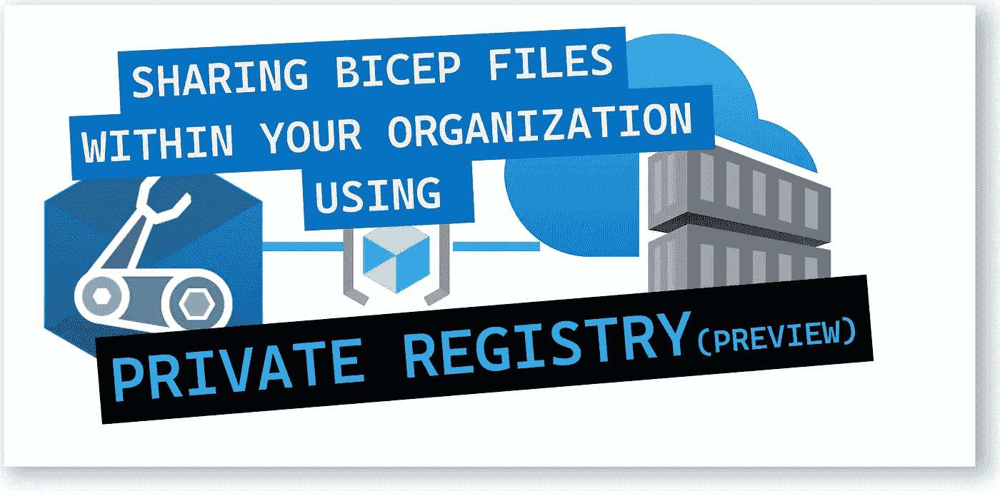
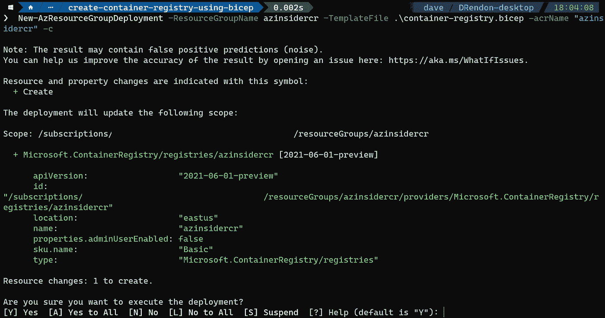
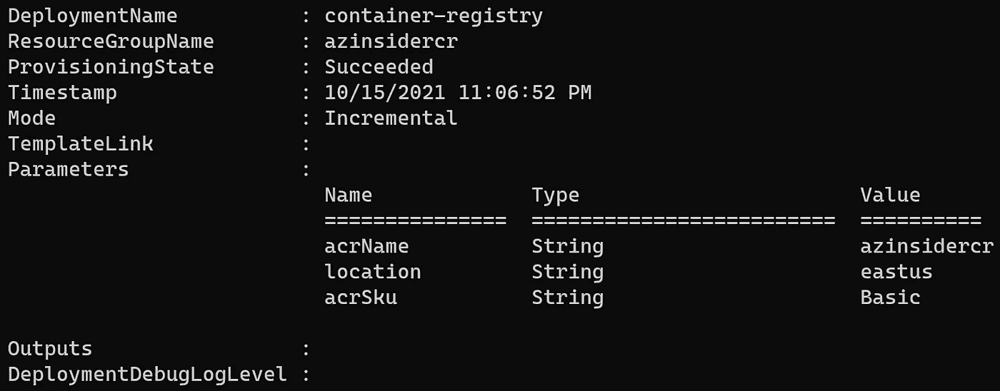
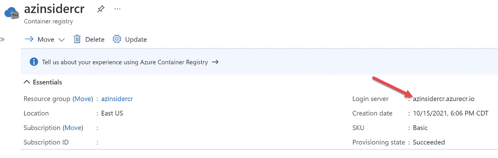
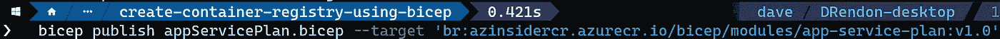
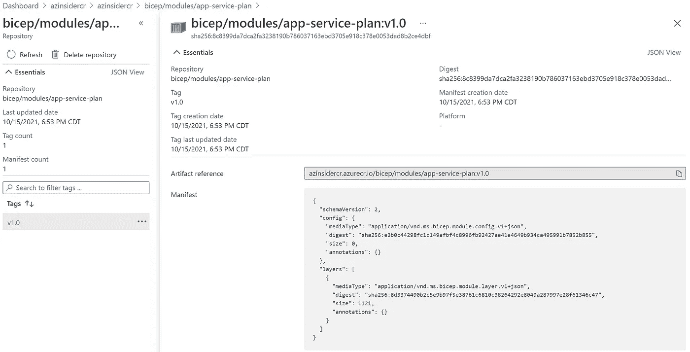

# 💪使用私有注册表在组织内共享 Bicep 文件

> 原文：<https://medium.com/codex/sharing-bicep-files-within-your-organization-using-a-private-registry-439294593a9b?source=collection_archive---------1----------------------->

了解如何在私有注册表中发布模块，并为需要将 Bicep 文件部署为模块的用户提供访问权限。



💪使用私有注册表在组织内共享 Bicep 文件

本文将回顾如何使用私有注册中心共享 Bicep 文件，以便在您的组织内作为模块使用。

终于来了！对私有模块注册表的支持从 2021 年 10 月 15 日开始提供！

# 为什么应该考虑使用私有注册中心？

这归结为可重用性和模块化。当在 Azure 中处理更复杂或更广泛的环境时，我们可以将我们的解决方案分成不同的模板。

在 ARM 模板中，我们能够使用链接或嵌套模板将我们的解决方案分解成许多相关的模板。然后，我们通过主模板部署解决方案，并引用链接或嵌套模板。

在 Bicep 中，*模块*被定义为一组一个或多个要一起部署的资源。模块只公开参数和输出，隐藏内部资源定义的细节。

要部署复杂的解决方案，您可以将您的 Bicep 模板分成许多更小的 Bicep 模板，然后通过主模板将它们部署在一起。每个模板都可以作为一个模块来使用。

模块是从另一个 Bicep 文件中消费的 Bicep 文件。使用模块，您可以通过封装部署的复杂细节来提高 Bicep 文件的可读性。

这样，您可以轻松地为不同的部署重用模块。

# 我将我的部署组织成模块，现在呢？

下一步是通过在整个组织中重用和共享 Bicep 模板来实现协作。

您可以利用 Bicep 私有注册中心来发布 Bicep 模块，这些模块部署了针对您组织的需求而预先配置的资源。您将通过使用版本控制访问和安全地更新模块。

# Bicep 私人登记处

Bicep 注册中心托管在 Azure Container Registry 上，这是一个基于开源 Docker Registry 2.0 的托管私有 Docker 注册中心服务。

可以把 Bicep 注册中心想象成一个私有的存储库，用来存储和管理 Bicep 模块和相关的工件。

## 我们如何与私有注册管理机构合作？

为了在您的组织内共享 Bicep 模块，我们可以使用私有注册表。我们将执行以下任务:

1.  使用 Bicep 文件创建容器注册表

2.配置私有注册表

3.在私有注册表中发布模块

## 先决条件:

*   Azure Bicep 和 Azure PowerShell 安装在您的本地计算机上
*   有效的 Azure 订阅
*   启用了所有者/参与者角色的用户
*   资源组

确保您的二头肌版本至少为 0.4.1008。您可以使用下面的命令来验证当前的 Bicep 安装:

```
bicep --version
```

# 1.使用 Bicep 文件创建容器注册表

下面的 Bicep 文件创建了一个 Azure 容器注册表:

```
[@minLength](http://twitter.com/minLength)(5)
[@maxLength](http://twitter.com/maxLength)(50)
[@description](http://twitter.com/description)('Provide a globally unique name of your Azure Container Registry')
param acrName string = 'acr${uniqueString(resourceGroup().id)}'[@description](http://twitter.com/description)('Provide a location for the registry.')
param location string = resourceGroup().location[@description](http://twitter.com/description)('Provide a tier of your Azure Container Registry.')
param acrSku string = 'Basic'resource acrResource 'Microsoft.ContainerRegistry/registries@2021-06-01-preview' = {
  name: acrName
  location: location
  sku: {
    name: acrSku
  }
  properties: {
    adminUserEnabled: false
  }
}
```

您可以参考以下 URL 来验证 Azure 容器注册表模板格式:

[](https://docs.microsoft.com/en-us/azure/templates/microsoft.containerregistry/registries?WT.mc_id=AZ-MVP-5000671%3Ftabs%3Dbicep&tabs=bicep) [## 微软。container registry/registries-Bicep & ARM 模板参考

### 注册表资源类型可以部署到:资源组。要了解资源组部署，请参阅 Bicep…

docs.microsoft.com](https://docs.microsoft.com/en-us/azure/templates/microsoft.containerregistry/registries?WT.mc_id=AZ-MVP-5000671%3Ftabs%3Dbicep&tabs=bicep) 

我们将使用下面的命令部署上面的 Bicep 文件:

```
$date = Get-Date -Format "MM-dd-yyyy"
$deploymentName = "AzInsiderDeployment"+"$date"New-AzResourceGroupDeployment -ResourceGroupName azinsidercr -TemplateFile .\container-registry.bicep -acrName "azinsidercr" -c
```

注意，我们使用标志-c 在执行部署之前预览部署。

下图显示了部署的预览:



Azure 容器注册表-部署预览

现在，我们将执行部署。下图显示了部署的输出:



部署输出

下一步是配置 Bicep 私有注册中心

# 2.配置私有注册表

首先，我们将获得登录服务器名称。您可以使用 Azure PowerShell 或从我们刚刚部署的容器注册表中的 Azure 门户获取登录服务器名称:



容器注册表—登录服务器

以下命令显示了如何使用 PowerShell 获取登录服务器名称:

```
Get-AzContainerRegistry -ResourceGroupName "<resource-group-name>" -Name "<registry-name>"
```

要将模块发布到注册表，您必须拥有推送映像的权限。

要从注册表部署模块，您必须拥有获取映像的权限。

现在让我们向私有注册表发布一个 Bicep 模块。

# 3.将 Bicep 模块发布到私有注册中心。

我们将使用 *publish* 命令并提供下面的 Bicep 文件，这些文件将被用作一个模块。在注册表中指定模块的目标位置。

复制下面的代码，在你的本地机器上保存为' *appPlan.bicep'* 。

```
param appPlanPrefix string
param sku string = 'F1'
param location string = 'eastus'resource appServicePlan 'Microsoft.Web/serverfarms@2021-01-15' = {
  //interpolate param
  name: '${appPlanPrefix}AppPlan'
  //pass on location param
  location: location
  kind: 'linux'
  sku: {
    //pass on sku param
    name: sku
  }
  properties:{
    reserved: true
  }

}
// Set an output which can be accessed by the module consumer
output appServicePlanId string = appServicePlan.id
```

现在，我们将使用下面的命令将上述 Bicep 文件发布到注册表中:

```
bicep publish appServicePlan.bicep --target 'br:azinsidercr.azurecr.io/bicep/modules/app-service-plan:v1.0'
```

注意事项:

*   每个模块名路径段必须是小写字母数字字符串，可以选择用“.”分隔、“_”或“-”。
*   有效字符包括字母数字、“_”或“-”。



Bicep 向私有注册中心发布一个模块

现在，您可以进入 Azure 门户的容器注册中心，在 repositories 部分，您将看到模块已发布，如下所示:



私有注册表中的 Bicep 模块

我们现在可以从 Bicep 文件引用注册表中的文件了！

点击这里查看 Bicep v. 0.4.1008 的完整更新:【https://github.com/Azure/bicep/releases/tag/v0.4.1008 

👉 [*在此加入****azin sider****邮箱列表。*](http://eepurl.com/gKmLdf)

*-戴夫·r*