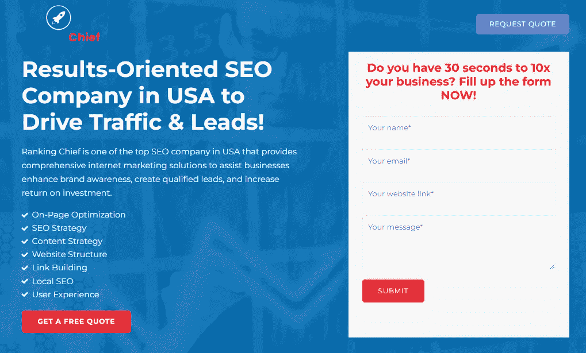
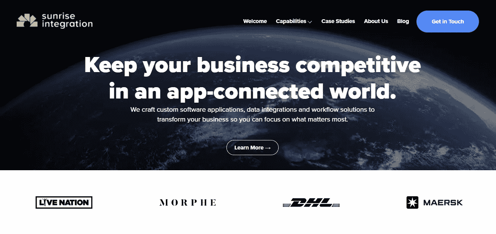
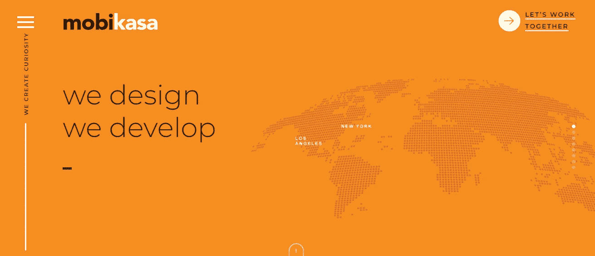
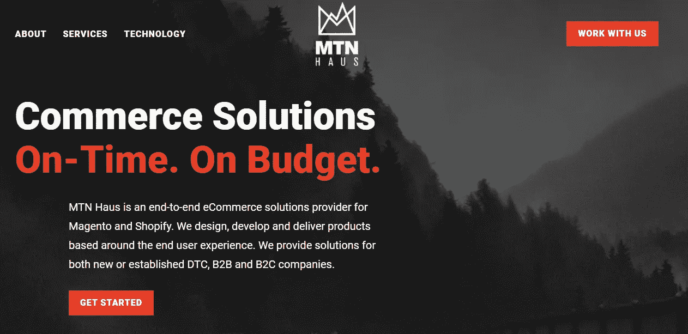
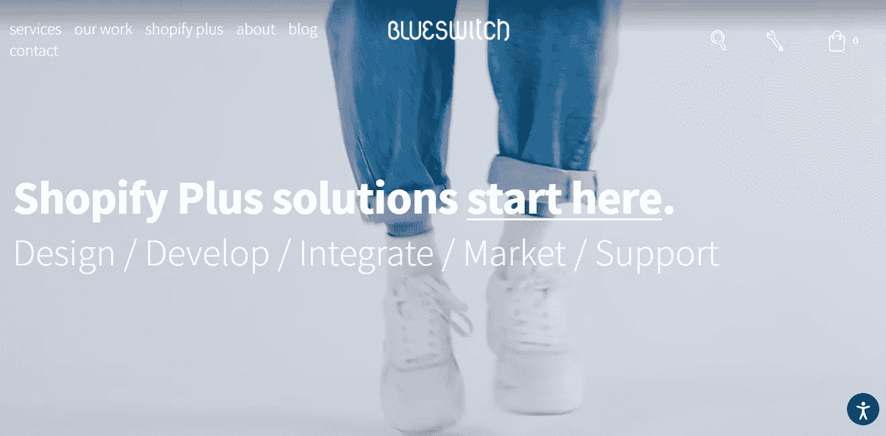
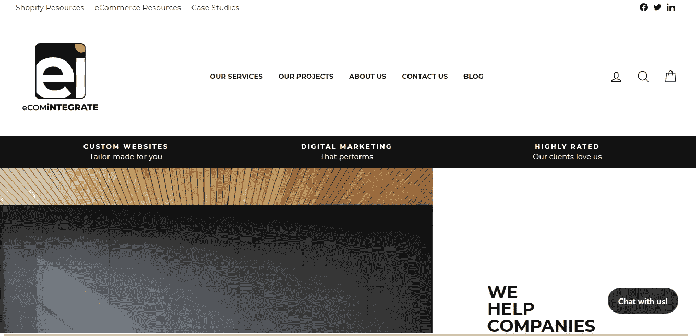
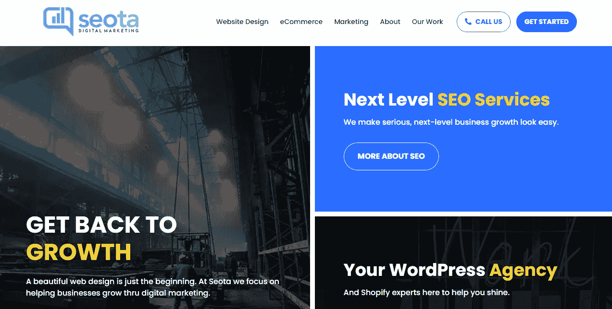
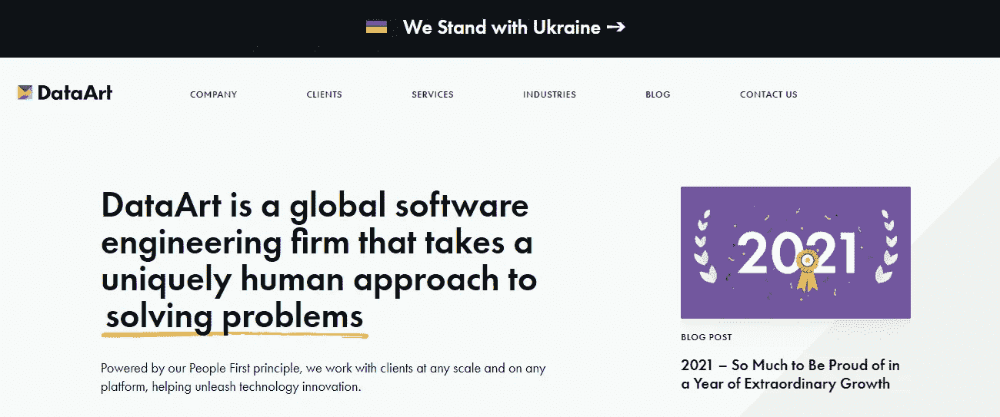

# 美国的 Shopify 网站开发公司

> 原文：<https://medium.com/codex/shopify-website-development-companies-in-usa-fbd74bf5c384?source=collection_archive---------11----------------------->

## 让美国最好的 Shopify web 开发公司完成您的 Shopify 项目，该公司提供 Shopify 主题开发服务、插件开发、迁移服务等。

罗伯特·科尔特斯在 [Unsplash](https://unsplash.com?utm_source=medium&utm_medium=referral) 上拍摄的照片

在搜索购物车软件解决方案时，您很可能会遇到 Shopify。但是为什么会这样呢？Shopify 到底是什么？更重要的是，在 2022 年，你应该选择与哪家顶尖的 Shopify 开发公司合作？

Shopify 是一个基于云的购物车解决方案，或软件即服务(SaaS)，使各行各业的企业能够快速成功地建立在线商店来销售他们的商品。

由于 Shopify 越来越受欢迎，我整理了一份 2022 年 Shopify 开发业务排行榜，供你考虑。

疫情的爆发影响了整个地球，导致了不可避免的社会孤立，这给了 Shopify 的发展带来了巨大的推动。

Shopify 开发最吸引人的一个方面是它提供了多种价格方案，每种方案都有一套独特的功能，适合各种规模的企业和各种行业。

Shopify 是一个面向所有人的平台。每个人，无论是初创公司还是大公司，都可以从 Shopify 电子商务平台中受益，因为它提供了各种集成，有助于软件和公司的可扩展性。

在 2022 年，大量的企业已经开始在互联网上销售他们的产品，其中许多都在使用 Shopify。

为什么如此多的新品牌和企业在 Shopify 上立足？我给你一些 Shopify 的好处，帮你回答这个问题。

# 查看美国 Shopify 网站开发公司列表

## 1.[最高长官](https://rankingchief.com/)

资料来源:最高长官

作为一家数字营销企业，Ranking Chief 处理广泛的服务，包括网站设计和开发以及付费广告。

他们擅长开发定制网站，尤其是基于 Shopify、WordPress、PHP 和 Laravel 等平台的网站。

Ranking Chief 的专业人员帮助您提供有针对性的、以结果为导向的电子商务解决方案，使您在竞争中脱颖而出。

获得最具沉浸感、最吸引人、功能最全的 Shopify 主题创作服务，确保满足您所有的特定需求和标准。

有竞争力的价格和绝对安全的保证只是排名第一提供的众多好处中的两个。

使用他们在美国的 Shopify 电子商务网站开发专家，你将能够通过销售专为你的商店设计的商品来吸引更多的顾客和创造更多的收入。

## 2.[日出集成](https://www.sunriseintegration.com/)

来源:日出集成

他们设计和开发高质量的定制软件应用程序和工作流解决方案，使您的公司能够专注于对其最重要的事情。

他们专门帮助初创公司和财富 500 强公司实现 web 开发项目并取得成功。

他们久经考验的方法，加上他们的多平台专业知识，为您提供了竞争优势。

Sunrise Integration 的数据集成专业人员团队二十多年来一直在设计完全定制的商业软件解决方案，尤其侧重于电子商务、物流、SaaS 软件、移动应用程序和其他领域。

他们精通各种平台，包括 Shopify、Bigcommerce、Magento、WordPress、幕府、亚马逊、易贝等。

他们为零售、医疗保健、金融、物流、时尚等行业提供帮助。

## 3.[点逻辑](https://www.dotlogics.com/)

来源:Dotlogics

Dotlogics 是一家做事与竞争对手不同的公司。

他们可以吹嘘我们的成就，但是这些已经公之于众了。

此外，他们认为我们只是和我们最近的工作一样优秀，因此他们把一切都投入到每个项目中，无论是为大公司还是为新成立的公司。

他们相信交流是真正的秘方，他们已经抛弃了行话和流行词汇，转而使用真实的人类语言。

他们的客户积极参与这个过程，因为他们在项目过程中收集的反馈越多，最终产品就可能越好。

他们不遗余力地确保只有他们提出的技术会产生更多的游客，提高你的销售，而不会增加复杂性或额外的阶段。

他们的专业知识超越了网页设计；他们对需要电子商务协助、SEO 优化、ERP 和 CRM 系统、后端解决方案以及各种其他服务的项目采用以结果为导向、以数据为中心的定制技术..给他们打电话；他们能够帮助你。

## 4.[莫比卡萨](https://www.mobikasa.com/)

资料来源:Mobikasa

他们提供从全方位服务开发到单点服务的各种服务，建议并帮助客户开发最具扩展性的网站和应用程序。

该公司提供在线应用程序、移动应用程序和平板应用程序，目标是提高流量和利润。

Mobikasa 的顶级开发人员和工程师设计和构建富有创意的 web 应用解决方案，吸引目标受众并推动流量，最终提高客户的收入。

无论您是在寻找一次性项目、交钥匙解决方案还是企业解决方案，Mobikasa 经验丰富的工程师、开发人员、平面设计师和其他创意专家团队都可以帮助您满足您的要求并实现您的目标。

他们的图形设计师和用户体验专家合作开发时尚、实用、独一无二的解决方案。

每个企业都有我可以帮助解决的问题。

无论你是在开发一个应用程序，一个网站，还是一个内部团队解决方案，他们都可以提供帮助。

他们为您的公司提供跨广泛营销平台的专家见解和经验。

## 5. [MTN 豪斯](https://mtnhaus.co/)

来源:MTN 豪斯

MTN 豪斯提供全面的商业解决方案，已建立的品牌和新进入市场的品牌都可以从中受益。

这些问题解决者热衷于数字商务和发明尖端技术，以推动公司在各自的行业向前发展。

作为 Rogue Fitness 创始团队的一员，他们的创始人花了十多年时间为公司奠定基础。

团队经验不仅限于电子商务，而是涵盖了当代公司任务的整个范围，包括客户服务、信息技术、仓储、运营、物流、金融和其他专业领域..

他们提供的服务包括平台搭建、升级、创意、用户体验设计、网页设计、开发和实施，以及数据分析、产品和应用程序开发和商业战略。

## 6. [BlueSwitch](https://blueswitch.com/)

来源:BlueSwitch

在纽约，BlueSwitch 是一家专注于电子商务的数字营销和网络设计工作室。该公司由 Shopify 开发人员、用户体验(UX)设计师、项目经理和出色的营销人员组成的技术团队可以推动您的公司走向新的成功高度。

他们的电子商务战略家利用他们广泛的市场知识来构建视觉上吸引人的网站，吸引更多的访问者，扩大他们的客户群，并提高成功转化的数量。

他们致力于通过提供多样化的服务来满足客户的需求。

他们与我们的每一个客户都保持着长期的关系。

他们的目标从一开始就是找到问题的解决方案，甚至在网站完成后，这个目标仍在继续。

他们希望看到他们的客户蓬勃发展，因此他们提供持续的网站援助和 IT 支持，以及营销服务，以帮助您的公司进一步扩张。

## 7. [eComIntegrate](https://ecomintegrate.com/)

资料来源:eComIntegrate

eComIntegrate 为组织提供了一个现代化的、定制的在线展示，以满足他们的个人需求和愿望。

他们知道你的公司是独一无二的，他们知道是什么让你在竞争中脱颖而出。因此，您的数字营销努力集中在将接受您的品牌并转化为销售的受众身上。

数字世界每天都在发展，他们深谙如何满足需求，同时发展您的业务并提高收入。

eComIntegrate 致力于为客户定制解决方案，他们通过与客户建立有意义的个人关系并了解他们的公司目标来实现这一目标。

他们是帮助小企业快速有效地建立和运行网站的专家。

## 8.[由空白建造](https://builtbyblank.com/)

来源:由 Blank 构建

Built By Blank 是一家电子商务机构，拥有各种全球客户组合和数据驱动的设计方法，其重点是建立用户体验以提高流量、转化率和底线销售额。

他们是在 Shopify 平台上开发和实施网站的专家。

Blank 的管理团队由成功的企业家组成，他们建立了电子商务业务，创造了数百万美元的收入。

他们现在向其他公司提供他们的知识，目标是通过合作实现最雄心勃勃的电子商务销售目标。

当涉及到客户行为和动机时，用户体验团队和 UX 设计团队使用定性和定量研究来指导他们的工作。

这包括评估客户需求的业务解决方案，恰当地构建手头的问题，并将这些信息转化为可操作的设计建议，以指导创造性的探索。

通过采取这一战略，Built By Blank 能够满足企业需求和用户目标，同时还能提供创新性、实用性、功能性和易用性，从而形成一个忠诚而有粘性的客户群。

## 9. [Seota 数字营销](https://seota.com/)

来源:Seota 数字营销

WordPress 和 Shopify 的网站开发是 Seota Digital Marketing 的专长，这是一家提供全面服务的数字企业。

他们是一个网页设计公司，将把你的品牌带到一个新的高度，增加你公司的价值。

Seota Digital Marketing 公司从杂乱的信息中剔除，提供你真正需要的东西，为你的网站增加更多的流量。

他们透明公开地努力教育你，提升你的排名。

他们是搜索引擎优化、WordPress、Shopify 和 WooCommerce 的专家。

他们的目标是提高您的企业知名度，并帮助您利用您的数字足迹，以经济高效的方式增加销售。

该公司雇佣了训练有素的人员，他们熟悉你的网站上发生的事情。

他们不实现由他人创建或设计的主题，他们只使用通过生成工具自制的设计。

他们在 Photoshop、WordPress 架构、PHP、CodeIgniter、CSS、JavaScript 和各种其他编程框架和平台方面拥有专业知识。

## 10.[数据艺术](https://www.dataart.com/)

来源:数据艺术

在解决问题方面，DataArt 是一家全球性的软件工程公司，采用独特的人性化方法。

凭借 20 多年的专业知识、遍布全球的训练有素的工程师团队、深入的行业知识和持续的技术研究，他们帮助客户开发定制软件，以增强公司运营并开拓新的市场机会。

他们可以在任何平台上与任何规模的客户合作，并随着客户需求的变化而发展。

好奇心、同理心、信任、诚实和直觉只是人类基本原则的一部分，这些原则指导着企业和客户与业主之间建立关系的方法。

这些特点有助于提供客户依赖的高价值、高质量的解决方案，以及他们信任的长期合作伙伴关系。

## 结论

到目前为止，你已经查看了美国所有最好的 Shopify 网站开发公司。

这个小指南可以帮助你找到符合你电子商务要求的相关公司。

借助 [**最好的本地 SEO 服务**](/codex/best-local-seo-companies-in-the-united-states-a28b03aba249)**你可以从你的 Shopify 网站获得高额收入。**

**上面写的所有信息不是支持或促进任何一家公司。该信息基于研究和客户评论。**

**我希望你能从这篇文章中找到合适的 Shopify 网站开发公司。**