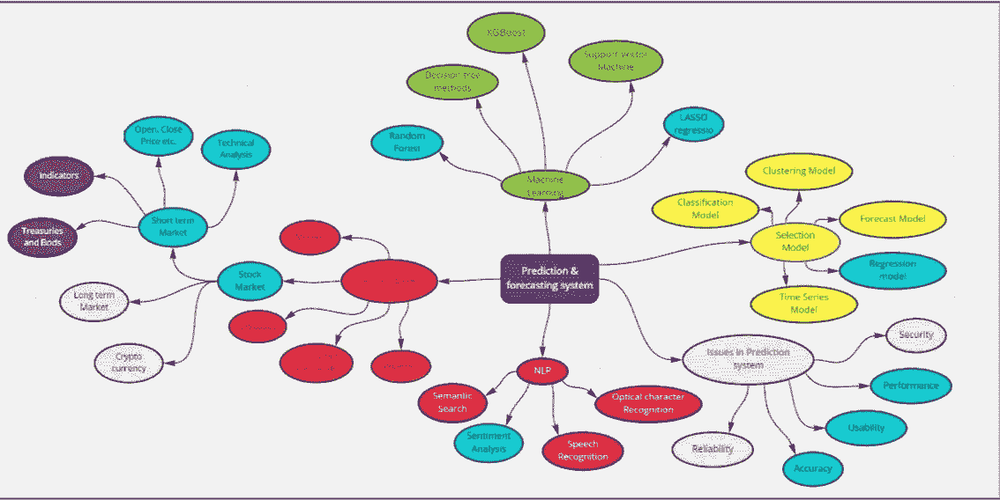
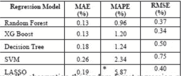
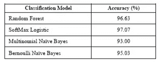
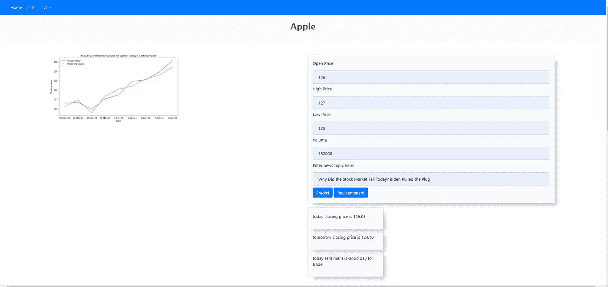
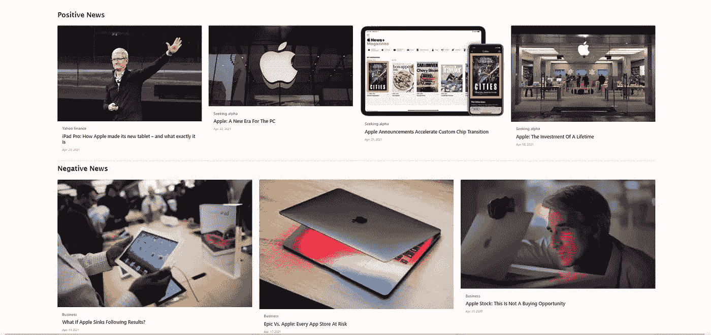

# 使用机器学习和 NLP 模型的短期股票价格预测。

> 原文：<https://medium.com/codex/short-term-stock-price-prediction-using-machine-learning-and-nlp-models-100440cc8ba2?source=collection_archive---------14----------------------->


[M. B. M.](https://unsplash.com/@m_b_m?utm_source=medium&utm_medium=referral) 在 [Unsplash](https://unsplash.com?utm_source=medium&utm_medium=referral) 上拍摄的照片

在这篇博客中，我讨论了我的经验和我的学术研究概述，这些研究使用随机森林、LASSO 回归和未来两天的分类模型预测公司的短期股价，还分析了其他经济因素，如公共新闻、Twitter feeds 等。最后，该系统用简单有效的用户界面建议股票交易者买卖股票以避免他们在日常交易中的损失。


股票市场是一个国家经济的驱动因素，也是许多投资者和股东的创收因素。因此，已经提出了许多尝试来预测每日股票市场中股票指数的运动，但是大多数系统缺乏其他影响因素的实时相关性，例如特定公司的内部因素、公司的公众认知、国家的突然变化，这些因素可能间接影响预测。因此，即使是有经验的股票交易者，预测股票指数的走势也是一项平凡的任务。

为了最小化交易者和购买者之间的非盈利交易决策的影响或减少其机会，以下系统解决了所有影响因素中的大部分，并防止当日股票交易者通过在错误的时间投资于非理想的公司来避免损失。



研究的概念图。

该项目的第一步是将范围缩小到每日股票交易，重点是使用从开源数据网站收集的特定股票指数的开盘价、最高价、最低价和过去数据量来预测股票的收盘价。在分析模型之前，我必须做一些预处理步骤，如清理数据，删除空字符等(如果你是计算机科学的学生，知道我的意思😉).因此，在完成这项平凡的任务后，我开始训练多种机器学习模型，特别是回归模型，以最适合预测这家公司的未来业绩。顺便说一下，出于研究目的，我选择了苹果股票指数(**【AAPL】**)和道琼斯指数( **DWJA** )，因为它们因产品或经济因素的突然发布而具有最高的不稳定表现。所以在比较了随机森林、SVM、决策树等模型后，XGBoost 随机森林给了我更好的损失函数度量。



所有回归模型的损失函数值。

在最终确定主要模型后，我开始分析最佳分类模型，以使用 NLP 和从 Kaggle 收集的数据集来找到主导外部因素的影响。按照相同的预处理步骤去除停用词，减少数据集中的噪声，我能够找到最准确的模型是 SoftMax 分类模型，其准确率为 97.07%。



所有分类模型的准确性度量。

分类模型的目的是发现目前影响股票交易的用户情绪，因此 Softamam 模型非常擅长通过新闻话题和 Twitter 推文从经验证的股票市场用户中发现用户情绪，并将其建议给股票交易员。

最终确定模型后，我进行了 K 倍验证，以证明我获得的模型是平衡的，既没有过度拟合也没有欠拟合。在执行了 3 层验证之后，测试数据获得了令人印象深刻的 96%的分数。我在 UI 中添加了预测值与实际值的图表，为用户提供额外的信息。

下图显示了随机森林回归模型的实现。

```
#import Roandom Forest model
from sklearn.ensemble import RandomForestRegressor

from datetime import datetime
start_time = datetime.now()

#fitting into the model
rfr = RandomForestRegressor(n_estimators=1000, criterion='mse', random_state=42,verbose=0)
rfr.fit(x_training, y_training)

#predict target from training data
rfr_predictions = rfr.predict(x_testing)
rfr_predictions

pickle.dump(rfr, open("aapl_tdyPrediction.pkl", 'wb'))
print('model saved...')
```

下图是预处理步骤和用户新闻情感分类模型的实现。

```
#import aaple news set
dataFrame=pds.read_csv("C:\\Users\\Acer\\Desktop\\AAPL\\AAPL_News(label-today).csv", encoding= "ISO-8859-1")
dataFrame.head()

dataFrame.shape

#split into testing and traing set
training_set = dataFrame[:3281]
testing_set = dataFrame[-820:]

#preprocessing part
#removing stop words and white spece.
news_data= training_set.iloc[:, 2:27]
news_data.replace("[^a-zA-Z]", " ", regex=True, inplace=True)

#converting upper to lower case letters
for col in news_data.columns:
    news_data[col]=news_data[col].str.lower()
news_data.head(1)

#append all news to an array
news_headlines = []
for row in range(0, len(news_data.index)):
    news_headlines.append(' '.join(str(x) for x in news_data.iloc[row, 0:25]))

from sklearn.feature_extraction.text import TfidfVectorizer
from sklearn.feature_extraction.text import CountVectorizer
from sklearn.ensemble import RandomForestClassifier

# implement RandomForest Classifier model with parameters
rfc=RandomForestClassifier(n_estimators=100,criterion='gini',max_features='auto',bootstrap=True,max_depth=1000,min_samples_split=2

#fit data to model
rfc.fit(train_df, training_set['Label'])

# transform text sentiment to vector sentiment
test_transformVector= []
for row in range(0, len(testing_set.index)):
    test_transformVector.append(' '.join(str(x) for x in testing_set.iloc[row, 2:27]))
test_tranform_data = count_vector.transform(test_transformVector)

#prediction for the Test Dataset
rfc_predictions = rfc.predict(test_tranform_data)

#dumping the most efficent model
pickle.dump(rfc, open("nlp_model.pkl", 'wb'))
print('model saved...')
```

下图显示了使用 python flask 集成模型和前端的 web 应用程序的 API 实现。

```
*# function to predict the price for AAPL and stock and news* @app.route(**'/predictAAPL'**, methods=[**'POST'**])
def predict():
    *# get stock values from the front end.* getVal1 = float(request.form[**'ph1'**])
    getVal2 = float(request.form[**'ph2'**])
    getVal3 = float(request.form[**'ph3'**])
    getVal4 = float(request.form[**'ph4'**])
    finalarray = np.array([[getVal1, getVal2, getVal3, getVal4]])  *# convert into an array

    # get news topic from the front end.* getNewsVal = str(request.form[**'ph'**])
    news_array = [getNewsVal]  *# convert into an array* predictions = nlpModel.predict(transform_model.transform(news_array))  *# prediction* pred = predictions[0]

    *# condition to suggestion for trade* if pred == 0:
        predictText = **'Not a good day to trade'** else:
        predictText = **'Good day to trade'** *# prediction for the two days with .2 decimal places* prediction = **'%.2f'** % aaplModelTdy.predict(finalarray)
    tomoPrediction = **'%.2f'** % aaplModelTmrw.predict(finalarray)

    *# return all values to the front end.* return render_template(**'AAPLPredict.html'**, data=predictText, data1=prediction, data2=tomoPrediction)
```

在通过所有测试和评估标准分析了系统的性能后，UI 是 designed❤，它来自 Bootstrap 和 Javascript 库，如 chart.js 等等😍…



股票价格预测

当用户进入网站时，他们只需输入他们刚刚获得的新闻的过去值。该系统将提供对今天和明天的即时预测，以及过去历史与预测值的图表，以使用户相信该系统是可靠的。



显示来自已验证信息的最新信息，以便用户使用。

由于分类模型对用户输入的和最新发布的关于特定组织的新闻进行分类，股票交易者将获得关于今天和明天表现的更新信息。在从目标受众那里获得用户响应后，我能够得出这样的结论:这样的系统将在股票交易领域和领域专家中获得良好的认可和响应。

因此，从这篇文章中，我很高兴分享我在研究期间的经历和面临的挑战。对于那些希望进一步了解我的技术实现的人，你们都可以查看我的 [GitHub 库](https://github.com/Purushothh/FYP/tree/master)和我发表在 I [CAETA 2021 Turkey](https://icaeta.aiplustech.org/accepted.html) 上的研究文章，或者在 [Youtube](https://youtu.be/jS5DySLBYaQ) 上的产品演示(可以更详细地了解高层设计和技术栈)。

我结束了这篇博客，它总结了我对金融领域一年的研究，我坚信这可以激励其他技术爱好者或学生从这一点上进一步尝试，或者找出可以添加到这个原型中的任何进一步的改进。

到那时再见！！！干杯！🥂