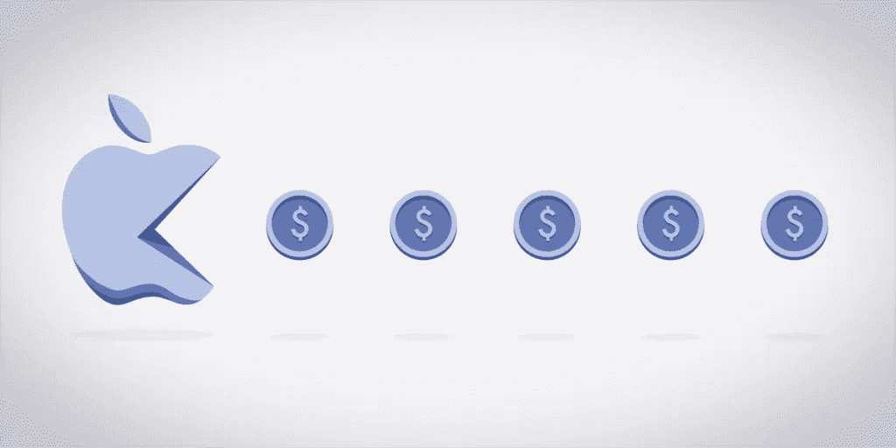

# 苹果应该垄断 iOS 吗？

> 原文：<https://medium.com/codex/should-apple-have-an-ios-monopoly-fad91b1fef73?source=collection_archive---------17----------------------->

# **苹果垄断**

假设我是一名游戏开发者。我为我的游戏倾注了心血、汗水和泪水，并把它发布在苹果的应用商店上。它是免费的，我决定通过出售游戏中的东西来赚钱，比如角色、皮肤、强力武器等等。

它开始得很好，我开始赚很多钱，但是因为我卖的是数字产品，我必须向苹果支付我所得的 30%。我是说，这太荒谬了！苹果只是冷静地坐着，赚取我 30%的收入，几乎什么都不做。更糟糕的是，实际上我没有其他方法来接触 iOS 用户。我试图建立自己的支付系统，并以更低的价格向我的客户提供我的产品，但苹果公司很快就禁止了我。为什么我没有选择？

这正是 Epic Games(《堡垒之夜》的创作者)所面临的问题。在“Epic Games v. Apple”的商标诉讼中，Epic 对苹果公司关于拥有苹果公司自有购买方式以外的其他应用内购买方式的限制提出了挑战(我们等待法院的判决)，这实际上是有意义的。苹果垄断了他们的应用商店。我知道说苹果公司垄断其产品有点奇怪，但这是有根据的，因为苹果在同一个市场上有竞争产品。

Spotify 实际上也有同样的问题，他们必须向 App Store 支付 30%的费用，这种成本的增加实际上转移到了客户身上，从而提高了订阅 Spotify 的价格，而最终获得 Apple Music 更便宜，只是因为归苹果所有，没有这 30%的费用。这就是反竞争的定义。

# **苹果怎么说？**

他们为什么要这么麻烦呢？这是堡垒之夜和 Spotify 所在的市场。他们可以选择对自己的产品为所欲为，收取任何他们认为合理的过高价格。在任何竞争激烈的市场中，这些问题都会自动地通过一些竞争对手的出现和更低的价格来解决。但是，这是垄断的一面。市场是苹果的，操作系统是苹果的，手机也是苹果的！当苹果掌控一切时，就没有竞争的空间。

苹果表示，如果 Spotify 觉得价格太高，他们可以打包走人。他们仍然有机会在其他平台上设置他们的应用程序，为什么不这样做呢？Spotify 对市场的定义是在苹果 iOS 生态系统中，苹果在这个生态系统中真正处于垄断地位，但苹果对市场的定义是整个应用市场，其垄断只是其中很小的一部分，不应该影响 Spotify。这总是一个灰色地带，取决于你站在哪一边。

> *[Spotify]想要应用程序商店的所有好处，但不认为他们应该为此支付任何费用。委员会代表 Spotify 的观点与公平竞争背道而驰*[【1】](https://techcrunch.com/2021/04/30/europe-charges-apple-with-antitrust-breach-citing-spotify-app-store-complaint/)。

我理解苹果的观点，但本质上它归结为选择和拥有一个产品。我花了 10 万卢比给自己买了一部 iPhone，苹果公司有什么资格告诉我应该运行什么，不应该运行什么？如果我想玩堡垒之夜，苹果应该能让我玩。如果我想玩**，应该有一个选项可以玩堡垒之夜。如果堡垒之夜准备以更低的价格给我买他们的游戏，为什么苹果要阻止他们？有多种方法可以解决这个难题，但没有一种方法能激励苹果去做任何事情。他们处于有利的垄断地位，并且愿意保持这种地位。**

# 第三方应用？

最简单的方法可能是像谷歌那样允许应用程序或第三方应用商店的侧装。苹果基于隐私不允许这样做。他们对正在使用的应用程序没有任何控制权，这些应用程序可能会严重侵犯隐私，苹果公司也无法对其进行控制。当然，这是有效的，最简单的解决方案是苹果公司取消此类设备的保修，并回避他们的责任。但至少现在消费者有了选择。

# 硬件/软件鸿沟

第二个想法可以追溯到我们实际上从苹果公司购买的东西的定义。是硬件的问题吗？是软件的问题吗？是一款极致一体化的产品吗？现在，即使我已经买了这个产品，苹果也严格限制我用它做什么。我可能想买 iPhone，但不希望它的操作系统对我的手机有严格的限制。苹果实际上应该以这样一种方式划分硬件和软件，即我应该能够在不实际购买 iOS 的情况下购买 iPhone。他们可以以更低的价格将其与 iOS 捆绑销售，但其他公司也应该有尝试的自由。这样一来，其他公司就可以开发自己的操作系统来利用苹果的硬件，谁知道呢？它实际上可能会比 iOS 更好。同样，现在消费者有了**选择**

# 新规定

另一个难以接受的想法是制定市场法则。如果你在经营一个市场，它实际上跨越了一定的门槛，那么某些规则就会到位，以确保没有滥用权力。

还有一种可能性是，在乌托邦式的环境中，可能会出现第三家公司与苹果和谷歌竞争，迫使它们降低价格以保持竞争力。但是，我在骗谁呢？我们已经向他们出卖了我们的灵魂。

来源

1.  [https://TechCrunch . com/2021/04/30/Europe-charges-apple-with-antitrust-breach-quoting-Spotify-app-store-complaint/](https://techcrunch.com/2021/04/30/europe-charges-apple-with-antitrust-breach-citing-spotify-app-store-complaint/)
2.  【https://www.bbc.com/news/technology-56840379 号
3.  [https://www . Brookings . edu/blog/tech tank/2021/06/02/the-epic-apple-app-case-reveals-monopoly-power-and-the-need-for-new-regulatory-oversight/](https://www.brookings.edu/blog/techtank/2021/06/02/the-epic-apple-app-case-reveals-monopoly-power-and-the-need-for-new-regulatory-oversight/)
4.  [https://protonmail.com/blog/apple-app-store-antitrust/](https://protonmail.com/blog/apple-app-store-antitrust/)