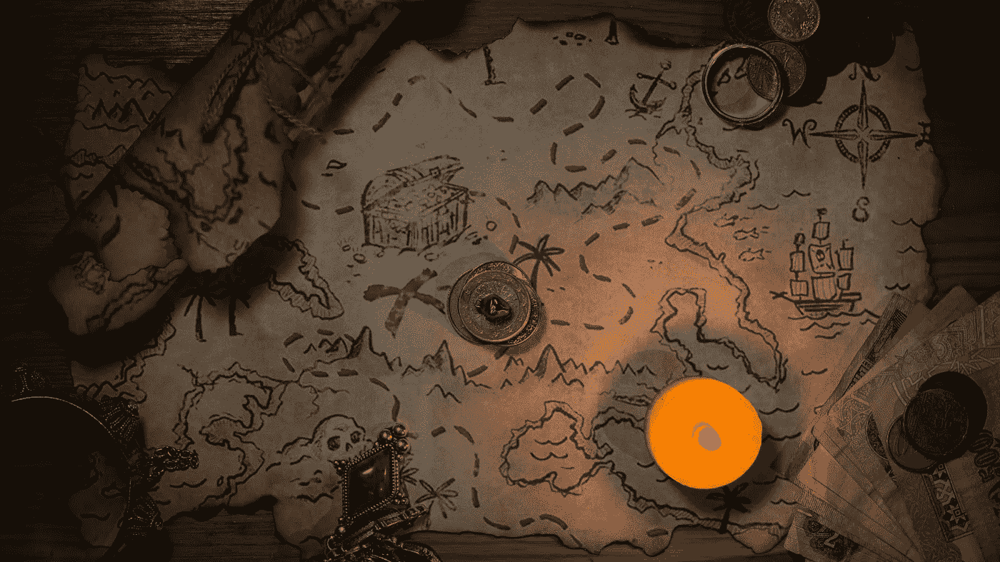

# 我应该学习新的东西吗？

> 原文：<https://medium.com/codex/should-i-learn-something-new-da67dce97ea7?source=collection_archive---------9----------------------->

时间只有这么多，所以要保持头脑清醒，时刻做好计划。现在，考虑你的下一步行动。

照片由 [Unsplash](https://unsplash.com/s/photos/treasure-map?utm_source=unsplash&utm_medium=referral&utm_content=creditCopyText) 上的 [Nadjib BR](https://unsplash.com/@depthcontroller?utm_source=unsplash&utm_medium=referral&utm_content=creditCopyText) 拍摄

# #包括

今天，一个问题和一些明智的建议来自一个四面楚歌的[新手](https://en.wikipedia.org/wiki/Rook_(chess))，在软件工程的大游戏中，它安全地与现实世界隔离开来——因为我认为我自己就是其中的一部分。