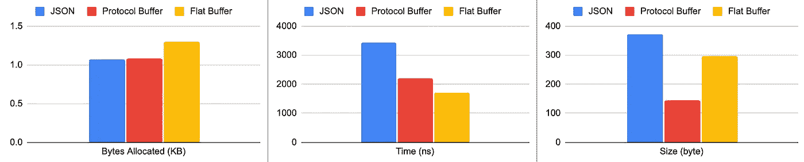
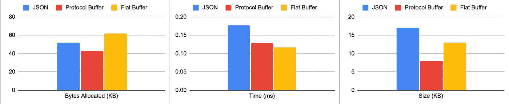
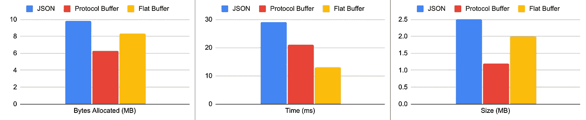
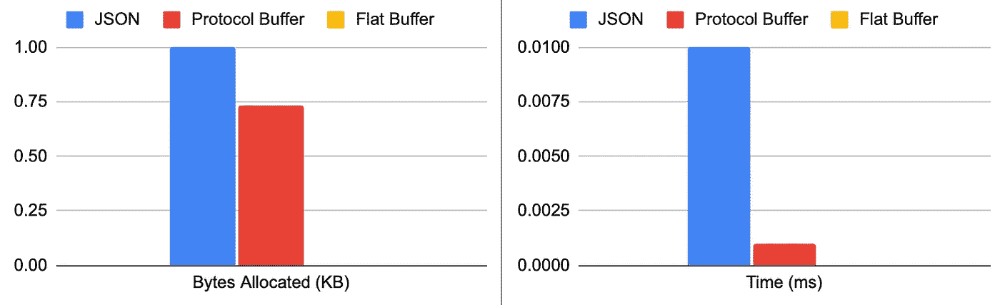
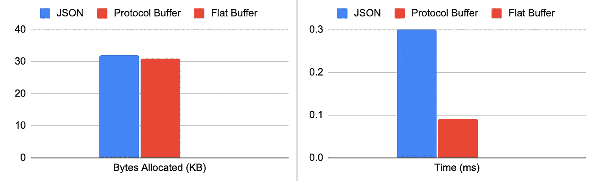
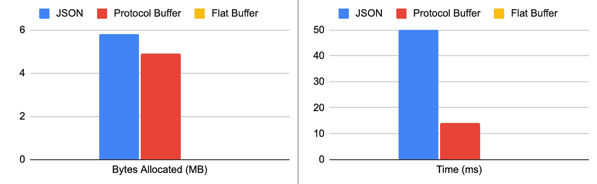

# 我应该使用 X-buffers 来序列化数据吗？

> 原文：<https://medium.com/codex/should-i-use-x-buffers-to-serialize-data-1cb405e0e98a?source=collection_archive---------15----------------------->

## x 缓冲区？你什么意思？，easy， **Flat-** buffers 和 **Protocol-** buffers(这不是官方的，只是我决定将这两个术语分组的一种方式)


由[凯文·Ku](https://unsplash.com/@ikukevk?utm_source=medium&utm_medium=referral)在 [Unsplash](https://unsplash.com?utm_source=medium&utm_medium=referral) 上拍摄

每当一项新技术或框架涌现时，人们通常会认为它在各方面都比以前的好，因为它更新，但是，理解它旨在解决什么问题以及它是否在所有情况下都足够好是很重要的，这就是为什么我决定写这篇文章，以便了解 X-Buffers 是否真的比 JSON 更好。

为了确定使用 X-Buffers 是否是一个好主意，我将通过不同的场景进行 Golang 基准测试。这是用于进行比较的模式(完整模式[这里是](https://github.com/cperez08/xbuffer-bench/tree/main/model))。

```
type **Customer** struct {
  **FirstName**   string               
  **LastName**    string               
  **Age**         uint32               
  **Balance**     float64              
  **Debt**        float64              
  **Preferences** *Preferences         
  **Friends**     []*Customer          
  **Addresses**   map[string]*Location 
}
```

如果您不熟悉协议缓冲区或 FlatBuffer，在进一步阅读之前，您可以查看一下这些资源。

*   [协议缓冲 IDL 指南](https://developers.google.com/protocol-buffers/docs/overview)和[协议缓冲简介](https://www.youtube.com/watch?v=72mPlAfHIjs)
*   [平面缓冲器介绍](https://google.github.io/flatbuffers/)和[平面缓冲器基准测试](https://google.github.io/flatbuffers/flatbuffers_benchmarks.html)

# **实验**

现在，让我们进行一些基准测试，为此，我将使用 3 种不同的复杂性级别，以便我们可以看到每种序列化格式在不同压力级别下的表现:

*   **第 1 级**，客户对象有 1 个地址。
*   **级别 2** ，客户对象有 10 个地址，10 个朋友，每个朋友包含 10 个地址。
*   **三级**，客户对象有 100 个地址，200 个好友，每个好友包含 100 个地址。

*所有测试均在 CPU 为英特尔酷睿 i5–6267 u CPU、2.90GHz、Golang 1.16.2 的机器上运行，*结果可能因其他语言或机器而异。

## 1 级封送指标

```
JSON   354464  3442 ns/op  1075 B/op  14 allocs/op
Proto  467773  2188 ns/op  1088 B/op  15 allocs/op
FBS    697542  1690 ns/op  1304 B/op  10 allocs/op**Size in bytes**
JSON:371, Proto:143, Fbs:296
```



一级元帅

我不得不承认，第一次运行这些测试时，我不得不重新考虑所有的实现，因为以前我有一个误解，认为 FlatBuffer 在所有意义上都比 JSON 和协议缓冲格式好得多，但正如您所看到的，对于我们最简单的场景，情况并非如此。

## 第 2 级封送指标

```
JSON    6504   177418 ns/op  52443 B/op  619 allocs/op
Proto   9921   128793 ns/op  43157 B/op  717 allocs/op
FBS     10000  116492 ns/op  62473 B/op  326 allocs/op**Size in KB**
JSON:17, Proto:8.9, Fbs:13
```



二级元帅

在这种情况下，JSON 在任何情况下都不再是赢家，Protocol Buffer 缩短了使用 FlatBuffer 的时间，作为结论，Protocol Buffer 看起来是我们在这种情况下的最佳选择，现在让我们将这种行为与更极端的情况进行对比。

## 第 3 级封送指标

```
JSON    39  29045645 ns/op  9810394 B/op  84209 allocs/op
Proto   55  21001219 ns/op  6334196 B/op  103901 allocs/op
FBS     78  13158922 ns/op  8333920 B/op  42052 allocs/op**Size in MB**
JSON:2.5, Proto:1.2, Fbs:2.0
```



三级元帅

记得这一次我使用了 100 个地址，200 个朋友，每个朋友有 100 个地址，这是一个不常见的用例，但也是可能的，我曾经在一个项目中遇到过这么大的对象。

对于这种极端情况，最糟糕的是 JSON 格式，FlatBuffer 现在甚至比上次的 Proto Buffer 还要快，关于大小的趋势与其他测试一致。

## 1 级解组统计

```
JSON    134371     10778 ns/op  1000 B/op  26 allocs/op
Proto   728599     1592 ns/op   733 B/op   13 allocs/op
FBS     510885903  2.365 ns/op  0 B/op     0 allocs/op
```



解组级别 1

是的，图片是正确的，FlatBuffer 没有尝试将二进制数据解析到对象中的分配，时间几乎为 0 (2 ns)，在协议缓冲区的情况下，它需要 0.7 KB 和 JSON 1 KB 的内存分配，关于协议缓冲区花费的时间大约为 0.001 ms 和 JSON 0.01 ms，让我们看看接下来会发生什么。

## 第 2 级解组统计

```
JSON     2886       353497 ns/op  32025 B/op  1000 allocs/op
Proto    13471      91999 ns/op   31446 B/op  705 allocs/op
FBS      444298354  2.490 ns/op   0 B/op      0 allocs/op
```



解组级别 2

FlatBuffer 不受对象大小和复杂性的影响，并保持以前的度量，另一方面，协议 Buffer 和 JSON 在内存分配方面彼此接近，协议 Buffer 为 31 KB，JSON 为 32 KB，但是，在花费的时间方面，协议 Buffer 为 0.09 ms，而 JSON 为 0.3 ms

## 第 3 级解组统计

```
JSON    22         50498996 ns/op   5849893 B/op  148547 allocs/op
Proto   78         14708673 ns/op   4989886 B/op  105029 allocs/op
FBS     527564692  2.248 ns/op      0 B/op        0 allocs/op
```



解组级别 3

FlatBuffer 再次保持了速度，协议缓冲区占用了大约 4.9 MB 的内存分配，而 JSON 占用了 5.8 MB 的内存分配(每次操作)，就花费的时间而言，协议缓冲区花费了 14 ms，而 JSON 花费了 50 ms 解析对象，这是一个非常重要的区别。

但是为什么 Flatbuffer 在解组对象时性能如此之好呢？公平地说，您需要知道，Flat Buffer 甚至不会解组字节，它在封送处理过程中所做的是通过偏移量和 vtables 来容纳字节，以便能够在以后访问数据，因此，它不是重新构建整个对象，而是准备字节数组，并根据需要根据数据类型和/或长度来查找字段(示例[此处为](https://github.com/cperez08/xbuffer-bench/blob/main/allocation/fbs.go#L45))。

如果你对上面显示的平坦缓冲区结果非常满意，请等一下，首先你需要知道使用它的缺点是什么，这些是我遇到的一些缺点:

*   调试二进制消息是非常困难的，你不能只记录有效载荷或使用中间体(防火墙、代理、发布/订阅等)来分析有效载荷并基于此做出决定，这也适用于协议缓冲区。
*   实现是乏味的，正如你在这里看到的，构建 FlatBuffer 对象比协议缓冲和 JSON 需要更多的小心和步骤。
*   一些语言中缺少一些功能，例如，二分搜索法(地图)还不能用于 Golang 或 Rust。

**在结束之前，让我分享一些最后的想法:**

*   关注内存分配之所以重要，是因为内存管理。在 Golang 中，负责这项工作的是垃圾收集器(GC ),它负责释放我们的程序不再使用的内存，简而言之，当堆内存超过 4MB 或在过去 2 分钟内没有启动时，就会触发 GC(默认),因此，如果您的 GC 需要一直努力清理内存，这将消耗您运行程序所需的 CPU。
*   如果读完这篇文章后，你认为使用 JSON 是一个坏主意，让我告诉你相反的情况，对于常规场景，这是我的第一选择，它被广泛支持，易于调试，正如你所看到的，在正常情况下这种差异并不过分。
*   根据之前的回答，您可能想知道什么时候是使用 X-Buffers 的好机会，我个人会使用 X-Buffers 进行服务对服务的通信、缓存存储，当业务需要非常低的延迟时，如在游戏中，或者当您在非常有限的环境(网络、磁盘、内存)下工作时，如物联网。

**奖励:**

1.  Golang proto buf 项目的一个分支叫做 GoGo proto buf，它承诺减少分配的字节数，让我们使用 gogofaster 方法来看看一些统计数据:

**马萨林**

```
GogoProto**L1**  1244660   944.4 ns/op     627 B/op      9 allocs/op
GogoProto**L2**  17931     67348 ns/op     31112 B/op    433 allocs/op
GogoProto**L3**  104       11383685 ns/op  4968503 B/op  62899 allocs/op
```

与标准协议缓冲区实现相比，GoGo Protobuf 的实现确实有所改进:

*   级别 1:字节分配减少 44%，速度提高 56%
*   级别 2:字节分配减少 27%，速度提高 47%
*   级别 3:字节分配减少 22%，速度提高 47%
*   在所有情况下，大小都完全相同
*   Gogo Protobuf 的统计是包括 FlatBuffer 和 JSON 在内的所有场景中最好的。

**解组**

```
GogoProto**L1**   1863813  628.5 ns/op     528 B/op      11 allocs/op
GogoProto**L2**   34784    34081 ns/op     22206 B/op    465 allocs/op
GogoProto**L3**   193      5784670 ns/op   3625775 B/op  64031 allocs/op
```

级别 1:字节分配减少 31%，速度提高 40%

级别 2:字节分配减少 29%，速度提高 66%

级别 3:字节分配减少 25%,速度提高 59%

**2。**您还可以将平面缓冲区与 gRPC 结合使用，并利用 HTTP2 获得更好的性能，[查看此处](https://grpc.io/blog/grpc-flatbuffers/)了解更多信息，[查看此处](https://github.com/google/flatbuffers/blob/master/grpc/tests/go_test.go)查看示例