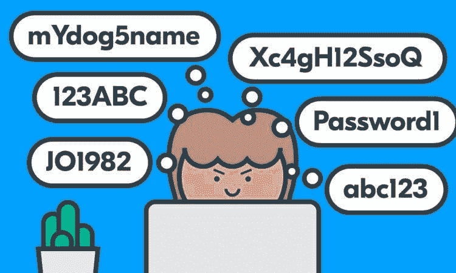

# 我们应该在浏览器中保存密码吗？

> 原文：<https://medium.com/codex/should-we-save-our-passwords-in-a-browser-f4ed5cb162b2?source=collection_archive---------15----------------------->

不要让你的浏览器保存你的密码。一个都没有。一个都没有。如果你这样做，这些密码是易受攻击的。所有人需要做的就是访问你的电脑(远程或物理)，除非你使用 Safari 或 Firefox 中的主密码功能，否则任何人都可以看到这些密码。

如果你一定要让你的浏览器存储你的密码，并且你没有使用 macOS，确保使用 Firefox 并启用主密码功能。使用 Chrome 的风险在于你的密码。

不要让你的网络浏览器存储你的密码，使用一个密码管理器。这样，别人查看您的密码的可能性就大大降低了。这并不完美，但比把密码的安全性交给网络浏览器要好得多。

有各种类型的密码管理器可供选择，其中基于云的选项是最受欢迎的。他们使用云的额外好处是可以从任何地方访问你的密码。大多数流行品牌(1Password、Dashlane、LastPass 等。)为你的智能手机提供应用程序，所以如果你使用多种设备(我们大多数人都这样)，那么基于云的服务将在所有设备上同步你的所有密码。有些甚至有桌面选项和浏览器插件，所以它们涵盖了所有的基础。

说到订阅，基本的选项集是免费提供的。如果您发现这些不足，您可以随时支付一个更高级的等级，通常包括更多的设置和附加的安全功能。

所有这些听起来都很方便，但有一点需要注意。可以说，你是在孤注一掷；一些在线密码管理员在过去也遇到过同样的问题。例如，几个月前，研究人员发现一些流行的密码管理器存在安全缺陷，他们的一些安卓版本的应用程序容易受到网络钓鱼攻击，而其他人则允许无休止地尝试输入主 PIN。

重要的是要记住，由于您的数据存储在服务器上，因此在发生违规或成功黑客攻击的情况下，网络犯罪分子可以批量下载这些信息，您的帐户可能会出现在该数据宝库中。如果发生这种情况，你需要依赖于你所选择的服务的运营商，他们已经根据你的主密码正确地实施了强加密*和*，请记住，它守卫着你大部分数字生活的大门。

虽然我们大多数人在管理数字生活时都有类似的需求，但我们的偏好可能会有细微的差异。因此，您需要知道哪个选项最适合您的需求。在选择密码管理器时，您至少应该回答几个问题:

*   您选择的服务如何存储您的数据？
*   如果您的设备发生问题，数据是否可以恢复？
*   您可以激活任何其他安全选项来增强保护吗？

确保仔细选择密码管理器，避免创建主密码时的常见错误。