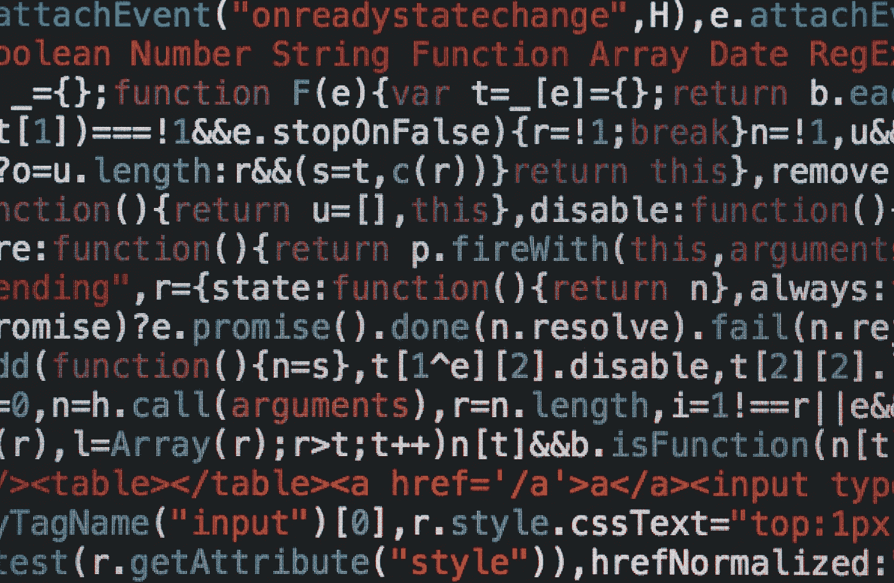

# 对于前端角色，我们应该开始使用术语 JavaScript developer 吗？

> 原文：<https://medium.com/codex/should-we-start-using-the-term-javascript-developer-for-front-end-roles-ae699c059816?source=collection_archive---------11----------------------->

## 你看过网飞的节目吗？

它是关于一个试图在“内陆”的贫困中生存的社区，每年人们都有机会通过一些挑战过上更好的生活，以便他们可以生活在他们所谓的“离岸”(天堂)。如果你还没有看过，我建议你去看，如果你看过，你就会看到我在面试时经历的相似之处。

年初我辞职了，因为我不开心，工作已经不适合我了。我也想开始使用现代技术，比如 React/Redux、Typescript、GraphQL、Contentful、Gatsby、NextJS。上了 React 的课程后，我开始申请要求 React 的工作。这些工作通常需要一个招聘人员的介绍电话，然后是编码挑战。我参加了太多的面试，以至于我忘记了他们，不得不回到我的日历上来回忆我在这篇文章的所有面试中度过的“令人惊奇”的时间。以下是一些例子:

1.  咨询公司→无编码练习→问我“什么是承诺？”，对此我回答抱歉我不知道。
2.  教育公司→基于角色的 React 选择题测验→通过测验→与公司的两名开发人员进行视频通话。一位开发人员问我以前是否做过单元测试，我回答说“没有，我所在的公司都不需要单元测试”。
3.  健身公司→让我做 2 个编码挑战→ CS 基础算法和数据结构
4.  远程公司→要求我在 8 小时内完成一个琐事 React 代码挑战→希望我使用 Flow、单元测试、Redux 和超越线框的设计
5.  软件公司→与招聘人员的精彩对话→但是寻找一个反应强烈的开发人员…不是我
6.  远程公司→问我 15 分钟基于 React 的问题，然后用 CS 基础知识进行编码练习
7.  远程公司→参加在线 Javascript 选择题测验和带有 async/await 承诺的编码挑战

这些都是前端角色，我觉得公司想要一个强大的 JavaScript 开发人员，而不是前端。在我看来，一个前端开发人员与一个设计师密切合作来匹配他们的设计，他们可能会交换适用于浏览器的想法。前端开发人员也可以与后端开发人员合作，以确保后端符合设计要求。对我来说，这是成为一名前端人员所需的几项技能之一，此外还有 CMS、跨浏览器测试、可访问性、SEO、页面性能、UX、DOM 操作、GIT、数据 API、数据格式等知识。只有一家公司测试了我的 CSS 技能。我们不再关心 CSS 了吗，现在公司真正想要的是什么？Javascript 开发人员？

自从我开始开发以来，我一直在代理机构工作，所以我一直在为不同的客户建立网站。我不知道什么是承诺，因为在那些公司里，他们在 WordPress、AEM 或 Drupal 上使用 jQuery，并不需要它们。三年前，我开始了我的 JavaScript 之旅，当时我被一个私人客户雇佣来设计和构建一个交互式的 React 表单。

回顾所有的面试，我开始发现一个模式，我能够回答所有招聘人员的问题(这表明我有这方面的经验)，但我挣扎着通过编码挑战。这些编码挑战中的大部分涵盖了计算机科学基础，对此我既没有学位也没有任何经验。他们看过我的简历，其中包括我的学历，但我仍然得到了算法和数据结构练习。在过去，编码挑战包括构建手风琴、旋转木马、汉堡菜单、子菜单飞越、叠加、滚动到某个位置，以及用 GSAP 或 CSS3 制作某种动画。我知道我申请的公司不需要上面提到的任何功能，但是你看我有经验。

在辞职寻找新的机会后，我觉得自己被困在了软件开发的“内陆”，因为我无法通过任何挑战。随着公司不断从 jQuery 转向 JavaScript，我想要一份可以拓展我的 JavaScript 经验的工作。导师制度怎么了？前端角色是否应该命名为 JavaScript？我是不是申请错了公司？我是同岗位唯一的前端开发人员吗，如果不是，我们该怎么办？